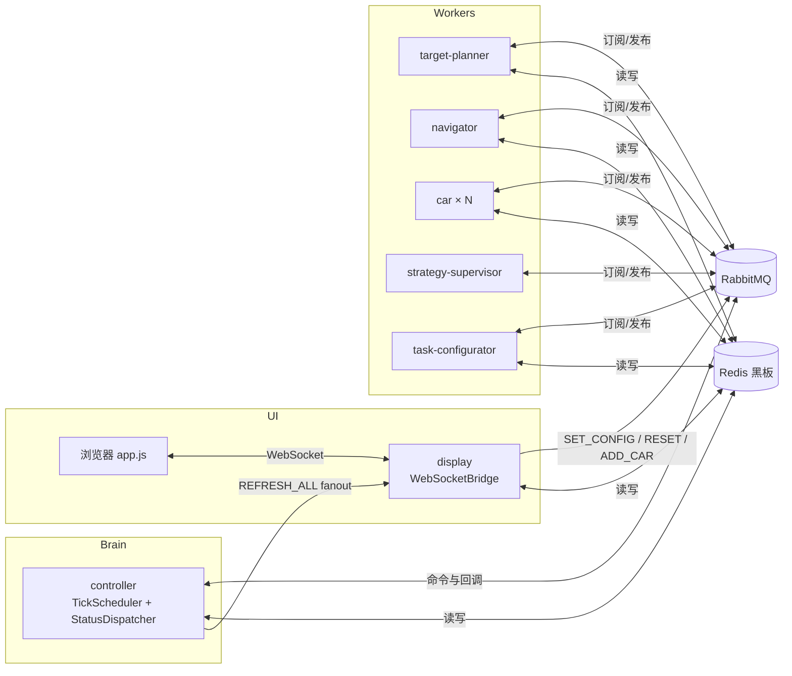

# 变电站巡检仿真系统 — 项目速览

> **用途**：新开 AI 对话或新成员入项时，先读本文即可建立全局认识。  
> **仓库**：https://github.com/a3030765513-oss/Car_homework.git  
> **更细的设计**：见 `人员分工.md`、`系统设计文档.md`、`CLAUDE.md`（编码规范）

---

## 1. 这是什么

多进程 Java 仿真：**多台小车在二维网格地图上协作探索**，避开障碍物，尽量覆盖全部可达区域。

- **通信**：RabbitMQ 传指令与事件；Redis 作共享「黑板」存地图与车辆状态  
- **调度**：`controller` 按节拍（默认 500ms）驱动全车状态机  
- **展示**：`display` 提供 Web 页面（Canvas 地图 + 控制面板 + 步数排行）  
- **JDK**：17；构建：`.\mvnw.cmd`（Windows 终端可用，不依赖系统 `mvn`）

---

## 2. 基础设施

| 服务 | 端口 | 用途 |
|------|------|------|
| Redis | 6379 | 黑板（地图位图、车辆状态、步数等） |
| RabbitMQ | 5672 / 管理台 15672 | 模块间异步消息 |
| Display HTTP | 8887 | 静态页面 `http://localhost:8887` |
| Display WebSocket | 8888 | 实时推送 `SimulationState` JSON |
| SQL Server | 1433 | 用户登录、注册、操作日志、统计分析（可选） |

```bash
docker compose up -d    # 仅 Redis + RabbitMQ
```

SQL Server 需单独安装，连接串见 `common/.../sql/DatabaseManager.java`。

---

## 3. 模块一览

```
common          公共库：黑板、MQ、模型、地图工具、认证/分析 API
controller      系统大脑：节拍调度、状态分派、探索完成判定
car             小车执行端：移动、点亮地图、步数统计（可多实例）
navigator       路径规划：BFS / A* → 写入 RouteList
target-planner  目标分配：贪心选未探索目标 → 写入 Target
task-configurator 任务初始化：flushDB、障碍物、出生点、TaskConfig
strategy-supervisor 路线监督：路径重叠/绕路时换加权路径
display         前端 + WebSocketBridge + ADD_CAR 动态启车
launcher        一键按序启动全部进程
```

**依赖关系**：各业务模块只依赖 `common`；模块之间**不直接调用**，只通过 MQ + Redis。

**Git 分支（4 人协作）**：

| 分支 | 负责人 | 侧重 |
|------|--------|------|
| `main` | 集成 | 合并后的主分支 |
| `hzx_common` | Person A | common + controller |
| `lyq_car` | Person B | car |
| `ylj_navigator` | Person C | navigator + target-planner + task-configurator |
| `wsh_test` | Person D | display + launcher |

---

## 4. 架构与一次节拍的数据流



**典型探索循环（单车）**：

1. `controller`：`IDLE` → 发 `ASSIGN_TARGET` → `target-planner` 写 `CarID:Target` → `TARGET_ASSIGNED`
2. `controller`：`WAITING_ROUTE` → 发 `PLAN_ROUTE` → `navigator` 写 `CarID:RouteList` → `ROUTE_PLANNED`
3. （可选）`controller` 发 `SUPERVISE_ROUTE` → `strategy-supervisor` 可能改路线 → `ROUTE_OPTIMIZED`
4. `controller`：`READY` → 发 `TICK_MOVE` → `car` 移动一格、点亮、步数+1 → `MOVED` / `ROUTE_DONE`
5. 每拍结束广播 `REFRESH_ALL`，`display` 读黑板推前端

---

## 5. 小车状态机（5 态）

| 状态 | 含义 | 主要写入者 |
|------|------|------------|
| `IDLE` | 无目标/路径或走完 | Car、Controller |
| `WAITING_ROUTE` | 已有目标，等路径 | Controller |
| `READY` | 有路径，等待本拍移动 | Controller、Car |
| `MOVING` | 本拍正在移动（心跳） | Car |
| `BLOCKED` | 下一步被挡 | Car |

**原则**：Car **不写** `WAITING_ROUTE`；Controller **不写** `MOVING`。

---

## 6. Redis 黑板 — 常用 Key

| Key | 说明 |
|-----|------|
| `mapView` | 位图，已探索区域 |
| `mapBlock` | 位图，障碍物 |
| `mapSealed` | 位图，被障碍封死的不可达区 |
| `mapHeat` | 热力图访问次数 |
| `{carId}:Position` | 当前坐标 |
| `{carId}:Target` | 目标格 |
| `{carId}:RouteList` | 待走路径（List） |
| `{carId}:History` | 历史轨迹（回放用） |
| `{carId}:Status` | 状态枚举名 |
| `{carId}:Steps` | 总移动步数 |
| `{carId}:EffectiveSteps` | **有效步数**（踩入此前未探索格的次数） |
| `TaskConfig` | 地图宽高、车数、障碍比例、算法、节拍间隔等 |
| `controller:instance` | Controller 单实例锁 |

车辆发现：`BlackboardClient.discoverCarIds()`（扫描 `Car*:Status`），**非**固定 5 台。

---

## 7. MQ 队列与消息类型

**队列**（`QueueNames.java`）：`ControllerCmd`、`TargetPlannerCmd`、`NavigatorCmd`、`TaskConfigCmd`、`StrategySupervisorCmd`、`Car_{carId}`；广播交换机 `UpdateView`（fanout）。

**消息类型**（`MessageTypes.java`）节选：

| 类型 | 方向概要 |
|------|----------|
| `SET_CONFIG` / `FORWARD_CONFIG` | 前端 → Controller → TaskConfigurator 初始化 |
| `TASK_READY` | 初始化完成，Controller 开始 tick |
| `ASSIGN_TARGET` / `TARGET_ASSIGNED` | 分配探索目标 |
| `PLAN_ROUTE` / `ROUTE_PLANNED` | 路径规划 |
| `SUPERVISE_ROUTE` / `ROUTE_OPTIMIZED` | 策略监督 |
| `TICK_MOVE` / `MOVED` / `ROUTE_DONE` / `BLOCKED` | 移动与阻塞 |
| `REFRESH_ALL` | 刷新前端 |
| `TOGGLE_PAUSE` / `SET_TICK_INTERVAL` / `RESET` | 控制 |

消息体统一 JSON：`{ type, tick, carId, timestamp, data }`（`MessageBuilder`）。

---

## 8. 启动顺序（重要）

```
1. docker compose up -d          # Redis + RabbitMQ
2. TaskConfigurator              # 等前端点「开始」或收到 SET_CONFIG 才真正初始化
3. Navigator
4. TargetPlanner
5. StrategySupervisor
6. Car001 … Car00N               # 或运行时 ADD_CAR 动态添加
7. Display
8. Controller                    # 必须最后启动，否则 tick 时黑板无车
```

- 一键脚本：`start_all.bat`（默认 3 台车）  
- 浏览器：`http://localhost:8887`（先登录页，默认需 SQL Server 用户表）

---

## 9. 编译与测试

```powershell
cd D:\car_homework
.\mvnw.cmd clean install          # 全量；若 car 的 jar 被占用会 clean 失败
.\mvnw.cmd install -rf :car       # 小车在跑时用这条跳过 clean
.\mvnw.cmd install -pl display -am  # 只编 display 及其依赖
```

**注意**：`car` 打成 **shade fat jar**（`car/target/car-1.0-SNAPSHOT.jar`），ADD_CAR 用 `java -jar` 启动；jar 被占用时无法 `clean`。

单模块测试需 **本机 Redis + RabbitMQ**（多数集成测试会 `flushDB`）。

---

## 10. 前端结构（`display/src/main/resources/web/`）

| 文件 | 作用 |
|------|------|
| `index.html` | 主仿真页：地图、控制、步数排行、ADD_CAR |
| `js/app.js` | WebSocket、双层 Canvas 渲染、回放、排行 `有效/总 步` |
| `js/auth.js` | 登录态、导航栏 |
| `analysis.html` + `analysis.js` | 统计分析页 |
| `login.html` | 登录 |

地图层：`mapView`（已探索）、`mapBlock`（障碍）、`mapSealed`（封死区）、车辆位置/路径/状态色。

---

## 11. 近期已实现的重要能力（hzx_common 等）

| 能力 | 关键文件 |
|------|----------|
| 动态添加小车 ADD_CAR | `display/DynamicCarLauncher.java`、`WebSocketBridge.handleAddCar`、`app.js` |
| 出生点：≤5 车四角+中心，>5 用 `SpawnPositionSelector` | `common/map/SpawnPositionSelector.java`、`TaskInitializer.java` |
| 高障碍场景优先内部探索目标 | `target-planner/GreedyTargetAllocator.java` |
| 路线闪烁修复 | `controller/StatusDispatcher`（`awaitingSupervision`）、`app.js` |
| 步数排行显示有效步数 | `MoveExecutor` + `{carId}:EffectiveSteps` + `app.js` `renderLeaderboard` |
| 探索区增量绘制 / 大地图 Base64 | `app.js` `paintIncrementalExplored` |

---

## 12. 按问题类型找代码

| 现象 / 任务 | 优先看 |
|-------------|--------|
| 车不动、状态卡住 | `StatusDispatcher.java`、`CommandHandler.java`、对应 Car 日志 |
| 路径奇怪、绕路、重叠 | `navigator/`、`strategy-supervisor/RouteOverlapEvaluator` |
| 目标总在外围兜圈 | `GreedyTargetAllocator.java` |
| 地图/init/障碍/出生点 | `TaskInitializer.java`、`DynamicObstacleUtil.java` |
| 前端不刷新、排行不对 | `WebSocketBridge.java`、`app.js` |
| 添加小车失败 | `DynamicCarLauncher.java`、`car/pom.xml` shade 配置 |
| 黑板读写、探索率 | `BlackboardClient.java` |
| 登录/用户管理 | `common/auth/`、`common/sql/`、`DisplayMain.java` |

---

## 13. 各模块入口类

| 模块 | Main 类 |
|------|---------|
| controller | `com.substation.controller.ControllerMain` |
| car | `com.substation.car.CarMain`（参数：`Car001`，可选 `--dynamic`） |
| navigator | `com.substation.navigator.NavigatorMain` |
| target-planner | `com.substation.targetplanner.TargetPlannerMain` |
| task-configurator | `com.substation.taskconfigurator.TaskConfiguratorMain` |
| strategy-supervisor | `com.substation.strategysupervisor.StrategySupervisorMain` |
| display | `com.substation.display.DisplayMain` |
| launcher | `com.substation.launcher.LauncherMain` |

---

## 14. 给 AI 助手的提示

1. 改 `common` 后通常需 `mvn install` 并**重启所有依赖它的进程**。  
2. 改 `display` 前端要 **Ctrl+F5**；改 Java 要重启 Display。  
3. 用户报现象时，若未明确说「改/修」，默认**只分析不写代码**（见 `CLAUDE.md`）。  
4. 编译失败 `Failed to delete car-1.0-SNAPSHOT.jar` → 先停小车进程或 `install -rf :car`。  
5. Controller 测试日志里「黑板已无未探索格」多为测试环境未跑 TaskConfigurator，属正常警告。

---

*文档版本：2026-06-22，与 `hzx_common` 分支当前实现同步。*
