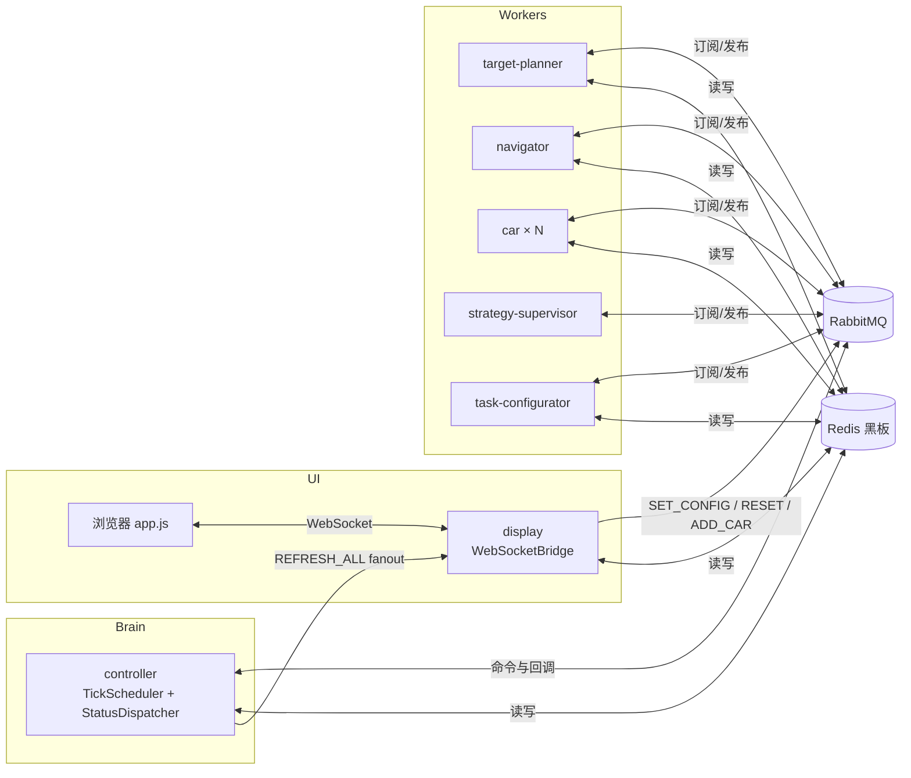

# 变电站巡检仿真系统 — 项目速览

> **用途**：新开 AI 对话或新成员入项时，先读本文即可建立全局认识。  
> **仓库**：https://github.com/a3030765513-oss/Car_homework.git  
> **更细的设计**：见 `人员分工.md`、`系统设计文档.md`、`CLAUDE.md`（编码规范）

---

## 1. 这是什么

多进程 Java 仿真：**多台小车在二维网格地图上协作探索**，避开障碍物，尽量覆盖全部可达区域。

- **通信**：RabbitMQ 传指令与事件；Redis 作共享「黑板」存地图与车辆状态  
- **调度**：`controller` 按节拍（默认 500ms）驱动全车状态机  
- **展示**：`display` 提供 Web 页面（Canvas 地图 + 控制面板 + 步数排行）  
- **JDK**：17；构建：`.\mvnw.cmd`（Windows 终端可用，不依赖系统 `mvn`）

---

## 2. 基础设施

| 服务 | 端口 | 用途 |
|------|------|------|
| Redis | 6379 | 黑板（地图位图、车辆状态、步数等） |
| RabbitMQ | 5672 / 管理台 15672 | 模块间异步消息 |
| Display HTTP | 8887 | 静态页面 `http://localhost:8887` |
| Display WebSocket | 8888 | 实时推送 `SimulationState` JSON |
| SQL Server | 1433 | 用户登录、注册、操作日志（**统计分析当前走前端 localStorage，不依赖 SQL**） |

```bash
docker compose up -d    # 仅 Redis + RabbitMQ
```

SQL Server 需单独安装，连接串见 `common/.../sql/DatabaseManager.java`。

---

## 3. 模块一览

```
common          公共库：黑板、MQ、模型、地图工具、认证/分析 API、InfraConnectionConfig（远程 Redis/MQ 参数）
controller      系统大脑：节拍调度、状态分派、探索完成判定
car             小车执行端：移动、点亮地图、步数统计（可多实例）
navigator       路径规划：BFS / A* → 写入 RouteList
target-planner  目标分配：贪心选未探索目标 → 写入 Target
task-configurator 任务初始化：clearSimulationState（仅清仿真键）、障碍物、出生点、TaskConfig
strategy-supervisor 路线监督：路径重叠/绕路时换加权路径
display         前端 + WebSocketBridge + ADD_CAR 动态启车
launcher        一键按序启动全部进程
```

**依赖关系**：各业务模块只依赖 `common`；模块之间**不直接调用**，只通过 MQ + Redis。

**Git 分支（4 人协作）**：

| 分支 | 负责人 | 侧重 |
|------|--------|------|
| `main` | 集成 | 合并后的主分支 |
| `hzx_common` | Person A | common + controller + 分布式 CLI、联调修复、统计 UI 增强（Person A 集成分支） |
| `lyq_car` | Person B | car |
| `ylj_navigator` | Person C | navigator + target-planner + task-configurator |
| `wsh_test` | Person D | display + launcher |

---

## 4. 架构与一次节拍的数据流



**典型探索循环（单车）**：

1. `controller`：`IDLE` → 发 `ASSIGN_TARGET` → `target-planner` 写 `CarID:Target` → `TARGET_ASSIGNED`
2. `controller`：`WAITING_ROUTE` → 发 `PLAN_ROUTE` → `navigator` 写 `CarID:RouteList` → `ROUTE_PLANNED`
3. （可选）`controller` 发 `SUPERVISE_ROUTE` → `strategy-supervisor` 可能改路线 → `ROUTE_OPTIMIZED`
4. `controller`：`READY` → 发 `TICK_MOVE` → `car` 移动一格、点亮、步数+1 → `MOVED` / `ROUTE_DONE`
5. 每拍结束广播 `REFRESH_ALL`，`display` 读黑板推前端

---

## 5. 小车状态机（5 态）

| 状态 | 含义 | 主要写入者 |
|------|------|------------|
| `IDLE` | 无目标/路径或走完 | Car、Controller |
| `WAITING_ROUTE` | 已有目标，等路径 | Controller |
| `READY` | 有路径，等待本拍移动 | Controller、Car |
| `MOVING` | 本拍正在移动（心跳） | Car |
| `BLOCKED` | 下一步被挡 | Car |

**原则**：Car **不写** `WAITING_ROUTE`；Controller **不写** `MOVING`。

---

## 6. Redis 黑板 — 常用 Key

| Key | 说明 |
|-----|------|
| `mapView` | 位图，已探索区域 |
| `mapBlock` | 位图，障碍物 |
| `mapSealed` | 位图，被障碍封死的不可达区 |
| `mapHeat` | 热力图访问次数 |
| `{carId}:Position` | 当前坐标 |
| `{carId}:Target` | 目标格 |
| `{carId}:RouteList` | 待走路径（List） |
| `{carId}:History` | 历史轨迹（回放用） |
| `{carId}:Status` | 状态枚举名 |
| `{carId}:Steps` | 总移动步数 |
| `{carId}:EffectiveSteps` | **有效步数**（踩入此前未探索格的次数） |
| `explorationEvents` | 探索事件列表（回放增量绘制） |
| `TaskConfig` | 地图宽高、车数、障碍比例、算法、节拍间隔、`active` 等 |
| `controller:instance` | Controller 单实例锁 |
| `auth:session:{token}` | 登录会话（**勿**随仿真初始化清除） |
| `auth:users` | 用户 Hash（SQL 登录体系） |

车辆发现：`BlackboardClient.discoverCarIds()`（扫描 `Car*:Status`），**非**固定 5 台。

---

## 7. MQ 队列与消息类型

**队列**（`QueueNames.java`）：`ControllerCmd`、`TargetPlannerCmd`、`NavigatorCmd`、`TaskConfigCmd`、`StrategySupervisorCmd`、`Car_{carId}`；广播交换机 `UpdateView`（fanout）。

**消息类型**（`MessageTypes.java`）节选：

| 类型 | 方向概要 |
|------|----------|
| `SET_CONFIG` / `FORWARD_CONFIG` | 前端 → Controller → TaskConfigurator 初始化 |
| `TASK_READY` | 初始化完成，Controller 开始 tick |
| `ASSIGN_TARGET` / `TARGET_ASSIGNED` | 分配探索目标 |
| `PLAN_ROUTE` / `ROUTE_PLANNED` | 路径规划 |
| `SUPERVISE_ROUTE` / `ROUTE_OPTIMIZED` | 策略监督 |
| `TICK_MOVE` / `MOVED` / `ROUTE_DONE` / `BLOCKED` | 移动与阻塞 |
| `REFRESH_ALL` | 刷新前端 |
| `TOGGLE_PAUSE` / `SET_TICK_INTERVAL` / `RESET` | 控制 |

消息体统一 JSON：`{ type, tick, carId, timestamp, data }`（`MessageBuilder`）。

---

## 8. 启动顺序（重要）

```
1. docker compose up -d          # Redis + RabbitMQ
2. TaskConfigurator
3. Navigator → TargetPlanner → StrategySupervisor
4. Car001 … Car00N
5. Display
6. Controller                    # 建议最后启动（见下）
```

- 一键脚本：`start_all.bat`（默认 3 台车，`chcp 65001` 控制台 UTF-8）  
- 浏览器：`http://localhost:8887` → `login.html` → `dashboard.html` 选功能  
- **分布式多机（已实现）**：各模块 `main` 通过 `InfraConnectionConfig.resolve` 读取 `deploy/infra.local.json`（命令行 `--redis-host` 可覆盖）；Person A 用 `localhost`，B/C/D 指向 Person A 的 Tailscale IP。操作清单见 **`四台分布式启动流程.md`**；一键脚本见 `scripts/`。  
- **分布式联调注意**：全组只有一套 Redis+MQ、一个 Controller、一个 Display、一个 TaskConfigurator 消费者；若本机与远程各起一个 TC，会抢 `TaskConfigCmd` 队列导致 `SET_CONFIG` 后收不到 `TASK_READY`  
- **乱序启动容错**：设计稿见 `启动健壮性方案.md`（**尚未编码**，当前仍建议按序启动）

**初始化注意**：点「开始」会触发 `FORWARD_CONFIG` → `TaskConfigurator` 调用 `BlackboardClient.clearSimulationState()`，**不再 `flushDB`**，避免清掉 `auth:session:*` 导致从仿真页返回时被登出。

---

## 9. 编译与测试

```powershell
cd D:\car_homework
.\mvnw.cmd compile                 # 改代码后快速校验（见 .cursor/rules/auto-compile.mdc）
.\mvnw.cmd clean install          # 全量；若 car 的 jar 被占用会 clean 失败
.\mvnw.cmd install -rf :car       # 小车在跑时用这条跳过 clean
.\mvnw.cmd install -pl display -am  # 只编 display 及其依赖
.\mvnw.ps1 compile                # PowerShell 包装（UTF-8 控制台 + 调 mvnw.cmd）
```

**编码（Windows 中文日志不乱码）**：根目录 `.mvn/jvm.config` 与根 `pom.xml` 的 `exec-maven-plugin` 已设 JVM UTF-8；`mvnw.cmd` / `start_all.bat` 执行 `chcp 65001`；各模块日志配置统一为 `common/src/main/resources/logback.xml`（控制台 `charset=UTF-8`）。

**注意**：`car` 打成 **shade fat jar**（`car/target/car-1.0-SNAPSHOT.jar`），ADD_CAR 用 `java -jar` 启动；jar 被占用时无法 `clean`。

单模块测试需 **本机 Redis + RabbitMQ**（多数集成测试会 `flushDB`）。

---

## 10. 前端结构（`display/src/main/resources/web/`）

| 文件 | 作用 |
|------|------|
| `login.html` | 登录 / 注册申请 |
| `dashboard.html` | 登录后入口（按角色：仿真 / 统计 / 用户管理） |
| `index.html` | 主仿真页：地图、控制、步数排行、ADD_CAR |
| `analysis.html` + `js/analysis.js` | **统计分析**（见 §11） |
| `user-management.html` | 管理员审核用户（共用 `css/style.css` + 页面内 `um-page` 作用域样式，避免 `.btn { flex:1 }` 把按钮拉满整行） |
| `css/style.css` | 仿真页全局样式（侧栏 `.btn`、三栏布局等） |
| `js/app.js` | WebSocket、Canvas、回放、完成保存弹窗 |
| `js/auth.js` | Token、`/api/auth/me`、权限、`renderNavBar` |

地图层：`mapView`（已探索）、`mapBlock`（障碍）、`mapSealed`（封死区）、车辆位置/路径/状态色。

**WebSocket**：`app.js` 默认连 `ws://localhost:8888`；远程浏览器需改 host 或只在 Display 本机打开。

---

## 11. 近期已实现的重要能力（hzx_common）

### 11.1 仿真核心（8bb3648 及以前）

| 能力 | 关键文件 / 说明 |
|------|-----------------|
| 动态添加小车 ADD_CAR | `DynamicCarLauncher.java`、`WebSocketBridge`、`app.js` |
| 出生点策略 | `SpawnPositionSelector`、`TaskInitializer` |
| **探索效率优化 A+B** | `ExplorationWeightedPathFinder`（已探索格代价高）、`FrontierCellFinder` + `GreedyTargetAllocator` 前沿目标；对比测 `ExplorationPathComparisonTest`、`ExplorationEfficiencyComparisonTest` |
| 有效步数排行 | `MoveExecutor` → `{carId}:EffectiveSteps`；`app.js` 按有效步数排序，显示 `有效/总` |
| 路线闪烁修复 | `StatusDispatcher`（`awaitingSupervision`、监督中仍 READY）、`app.js` 路线绘制 |
| 回放地图缺口修复 | `TaskInitializer`/`CarMain` 出生写探索事件；`WebSocketBridge.sendReplayData` 终局 `mapViewB64`；`app.js` tick 合并 |
| **任务完成 100% 同步** | 前后端均以 **100%** 判定结束；`completeTask` 停 tick、`TaskConfig.active=false`；`WebSocketBridge` 推送前从黑板读探索率；`app.js` 冻结节拍/探索率并弹保存窗 |
| 仿真初始化不清会话 | `BlackboardClient.clearSimulationState()` 替代全库 `flushDB`，保留 `auth:*` |
| 探索区增量绘制 / 大地图 Base64 | `app.js` |

**探索完成判定**（`BlackboardClient.isExplorationComplete`）：探索率整数 **100%** 且无可探索未踩格；`StatusDispatcher` 全车 IDLE 30 拍兜底时也要求已完成。

### 11.2 分布式联调与编码（aa63b4c、62339e1）

| 能力 | 关键文件 / 说明 |
|------|-----------------|
| **远程基础设施 CLI** | `InfraConnectionConfig`；各 `*Main` 与 `LauncherMain` 解析 `--redis-host` / `--mq-host`；Person A 不加参，C/D 指向 A 的 IP |
| **分布式初始化 Redis 优化** | `TaskInitializer` 出生点/封死区计算用内存 `boolean[][]` 障碍栅格，避免每格 `isBlocked()` 经 Tailscale 打 Redis；`BlackboardClient` Jedis 超时 **30s**（默认 2s 易 `Read timed out`） |
| **UTF-8 工具链** | `.mvn/jvm.config`、`mvnw.cmd`/`mvnw.ps1`、`start_all.bat`、`pom.xml` exec JVM 参数、`common/.../logback.xml` |
| **分布式联调文档** | `四台分布式启动流程.md`（Tailscale 四人四机 + `deploy/infra.local.json`） |

### 11.3 统计分析 UI（Person D + 本地增强，仍走 localStorage）

| 能力 | 说明 |
|------|------|
| 术语区分 | **步数有效率** = `有效步数/总步数`；**探索覆盖率** = 地图探索率（完成时通常 100%） |
| 保存字段扩展 | `app.js` `showSavePopup` 写入 `efficiencyPercent`、`wastedSteps`、`algorithm`、`obstacleRatio`、`mapWidth/Height`、`balanceScore`、`cars[]` 等 |
| 列表页 | 卡片主展示步数有效率配色；顶栏汇总（条数、平均/最佳/最差）；按算法筛选 |
| 多记录对比 | 「选择对比」模式勾选 2～5 条 → 弹窗表格并排指标 |
| JSON 导入/导出 | `{ version, exportedAt, records }`；导入按 `timestamp` 去重合并；最多保留 50 条 |
| 详情页图表 | 删除混轴柱状图与无信息进度条；改为 **环图**（有效 vs 无效步数）+ **堆叠柱**（各车有效/无效）；**均衡条**展示各车有效步数贡献 |
| 用户管理页样式 | `user-management.html` 与仿真页统一 `header` + `style.css`；`body.um-page` 覆盖全局 `.btn` 尺寸 |

**尚未实现**（见 `统计分析改进方案.md`）：`rateTimeline` 探索率曲线、后端 `AnalysisEngine`/SQL 持久化、CSV 导出、热力图缩略图。

设计文档：`display/.../统计分析模块设计文档.md`；改进路线图：`统计分析改进方案.md`（P0 大部分已完成，P1 对比为表格非折线）。

---

## 12. 按问题类型找代码

| 现象 / 任务 | 优先看 |
|-------------|--------|
| 车不动、状态卡住 | `StatusDispatcher.java`、`CommandHandler.java`、对应 Car 日志 |
| 探索率与地图不同步、结束后节拍仍涨 | `StatusDispatcher.completeTask`、`WebSocketBridge.resolveExplorationRate`、`app.js` `simulationFrozenTick` |
| 仿真后返回 dashboard 变登录页 | 是否误用 `flushDB`；应使用 `clearSimulationState` |
| 统计分析无数据 / 图表平淡 | `sim_records`、`analysis.js`；旧记录缺新字段时用 `--` 兼容；改进方向见 `统计分析改进方案.md` |
| 分布式点开始后一直等 TC | 检查 Person C 的 TC 是否在线；RabbitMQ 是否多个 TC 消费者抢队列；TC 日志是否 Redis `Read timed out`（需 `62339e1` 修复 + `mvn install`） |
| 远程 Redis 超时 | `BlackboardClient` 30s 超时；初始化勿对每格打 Redis；C/D 启动必须带 `--redis-host` |
| 用户管理页按钮特大 | `user-management.html` 须用 `um-page` 覆盖 `style.css` 的 `.btn { flex:1 }` |
| 路径绕路、有效步数低 | `navigator` 加权路径、`GreedyTargetAllocator` 前沿格 |
| 目标总在外围兜圈 | `GreedyTargetAllocator.java` |
| 地图/init/障碍/出生点 | `TaskInitializer.java`、`DynamicObstacleUtil.java` |
| 前端不刷新、排行不对 | `WebSocketBridge.java`、`app.js` |
| 添加小车失败 | `DynamicCarLauncher.java`、`car/pom.xml` shade 配置 |
| 黑板读写、探索率 | `BlackboardClient.java` |
| 登录/用户管理 | `common/auth/`、`common/sql/`、`DisplayMain.java` |

---

## 13. 各模块入口类

| 模块 | Main 类 | 远程连接 |
|------|---------|----------|
| controller | `com.substation.controller.ControllerMain` | `InfraConnectionConfig.fromArgs(args)` |
| car | `com.substation.car.CarMain`（`Car001`，可选 `--dynamic`） | 同上（`Car001` 与 `--redis-host` 可同参传入） |
| navigator | `com.substation.navigator.NavigatorMain` | 同上 |
| target-planner | `com.substation.targetplanner.TargetPlannerMain` | 同上 |
| task-configurator | `com.substation.taskconfigurator.TaskConfiguratorMain` | 同上 |
| strategy-supervisor | `com.substation.strategysupervisor.StrategySupervisorMain` | 同上 |
| display | `com.substation.display.DisplayMain` | 同上 |
| launcher | `com.substation.launcher.LauncherMain` | 自有参数解析，语义与 `InfraConnectionConfig` 一致 |

---

## 14. 给 AI 助手的提示

1. 改 `common` 后通常需 `mvn install` 并**重启所有依赖它的进程**。  
2. 改 `display` 前端要 **Ctrl+F5**；改 Java 要重启 Display。  
3. 用户报现象时，若未明确说「改/修」，默认**只分析不写代码**（见 `CLAUDE.md`）。  
4. 编译失败 `Failed to delete car-1.0-SNAPSHOT.jar` → 先停小车进程或 `install -rf :car`。  
5. Controller 测试日志里「黑板已无未探索格」多为测试环境未跑 TaskConfigurator，属正常警告。  
6. `AnalysisEngine` / `doc/statistics-analysis-design.md` 中后端分析 API 多为**空壳**；当前统计 UI 走 **localStorage + JSON 导入导出**，不依赖 SQL。  
7. Person D 分支 `wsh_test` 的 display 统计页已合入 `hzx_common`（含 P0 统计增强与分布式 CLI）。  
8. 改 `common` 后远程联调方需 `git pull` + `mvn install -DskipTests` 并**重启**对应进程，否则仍跑旧 jar。

### 扩展文档索引

| 文档 | 内容 |
|------|------|
| `四台分布式启动流程.md` | **推荐**：四人四机分工、`scripts/*.ps1` 一键启动、常见故障 |
| `多人同步观看网页教程.md` | 多台电脑实时看同一仿真页面（防火墙、观众 URL） |
| `分布式部署指南.md` | 多机原理、防火墙、portproxy 备选 |
| `启动健壮性方案.md` | 乱序启动、就绪闸门（设计稿，未实现） |
| `统计分析改进方案.md` | 统计图表改进（P0 大部分已落地；P1+ 待做） |
| `display/.../统计分析模块设计文档.md` | 已实现统计模块数据流 |
| `CLAUDE.md` | 编码规范、编译与测试闭环 |

---

*`sim_records` 单条记录字段示例*（保存于 `app.js`，分析于 `analysis.js`）：

```json
{
  "explorationRate": 100,
  "tick": 245,
  "duration": 122,
  "totalSteps": 356,
  "totalEffectiveSteps": 264,
  "efficiencyPercent": 74,
  "wastedSteps": 92,
  "carCount": 5,
  "algorithm": "BFS",
  "obstacleRatio": 0.15,
  "mapWidth": 30,
  "mapHeight": 30,
  "balanceScore": 0.82,
  "cars": [{ "carId": "Car001", "steps": 80, "effectiveSteps": 62, "status": "IDLE" }],
  "timestamp": 1718000000000,
  "date": "2026-6-22 15:30:22"
}
```

---

*文档版本：2026-06-22（hzx_common；含分布式 CLI、统计 P0、UTF-8 与 TC 初始化优化）*
