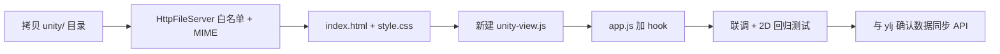

# ylj 分支 Unity 3D 视图合并方案

> 对照分支：`origin/ylj_navigator`（Person C）  
> 目标分支：当前主开发线（`hzx_common2` 等）  
> 参考目录：`d:\car_homework\new\`（git worktree，不覆盖主项目）

---

## 1. 背景

Person C（ylj）在 `ylj_navigator` 分支实现了 **Unity WebGL 3D 地图视图**，与现有 2D Canvas 仿真页并存，通过按钮切换。

主项目在此期间已新增：

- 路径回放 API + 历史场次下拉
- 统计/回放同步保存（`SimulationRecordService`）
- 动态加车修复（`CAR_LAUNCHED`、进程清理、JAR 复制）
- 任务完成保存弹窗、`buildWebSocketUrl` 等

因此 **不能整文件覆盖**，应采用选择性合并。

---

## 2. ylj 改动清单

| 文件/目录 | 类型 | 说明 |
|-----------|------|------|
| `display/src/main/resources/web/unity/` | **新增** | Unity WebGL 构建（`Build/*.wasm/.data/.js`、`TemplateData/`、`index.html`），约 6.5MB |
| `display/src/main/resources/web/index.html` | 修改 | 增加 `btn-unity`、`unity-shell` iframe 容器 |
| `display/src/main/resources/web/css/style.css` | 修改 | `.unity-shell`、`.unity-frame`、`.unity-input-layer` 等样式 |
| `display/src/main/resources/web/js/app.js` | 修改 | 约 150 行：2D/3D 切换、iframe 尺寸、摄像机控制桥接 |
| `display/src/main/java/.../HttpFileServer.java` | 修改（轻微） | ylj 分支本身几乎无 Unity 专用逻辑；**合并时需主动补充**白名单与 MIME |
| `common/src/main/resources/logback.xml` | 修改（可选） | 日志格式 `%logger{0}` vs `%logger{36}` |
| `start_all.bat` | 修改（可选） | 启动前 `mvn install`、UTF-8 编码，与 3D 无强耦合 |

### 2.1 3D 功能实际范围（重要）

ylj 当前集成主要是 **「视图壳 + 摄像机控制」**：

- 2D Canvas ↔ Unity iframe 切换
- 通过 `unityInstance.SendMessage('GameController', ...)` 发送：
  - `OnWebPan`
  - `OnWebOrbit`
  - `OnWebZoom`

**尚未在 `app.js` 中发现**将 WebSocket 仿真数据（地图位图、小车位置、路径）推送给 Unity 的逻辑。  
合并后若 3D 场景不随仿真更新，需与 Person C 确认 Unity 侧期望的数据接口（例如 `UpdateState(json)`）。

### 2.2 资源路径说明

| 路径 | 是否用于合并 |
|------|----------------|
| `display/src/main/resources/web/unity/` | ✅ 正确来源 |
| `display/target/classes/web/unity/` | ❌ 编译产物，不要从这里拷贝 |

---

## 3. 与当前项目的冲突点

### 3.1 当前有、ylj 没有（合并时须保留）

- `ReplayApiHandler` + `/api/replay/` 路由
- `index.html` 中 `replay-run-select` 历史场次下拉
- `SimulationRecordService`（保存时同步写入回放表 + 统计表）
- `CAR_LAUNCHED` / `CAR_LAUNCH_FAILED` 加车反馈
- `DynamicCarProcessKiller`、动态 JAR 启动
- `buildWebSocketUrl()`、任务完成保存/不保存弹窗
- `POST /api/analysis/discard`

### 3.2 ylj 有、当前没有（需要合入）

- 整个 `web/unity/` 目录
- `btn-unity` 按钮与 `unity-shell` DOM
- `app.js` 中 Unity 视图逻辑（建议拆到独立 JS）
- `style.css` 中 Unity 相关样式

### 3.3 `app.js` 差异规模

两版 `app.js` 相差约 **150 行**，适合 **选择性合并** 或 **拆模块**，禁止整文件替换。

---

## 4. 推荐合并步骤

### 步骤 0：准备参考目录（已完成）

```powershell
# 已在项目根创建独立 worktree，不污染主工作区
git worktree add d:\car_homework\new origin/ylj_navigator
```

```text
d:\car_homework\       ← 主项目（继续开发）
d:\car_homework\new\   ← ylj 快照（只读对照）
```

---

### 步骤 1：原样拷贝 Unity 静态资源（零冲突）

```powershell
Copy-Item -Recurse `
  "d:\car_homework\new\display\src\main\resources\web\unity" `
  "d:\car_homework\display\src\main\resources\web\unity"
```

注意：

- `unity.wasm`、`unity.data` 等体积较大，正常提交 Git 或后续考虑 Git LFS
- `mvn compile` 后自动出现在 `target/classes/web/unity/`

---

### 步骤 2：修改 `HttpFileServer.java`（必做）

在**现有**文件上追加，**保留** `ReplayApiHandler` 等已有逻辑。

**白名单增加：**

```java
"/unity/"
```

**MIME 类型增加：**

```java
"wasm", "application/wasm"
"data", "application/octet-stream"
"ico",  "image/x-icon"
```

**原因：** Unity 通过 iframe 加载 `unity/index.html` 及其 `.wasm/.data`，请求**不会**携带 Bearer Token，必须白名单放行，否则会 401。

---

### 步骤 3：修改 `index.html` + `style.css`（低冲突）

#### index.html

对照 `new/display/src/main/resources/web/index.html`：

1. 在「添加小车」旁增加：

   ```html
   <button id="btn-unity" class="btn" title="切换到 Unity 3D 地图">🎮 3D视图</button>
   ```

2. 在 `map-stack` 后增加：

   ```html
   <div id="unity-shell" class="unity-shell" hidden>
     <iframe id="unity-frame" class="unity-frame"
             src="unity/index.html" title="Unity 3D 地图" tabindex="-1"></iframe>
     <div id="unity-input" class="unity-input-layer"
          title="左键拖移 | Shift+左键或右键旋转 | 滚轮缩放"></div>
   </div>
   ```

3. **保留**现有 `replay-run-select`、历史场次、保存弹窗相关结构。

#### style.css

从 ylj 版追加 Unity 样式块（约 106–121 行），不改动其它已有样式：

- `.unity-shell` / `.unity-shell.active`
- `.unity-frame`
- `.unity-input-layer`
- `.map-area.map-area-unity`

---

### 步骤 4：`app.js` 拆模块（推荐）

避免与主 `app.js` 大规模冲突，新建独立文件：

```text
display/src/main/resources/web/js/unity-view.js   ← 从 ylj app.js 提取
display/src/main/resources/web/js/app.js          ← 仅增加少量 hook
```

#### unity-view.js 职责

从 ylj `app.js` 迁移：

| 功能 | 说明 |
|------|------|
| `is3DView` 状态 | 当前是否为 3D 模式 |
| `show3DMapView()` / `exitUnityView()` | 显示/隐藏 iframe |
| `syncUnityFrameSize()` | 按地图尺寸调整 iframe |
| `initUnityCameraInput()` | 指针/滚轮事件 |
| `sendUnityCamera()` | 调用 `GameController.OnWebPan/Orbit/Zoom` |

#### app.js 仅增加 hook（示例）

```javascript
// finalizeCanvas 末尾
if (window.UnityView) UnityView.onCanvasReady();

// onResetClick、进入回放、任务完成时
if (window.UnityView) UnityView.exit();

// window resize
if (window.UnityView) UnityView.syncSize();

// 待 Unity 接口确认后（可选）
// if (window.UnityView && is3DView) UnityView.syncSimulation(liveData);
```

#### index.html 引入顺序

```html
<script src="js/unity-view.js"></script>
<script src="js/app.js"></script>
```

---

### 步骤 5：可选改进（非 3D 核心）

| 文件 | 建议 |
|------|------|
| `logback.xml` | 保留当前格式，或采用 ylj 短 logger 名 |
| `start_all.bat` | 可借鉴「启动前 `mvn install -DskipTests`」与 UTF-8 设置；与 `scripts/_common.ps1` 的 `-am` 思路一致 |
| `CAR_COLORS` | ylj 为 3D 调了降饱和色；可 2D 保持现状，3D 模式单独色板 |

---

## 5. 合并流程图



---

## 6. 验证清单

合并完成后逐项检查：

- [ ] `http://localhost:8887/unity/index.html` 可访问
- [ ] 浏览器 Network 中 `.wasm`、`.data` 返回 200，MIME 正确
- [ ] 2D：开始 / 暂停 / 重置 / 加车 / 回放 / 保存统计 均正常
- [ ] 点击「3D视图」→ iframe 加载 Unity
- [ ] 再点「2D视图」→ 回到 Canvas
- [ ] 3D 模式下拖移 / 旋转 / 滚轮缩放有响应
- [ ] 仿真运行时 3D 场景是否随小车/地图更新（需 Person C 确认接口后补测）

---

## 7. 分工与工期估算

| 阶段 | 负责人 | 内容 | 预估 |
|------|--------|------|------|
| 1–3 | Display（你） | 静态资源 + HttpFileServer + HTML/CSS | 0.5 天 |
| 4 | Display + ylj | 拆 `unity-view.js`、hook 对接 | 1 天 |
| 5 | ylj | Unity 数据同步接口（若需要） | 视 Unity 工程而定 |

---

## 8. 禁止事项

| 做法 | 原因 |
|------|------|
| ❌ 用 ylj 的 `app.js` / `index.html` 整文件覆盖 | 会丢失回放、统计同步、加车修复 |
| ❌ 从 `target/classes/web/unity` 拷贝 | 应用 `src/main/resources/web/unity` |
| ❌ 整分支 `git merge ylj_navigator` | 冲突面大，回滚成本高 |

---

## 9. 关键代码对照位置

| 内容 | ylj 参考路径（`new/` 下） |
|------|---------------------------|
| Unity 资源 | `display/src/main/resources/web/unity/` |
| 3D 按钮与 iframe | `display/src/main/resources/web/index.html` |
| Unity 样式 | `display/src/main/resources/web/css/style.css` |
| 视图逻辑 | `display/src/main/resources/web/js/app.js`（搜索 `is3DView`、`unity-shell`） |
| Unity 入口页 | `display/src/main/resources/web/unity/index.html` |

---

## 10. 后续：仿真数据同步（待 ylj 确认）

若 3D 需与 2D 同步显示小车与地图，建议在 `unity-view.js` 增加：

```javascript
function syncSimulation(state) {
  var instance = resolveUnityInstance();
  if (!instance) return;
  instance.SendMessage('GameController', 'UpdateState', JSON.stringify(payload));
}
```

在 `app.js` 的 `onSocketMessage` 中，当 `is3DView === true` 时调用。  
具体方法名与 JSON 结构需与 Unity 工程 `GameController` 脚本一致，由 Person C 提供接口文档。

---

*文档生成日期：2026-06-23*
