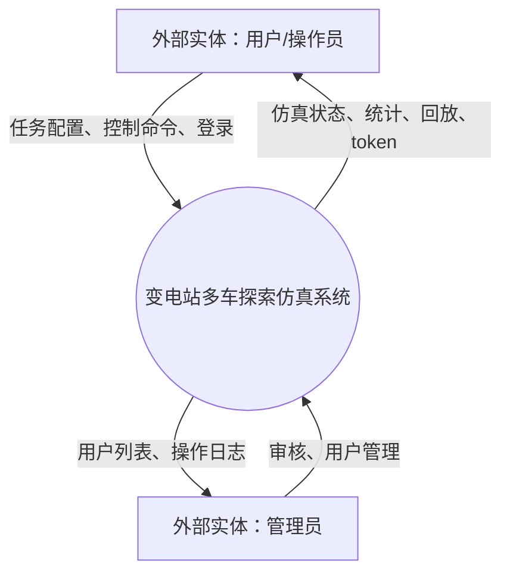
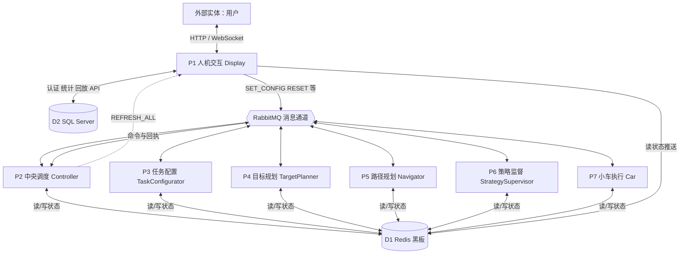
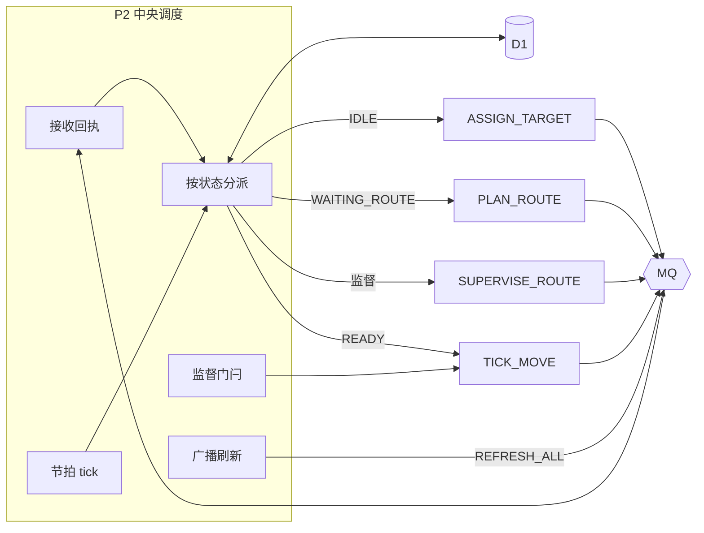
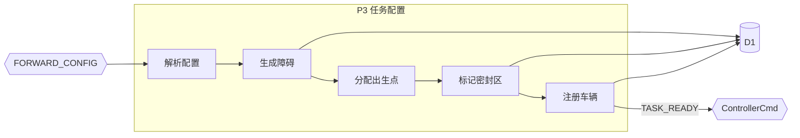

# 变电站巡检仿真系统 — DFD 数据流图说明

> 用于软件工程 / 软件体系结构课程：上下文图、0 层分解、数据存储与主要数据流。  
> 对应架构：Redis 黑板 + RabbitMQ 消息 + 多进程 Java 模块 + Display HTTP/WebSocket。

---

## 1. DFD 元素与项目映射

| DFD 元素 | 在本项目中的含义 | 示例 |
|----------|------------------|------|
| **外部实体** | 使用系统、不与系统内部加工混淆的角色 | 操作员、管理员 |
| **处理（加工）** | 对数据进行变换的业务进程/模块 | Controller、Navigator |
| **数据存储** | 持久或共享的数据集合 | Redis 黑板、SQL Server |
| **数据流** | 数据在实体、处理、存储之间的传递 | 任务配置、车轨迹、控制命令 |

**不宜作为 DFD「子系统」的内容：**

- Docker、Tailscale、四人四机部署 → 属于**部署视图**，不进逻辑 DFD
- `common` 模块 → 共享代码库，能力归入各**处理 P**
- RabbitMQ → 通常画成**数据流通道**或旁注「消息队列」，与 Redis 黑板区分

---

## 2. 上下文图（Context Diagram）

### 2.1 系统边界

**一个总系统：变电站多车探索仿真系统**

边界内：Display、Controller、TaskConfigurator、TargetPlanner、Navigator、StrategySupervisor、Car、common 中的认证/统计/回放服务等。

边界外：通过浏览器访问的用户。

### 2.2 外部实体

| 实体 | 说明 | 可与谁合并 |
|------|------|------------|
| **E1 操作员** | 登录、配置地图、开始/暂停/重置、观看仿真 | 验收演示常用 |
| **E2 管理员** | 审核注册、用户管理、操作日志 | 可与 E1 合并为「用户」，用角色区分 |
| **E3 分析员** | 查看统计、路径回放、保存场次 | 可与 E1 合并 |

### 2.3 上下文级主要数据流

| 从 → 到 | 数据流名称 | 说明 |
|---------|------------|------|
| 操作员 → 系统 | 登录凭证 | HTTP `POST /api/auth/login` |
| 操作员 → 系统 | 任务配置 | 地图宽高、车数、障碍比例、算法、节拍 |
| 操作员 → 系统 | 控制命令 | 开始、重置、暂停、调速、加车、切障碍 |
| 系统 → 操作员 | 认证结果 | token、角色 |
| 系统 → 操作员 | 仿真状态 | tick、探索率、车辆位置/路线、地图 |
| 系统 → 操作员 | 统计与回放 | 场次列表、轨迹回放、有效率/均衡指数 |
| 管理员 → 系统 | 管理指令 | 审核注册、重置密码 |
| 系统 → 管理员 | 用户与日志 | 用户列表、operation_logs |



---

## 3. 0 层图：七个处理（子系统）

按**职责**划分，与代码模块一一对应；**不按 Person A/B/C/D 四台电脑划分**。

| 编号 | 处理名称 | 对应模块 | 核心职责 |
|------|----------|----------|----------|
| **P1** | 人机交互与网关 | Display + 浏览器 | HTTP API、WebSocket、转发命令、推送画面 |
| **P2** | 中央调度 | Controller | 五态节拍、发令、任务结束、刷新触发 |
| **P3** | 任务与地图初始化 | TaskConfigurator | 建图、障碍、密封区、注册车辆、TASK_READY |
| **P4** | 目标规划 | TargetPlanner | 前沿格、分配探索目标 |
| **P5** | 路径规划 | Navigator | BFS/A* 算路、写 RouteList |
| **P6** | 策略监督 | StrategySupervisor | 路线评估、重合检测、加权优化 |
| **P7** | 小车执行 | Car（多实例） | TICK_MOVE、移动、探索、上报 MOVED |

**若作业要求 0 层不超过 5 个处理**，可合并：

- P4 + P5 → **探索规划**（仍建议 P6 单独保留，体现监督器）

---

## 4. 数据存储

| 编号 | 名称 | 技术 | 存储内容 |
|------|------|------|----------|
| **D1** | 仿真黑板 | Redis | mapView / mapBlock / mapSealed、Car*:Status/Position/Target/RouteList/History、TaskConfig、explorationEvents |
| **D2** | 业务数据库 | SQL Server | users、registration_requests、operation_logs、simulation_runs、simulation_run_stats |
| **（旁注）** | 消息通道 | RabbitMQ | *Cmd 队列上的命令与事件（非长期状态） |

**说明：**

- 仿真**运行中**的权威状态在 **D1**；各 P2～P7 通过 `BlackboardClient` 读写
- **D2** 用于登录 Session 关联（Session 在 Redis `auth:session:*`）、场次归档、统计分析
- **规划路线** `RouteList` 仅在 D1，**不**归档进 SQL；回放用 **History 轨迹**

---

## 5. 0 层数据流总图



---

## 6. 各处理的数据流明细

### P1 人机交互与网关（Display）

| 方向 | 数据流 | 来源/去向 |
|------|--------|-----------|
| 输入 | 用户命令 | 外部实体 → WebSocket |
| 输入 | REFRESH 触发 | P2 经 MQ Fanout |
| 输入 | 黑板快照 | 读 D1 |
| 输出 | 仿真画面 JSON | → 外部实体 |
| 输出 | 控制命令 | → MQ `ControllerCmd` |
| 输出/输入 | 登录、统计、回放 | ↔ D2（HTTP API） |

**典型命令（WebSocket → MQ）：** `SET_CONFIG`、`RESET`、`TOGGLE_PAUSE`、`SET_TICK_INTERVAL`、`TOGGLE_OBSTACLE`  
**本地处理（不转发）：** `ADD_CAR`（本机启动 Car 进程）

---

### P2 中央调度（Controller）

| 方向 | 数据流 | 说明 |
|------|--------|------|
| 读/写 | 车辆五态、pending 标记 | D1 + 内存 |
| 输入 | TASK_READY、ROUTE_PLANNED、MOVED… | MQ `ControllerCmd` |
| 输出 | ASSIGN_TARGET、PLAN_ROUTE、SUPERVISE_ROUTE、TICK_MOVE | MQ 各业务队列 |
| 输出 | REFRESH_ALL | MQ Fanout → P1 |
| 输入 | SET_CONFIG、RESET | 来自 P1 |

**唯一实例**：Redis `controller:instance` 锁。

---

### P3 任务与地图初始化（TaskConfigurator）

| 方向 | 数据流 | 说明 |
|------|--------|------|
| 输入 | FORWARD_CONFIG、FORWARD_RESET | MQ `TaskConfigCmd` |
| 输出 | TASK_READY | → P2 |
| 写 | TaskConfig、mapBlock、mapSealed、Car* 初始状态 | D1 |
| 写 | 出生格探索 | D1 mapView |

**代码入口：** `TaskConfiguratorMain` → `TaskInitializer.initialize()`

---

### P4 目标规划（TargetPlanner）

| 方向 | 数据流 | 说明 |
|------|--------|------|
| 输入 | ASSIGN_TARGET | MQ |
| 读 | 地图、前沿、他车占用 | D1 |
| 写 | Car Target | D1 |
| 输出 | TARGET_ASSIGNED | → P2 |

---

### P5 路径规划（Navigator）

| 方向 | 数据流 | 说明 |
|------|--------|------|
| 输入 | PLAN_ROUTE | MQ |
| 读 | 障碍、探索位图、起终点 | D1 |
| 写 | RouteList | D1 |
| 输出 | ROUTE_PLANNED | → P2 |

可多实例竞争消费 `NavigatorCmd`（扩展算力）。

---

### P6 策略监督（StrategySupervisor）

| 方向 | 数据流 | 说明 |
|------|--------|------|
| 输入 | SUPERVISE_ROUTE | MQ |
| 读 | 路线、探索率、他车路线 | D1 |
| 写 | 优化后 RouteList（或清目标/路线） | D1 |
| 输出 | ROUTE_OPTIMIZED | → P2 |

P2 在 `awaitingSupervision` 期间不发 `TICK_MOVE`。

---

### P7 小车执行（Car）

| 方向 | 数据流 | 说明 |
|------|--------|------|
| 输入 | TICK_MOVE、BLOCKED_TIMEOUT | MQ `Car_{id}` |
| 读/写 | 位置、状态、RouteList | D1 |
| 写 | mapView 探索、History 轨迹 | D1 |
| 输出 | MOVED、ROUTE_DONE、BLOCKED | → P2 |

每车独立进程，各有一个 `BlackboardClient`（连同一 D1）。

---

## 7. 建议的 1 层展开（选 1～2 个画细图）

### 7.1 P2 中央调度（推荐）



### 7.2 P3 任务初始化（推荐）



---

## 8. 关键端到端数据流（口述用）

### 8.1 点「开始」

```
用户 → P1: SET_CONFIG
P1 → MQ → P2: SET_CONFIG
P2 → MQ → P3: FORWARD_CONFIG
P3 → D1: 写地图/车辆/TaskConfig
P3 → MQ → P2: TASK_READY
P2: 启动 tick 调度
```

### 8.2 一车一步

```
P2 → MQ → P7: TICK_MOVE
P7 → D1: 更新位置、探索、History
P7 → MQ → P2: MOVED
P2 → MQ → P1: REFRESH_ALL（经 Fanout）
P1 → D1: 读快照 → 用户浏览器
```

### 8.3 保存回放

```
用户 → P1: 保存统计（HTTP）
P1 → D2: simulation_run_stats
（归档）P1/common: 从 D1 读 History/地图 → D2 simulation_runs
用户回放 → P1: GET /api/replay/runs/{id} → D2
```

---

## 9. 与四人分工的对应（部署视图，非 DFD 子系统）

| 人员 | 常跑进程 | DFD 中的处理 |
|------|----------|--------------|
| Person A | Redis/MQ、Controller | P2 + 基础设施 |
| Person B | Car × N | P7 |
| Person C | TaskConfigurator、Navigator、TargetPlanner、StrategySupervisor | P3、P4、P5、P6 |
| Person D | Display、SQL、浏览器 | P1 + D2 |

DFD **逻辑**按 P1～P7 画；**物理**可在报告另附部署图说明多机。

---

## 10. 绘图检查清单

- [ ] 上下文图只有一个系统 + 外部实体
- [ ] 0 层图处理数约 7（或合并后 5～6），每个处理有编号 P1…Pn
- [ ] Redis、SQL 画成**数据存储**（开口矩形），不是处理
- [ ] MQ 标为数据流或旁注，不与 Redis 混淆
- [ ] 数据流有名称（如「任务配置」「车轨迹」），不只写「数据」
- [ ] 不出现「Java 类名」堆砌；用业务名（中央调度、路径规划）

---

## 11. 相关文档

- [接口文档.md](./接口文档.md) — HTTP / WebSocket / MQ 消息明细
- [手动启动指南.md](./手动启动指南.md) — 进程启动顺序
- [personA/](./personA/) — Person A 模块说明

---

## 12. 验收一句话

> 上下文图把**整个仿真系统**作为黑箱；0 层拆 **Display、Controller、TaskConfigurator、TargetPlanner、Navigator、StrategySupervisor、Car** 七个处理，**Redis 为黑板数据存储，SQL 为持久化存储，RabbitMQ 为模块间命令流**；按职责而非按四台电脑划分。
