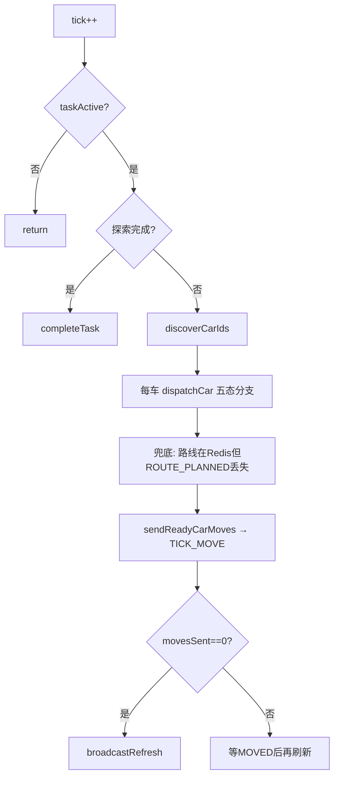

# Controller 调度器说明

Controller 是仿真系统的 **大脑**：唯一节拍驱动器、唯一 `TICK_MOVE` 发送方。它不自己算路、不自己移动，只根据 Redis 里每辆车的状态，通过 MQ 指挥 TargetPlanner、Navigator、Car、StrategySupervisor。

---

## 一、什么时候工作？

| 阶段 | 行为 |
|------|------|
| 进程启动 | 连 Redis/MQ、抢单实例锁、订阅 `ControllerCmd`，**不 tick** |
| 收到 `SET_CONFIG` | 停调度、清 pending、转发 `FORWARD_CONFIG` |
| 收到 `TASK_READY` | `taskActive=true`，启动 `TickScheduler` |
| 每拍 `dispatch()` | 发现车辆 → 五态分发 → 发移动令 → 可能刷新前端 |
| 探索 100% 或任务完成 | `completeTask()`，停调度 |
| 收到 `RESET` | 停调度、转发重置、清状态 |

**未收到 `TASK_READY` 前**，`dispatch()` 直接 return，车不会动。

---

## 二、模块组成

| 类 | 职责 |
|----|------|
| `ControllerMain` | 入口：连中间件、单实例锁、组装组件、订阅 MQ |
| `TickScheduler` | 定时器，默认 **500ms** 一拍，可调 100～2000ms |
| `CommandHandler` | 解析 `ControllerCmd` 入站消息，转给 Dispatcher / Scheduler |
| `StatusDispatcher` | **核心**：`dispatch()` 五态循环、发令、收回调 |

路径：`controller/src/main/java/com/substation/controller/`

---

## 三、每拍 `dispatch()` 做什么？

1. `tick++`
2. 遍历所有车，按 `CarStatus` 调用 `dispatchCar`
3. 对 `READY` 且满足条件的车发 **`TICK_MOVE`**
4. 若本拍没人可动，发 **`REFRESH_ALL`**（fanout）

---

## 四、五态分发（`dispatchCar`）

| 状态 | 本拍动作 |
|------|----------|
| `IDLE` | 发 `ASSIGN_TARGET` → TargetPlanner（`pendingTargetRequests` 防重复） |
| `WAITING_ROUTE` | 发 `PLAN_ROUTE` → Navigator；超时 5 tick 无路线则清目标回 IDLE |
| `READY` | 在第二轮 `sendReadyCarMoves` 里发 `TICK_MOVE` |
| `MOVING` | 检测卡住：连续 2 tick 仍 MOVING → 强制改 READY |
| `BLOCKED` | 随机 2～5 tick 超时后清路线/目标，回 IDLE，发 `BLOCKED_TIMEOUT` |

**监督中**：车在 `awaitingSupervision` 时 **不发** `PLAN_ROUTE` 和 `TICK_MOVE`（防路线闪烁）。

---

## 五、MQ 回调（CommandHandler → StatusDispatcher）

| 收到消息 | 处理 |
|----------|------|
| `TASK_READY` | `onTaskReady()`，启动调度 |
| `TARGET_ASSIGNED` | 成功 → `WAITING_ROUTE`；失败 → 保持/收尾 |
| `ROUTE_PLANNED` | 成功 → 可能监督 → `READY`；失败 → `IDLE` |
| `ROUTE_OPTIMIZED` | 重合重分配 或 监督结束 → `READY` |
| `MOVED` / `ROUTE_DONE` / `BLOCKED` | `onMoveAcknowledged`，清 `pendingMoveRequests` |
| `SET_CONFIG` / `RESET` / `TOGGLE_PAUSE` / `SET_TICK_INTERVAL` | 配置与控制 |

---

## 六、TICK_MOVE 谁发、何时发？

**只有 Controller 发**，路径：`trySendTickMove` → `Car_{carId}` 队列。

必须同时满足：

1. `taskActive`
2. 状态 `READY`
3. 不在 `awaitingSupervision`
4. 不在 `pendingMoveRequests`（上一轮移动未 ack）

收到 `MOVED` / `ROUTE_DONE` / `BLOCKED` 后从 `pendingMoveRequests` 移除，下一拍才能再发。

---

## 七、策略监督衔接

算路成功且 `shouldSupervise(carId)` 时：

- 探索率 **< 85%**
- 距上次监督 **≥ 15 tick**

流程：加入 `awaitingSupervision` → 发 `SUPERVISE_ROUTE` → 等 `ROUTE_OPTIMIZED` → `onRouteSupervisionFinished` 后再允许 `TICK_MOVE`。

详见 [策略监督器说明.md](./策略监督器说明.md)。

---

## 八、Controller 发出的主要 MQ

| 消息 | 目标队列 |
|------|----------|
| `ASSIGN_TARGET` | `TargetPlannerCmd` |
| `PLAN_ROUTE` | `NavigatorCmd` |
| `SUPERVISE_ROUTE` | `StrategySupervisorCmd` |
| `TICK_MOVE` | `Car_{carId}` |
| `BLOCKED_TIMEOUT` | `Car_{carId}` |
| `FORWARD_CONFIG` / `FORWARD_RESET` | `TaskConfigCmd` |
| `REFRESH_ALL` | `UpdateView` fanout |

---

## 九、pending 集合（防重复与防跳格）

| 集合 | 作用 |
|------|------|
| `pendingTargetRequests` | 已发 `ASSIGN_TARGET`，等 `TARGET_ASSIGNED` |
| `pendingPlanRequests` | 已发 `PLAN_ROUTE`，等 `ROUTE_PLANNED` |
| `pendingMoveRequests` | 已发 `TICK_MOVE`，等移动 ack |
| `awaitingSupervision` | 已发 `SUPERVISE_ROUTE`，等 `ROUTE_OPTIMIZED` |

`prepareForNewConfig` / `onTaskReady` / `forwardReset` 会清空这些集合，避免上轮任务残留。

---

## 十、关键常量

| 常量 | 值 | 含义 |
|------|-----|------|
| `SUPERVISE_RATE_THRESHOLD` | 85 | 探索率超此值不监督 |
| `SUPERVISE_COOLDOWN_TICKS` | 15 | 同车监督冷却 |
| `WAITING_ROUTE_TIMEOUT_TICKS` | 5 | 等路线超时 |
| `MOVING_STUCK_TICKS` | 2 | MOVING 卡住恢复 |
| `BLOCKED_TIMEOUT_MIN/MAX` | 2～5 | 阻塞随机超时 |
| 默认 tick 间隔 | 500ms | `TickScheduler` |

---

## 十一、单实例与启动顺序

- 启动时 `acquireControllerLock()`，已有实例则退出
- 建议 **最后启动** Controller（先 TC / Nav / TP / SS / Car / Display）
- 启动时 `purgeQueue(ControllerCmd)` 清积压

---

## 十二、一句话总结

**Controller = 节拍 + 状态机调度器**：`TASK_READY` 后每拍看五态，依次触发分目标、算路、（监督）、移动；`TICK_MOVE` 只从这里发出，且一车一拍最多一条（等 ack）。

---

## 十三、相关源码

| 文件 | 路径 |
|------|------|
| 入口 | `controller/.../ControllerMain.java` |
| 定时器 | `controller/.../TickScheduler.java` |
| MQ 路由 | `controller/.../CommandHandler.java` |
| 核心调度 | `controller/.../StatusDispatcher.java` |

测试：`StatusDispatcherTest`、`CommandHandlerTest`。
