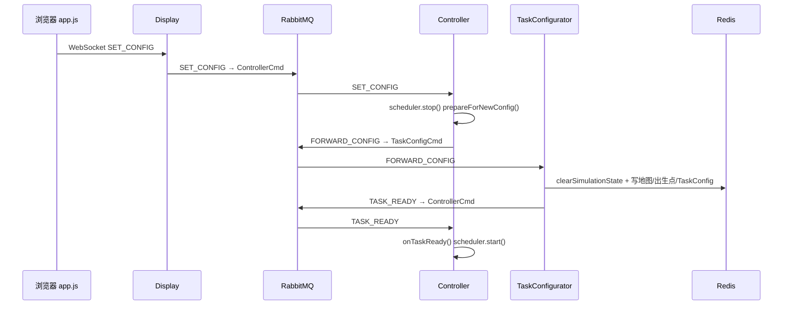
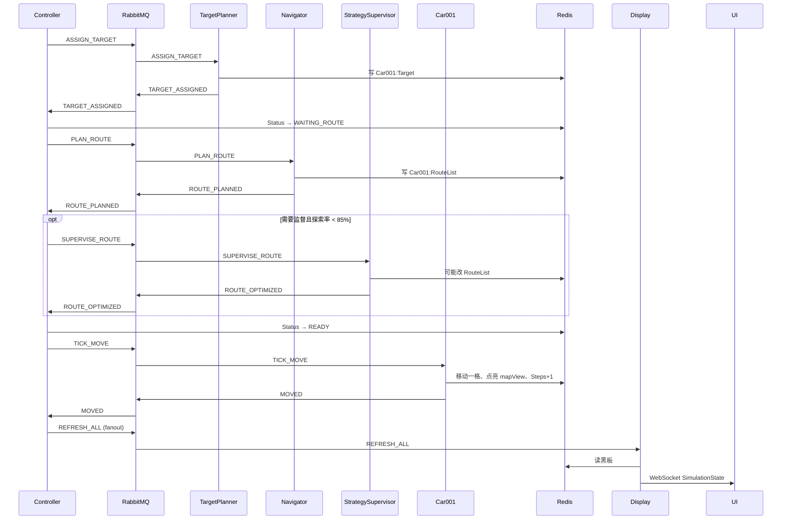

# Person A 代码阅读路线

> **读者**：Person A（`hzx_common` 分支）  
> **职责**：common 核心协议与黑板、controller 节拍调度、strategy-supervisor 路线监督、common/map 探索优化算法  
> **配套文档**：[`PROJECT_CONTEXT.md`](../../PROJECT_CONTEXT.md)（全局）、[`../人员分工.md`](../人员分工.md)（原始分工）、[`../人员代码阅读指南.md`](../人员代码阅读指南.md)（文件索引）、[`PersonA模块说明索引.md`](./PersonA模块说明索引.md)（模块说明）

---

## 1. 怎么读才不容易迷路

不要按 Maven 模块字母顺序看。推荐路径是：

1. 先知道**系统干什么、数据存在哪**
2. 再跟**一次「点开始 → 车动一格」**的完整消息链
3. 最后深入**你负责的那几块**

读每个 Java 文件时，固定问四个问题：

| 问题 | 说明 |
|------|------|
| **谁调用我？** | 入口、`main`、MQ 订阅、定时器回调 |
| **我读/写 Redis 哪些 key？** | 对照 `BlackboardClient` 与 `PROJECT_CONTEXT.md` §6 |
| **我发/收哪些 MQ 消息？** | 对照 `MessageTypes` + `QueueNames` |
| **失败或边界时怎么办？** | 超时、pending 集合、状态回退 |

改代码前养成习惯：**先 grep 常量名**，再跑对应模块测试。

---

## 2. 推荐阅读顺序（约 4～5 天）

### 第 0 步：建立地图（半天）

| 顺序 | 读什么 | 目的 |
|------|--------|------|
| 1 | [`PROJECT_CONTEXT.md`](../../PROJECT_CONTEXT.md) §1–§8 | 模块列表、节拍数据流、五态状态机、Redis key、MQ 队列、启动顺序 |
| 2 | `../人员分工.md` | 原始接口约定；弄清 C/B/D 各管什么 |
| 3 | `../人员代码阅读指南.md` → **Person A** 整节 | 你的文件清单与必跑测试 |
| 3b | `PersonA模块说明索引.md` | 各模块说明文档（Controller、MQ、黑板等） |
| 4 | **跑一遍** | `docker compose up -d` → `start_all.bat` → 浏览器点「开始」 |

这一步不必抠实现。目标是脑子里有一张总图：

```
浏览器 → Display → MQ → TaskConfigurator 写黑板
                    → Controller 收到 TASK_READY 开始 tick
                    → 每拍：分目标 → 算路 → (监督) → 移动 → REFRESH → 前端刷新
```

---

### 第 1 步：公约层 — common（约 1 天）

全员都依赖你维护的接口，按下面顺序读：

| 顺序 | 文件 | 怎么读 |
|------|------|--------|
| 1 | `common/.../mq/MessageTypes.java` | 抄一张消息类型小表 |
| 2 | `common/.../mq/QueueNames.java` | 哪个模块订阅哪个队列 |
| 3 | `common/.../mq/MessageBuilder.java` | 看 2～3 条典型消息的 JSON 字段 |
| 4 | `common/.../model/CarStatus.java` | 五态枚举 |
| 5 | `common/.../model/Point.java`、`RouteStep.java` | 坐标与路径步 |
| 6 | `common/.../model/SimulationState.java` | WebSocket 推给前端的快照结构 |
| 7 | **`common/.../redis/BlackboardClient.java`** | **最重要**；按方法名跳读，不要从头到尾 |
| 8 | [`PROJECT_CONTEXT.md`](../../PROJECT_CONTEXT.md) §6 | Redis key 表与 BlackboardClient 对照 |

**BlackboardClient 建议先搜这些方法：**

- `discoverCarIds`、`getCarStatus`、`setCarStatus`
- `getCarTarget`、`setCarTarget`、`clearCarTarget`
- `getCarRoute`、`clearRoute`
- `getExplorationRate`、`isExplorationComplete`
- `clearSimulationState`、`beginSimRun`、`clearSimRunMetadata`
- `writeBlockBitmap`（障碍批量写入，联调性能相关）

**验证（必跑）：**

```powershell
cd D:\car_homework
.\mvnw.cmd test -pl common -Dtest=BlackboardClientTest,MessageBuilderTest,MessageTypesTest
```

---

### 第 2 步：系统心脏 — controller（1～2 天）

按**一次任务生命周期**读，不要按类名随机跳。

| 顺序 | 文件 | 关注点 |
|------|------|--------|
| 1 | `controller/.../ControllerMain.java` | 启动、连 Redis/MQ、订阅 `ControllerCmd`、单实例锁 |
| 2 | `controller/.../TickScheduler.java` | 节拍定时器；`start` / `stop` / `togglePause` / `setInterval` |
| 3 | `controller/.../CommandHandler.java` | **事件驱动**：各类 MQ 回调如何转给 `StatusDispatcher` |
| 4 | `controller/.../StatusDispatcher.java` | **每拍逻辑**：`dispatch()` → `dispatchCar()` 五态分支 |

**StatusDispatcher 阅读路线：**

1. `dispatch()` — 一拍拍做什么：发现车辆 → 分派 → 发移动 → 刷新
2. `dispatchCar()` — `IDLE` / `WAITING_ROUTE` / `READY` / `MOVING` / `BLOCKED` 各走哪条分支
3. 回调方法 — `onTargetAssigned`、`onRoutePlanned`、`onMoveAcknowledged`
4. 监督相关 — `shouldSupervise`、`sendSuperviseRoute`、`awaitingSupervision`、`onRouteSupervisionFinished`、`onRouteOverlapReassign`
5. 收尾 — `completeTask()`、`broadcastRefresh()`

建议自己画一张五态转移图（纸笔或 mermaid），比反复看代码更高效。

**验证（必跑）：**

```powershell
.\mvnw.cmd test -pl controller -Dtest=StatusDispatcherTest,CommandHandlerTest
```

有时间可跑 `controller/.../ConsoleDemo.java`（纯 MQ 联调演示）。

---

### 第 3 步：路线监督 — strategy-supervisor（半天～1 天）

**前提**：已理解 Controller 何时发 `SUPERVISE_ROUTE`、如何处理 `ROUTE_OPTIMIZED`。

| 顺序 | 文件 | 关注点 |
|------|------|--------|
| 1 | `strategy-supervisor/.../StrategySupervisorMain.java` | 订阅 `StrategySupervisorCmd`，处理 `SUPERVISE_ROUTE` |
| 2 | `strategy-supervisor/.../RouteOverlapEvaluator.java` | 路线与其他车是否重叠 |
| 3 | `strategy-supervisor/.../WeightedPathPlanner.java` | 加权路径替换原路线 |
| 4 | `strategy-supervisor/.../RouteEvaluator.java` | 评估接口扩展点 |

读的时候始终对照：

- `StatusDispatcher.onRoutePlanned()` — 何时进入 `awaitingSupervision`
- `CommandHandler` — `ROUTE_OPTIMIZED` 分支（`overlapReassign` vs `optimized`）

**验证：**

```powershell
.\mvnw.cmd test -pl strategy-supervisor -Dtest=RouteOverlapEvaluatorTest
```

---

### 第 4 步：探索优化 — common/map（约 1 天）

与 C 的 `GreedyTargetAllocator` **有调用关系**，建议从**调用方反推**：

| 顺序 | 从哪进 | 再看什么 |
|------|--------|----------|
| 1 | `WeightedPathPlanner.java` | 如何调 `ExplorationWeightedPathFinder` |
| 2 | `ExplorationWeightedPathFinder.java` | 加权寻路主逻辑 |
| 3 | `ExplorationPathCosts.java` | 已探索格代价常量 |
| 4 | `FrontierCellFinder.java` | 前沿格子（未探索与已探索交界） |
| 5 | C 的 `GreedyTargetAllocator.java`（只读） | 如何调 `FrontierCellFinder` — 改接口需通知 C |
| 6 | `UnexploredClusterFinder.java` 等 | 扩展阅读 |

`ReachabilityAnalyzer`、`SpawnPositionSelector` 属 TaskConfigurator 初始化链，**知道存在即可**，不必优先深挖。

**验证：**

```powershell
.\mvnw.cmd test -pl common -Dtest=FrontierCellFinderTest,ExplorationPathComparisonTest
```

改 map 探索逻辑后，建议 C 跑：`GreedyTargetAllocatorTest`。

---

### 第 5 步：周边模块（按需、别一开始啃）

| 主题 | 读到什么程度 | 代表路径 |
|------|--------------|----------|
| 任务初始化 | 知道流程 | C：`task-configurator/.../TaskConfiguratorMain.java`、`TaskInitializer.java` |
| 路径规划 | 知道 PLAN_ROUTE 谁消费 | C：`navigator/...` |
| 目标分配 | 知道 ASSIGN_TARGET 谁消费 | C：`target-planner/.../GreedyTargetAllocator.java` |
| 小车移动 | 知道 MOVED 从哪来 | B：`car/...` |
| 前端刷新 | 知道 REFRESH_ALL | D：`display/.../WebSocketBridge.java`、`web/js/app.js` |
| 分布式地址 | 联调时再看 | `common/.../infra/InfraConnectionConfig.java`、`deploy/infra.local.json` |
| 回放归档 | 改接口时再看 | `common/.../replay/*` |
| 登录用户 | 基本不用 | B/D：`common/.../auth/**` |

---

## 3. 从点「开始」到第一辆车移动 — 消息序列

下面是一条**典型成功路径**（单车 `Car001`，含可选监督）。括号内为主要负责模块。

### 3.1 初始化阶段



| 步骤 | 消息 | 队列 | 关键代码 |
|------|------|------|----------|
| 1 | `SET_CONFIG` | `ControllerCmd` | D：`WebSocketBridge`；Ctl：`CommandHandler` §SET_CONFIG |
| 2 | `FORWARD_CONFIG` | `TaskConfigCmd` | Ctl：`StatusDispatcher.forwardConfig()`；TC：`TaskConfiguratorMain` |
| 3 | （写黑板） | — | TC：`TaskInitializer` → `BlackboardClient` |
| 4 | `TASK_READY` | `ControllerCmd` | TC 发；Ctl：`onTaskReady()` 启动 `TickScheduler` |

### 3.2 第一个探索循环（每拍或每步）



| 阶段 | 车辆状态变化 | 你应看的 A 侧代码 |
|------|--------------|-------------------|
| 分目标 | `IDLE` → `WAITING_ROUTE` | `sendAssignTarget()`、`onTargetAssigned()` |
| 算路 | `WAITING_ROUTE` →（监督中）→ `READY` | `checkAndPlanRoute()`、`onRoutePlanned()`、`shouldSupervise()` |
| 移动 | `READY` → `MOVING` → `READY`/`IDLE` | `trySendTickMove()`、`onMoveAcknowledged()` |
| 刷新 | — | `broadcastRefresh()`；D 侧 `WebSocketBridge` |

### 3.3 五态与「谁写状态」

| 状态 | 含义 | 主要写入者 |
|------|------|------------|
| `IDLE` | 无目标/路径或走完 | Car、Controller |
| `WAITING_ROUTE` | 有目标，等路径 | **Controller**（`onTargetAssigned`） |
| `READY` | 有路径，等本拍移动 | Controller、Car |
| `MOVING` | 本拍正在移动 | **Car** |
| `BLOCKED` | 下一步被挡 | **Car** |

**原则**：Car **不写** `WAITING_ROUTE`；Controller **不写** `MOVING`。

---

## 4. 按天学习计划（参考）

```
Day 1   PROJECT_CONTEXT + MessageTypes/QueueNames + BlackboardClient 核心方法
Day 2   CommandHandler → StatusDispatcher（跟五态与 dispatch 循环）
Day 3   strategy-supervisor + 与 Controller 监督回调对照
Day 4   common/map 探索优化 + 相关测试
Day 5   完整联调；RabbitMQ 管理台查 Consumers；Redis 查 Car*:Status
```

---

## 5. 联调与排错（Person A 常用）

### 5.1 启动顺序

```
docker compose up -d
TaskConfigurator → Navigator → TargetPlanner → StrategySupervisor
→ Car001…Car00N → Display → Controller（建议最后）
```

一键：`start_all.bat`（默认 3 台车）。

### 5.2 排错顺序

1. **RabbitMQ 管理台**（`http://localhost:15672`）— 各业务队列 **Consumers 是否 = 1**（多开会抢消息，车会一卡一卡）
2. **TaskConfigCmd** — 点开始后是否有消费者在；无消费者则收不到 `TASK_READY`
3. **Controller 窗口** — 是否有 `[Controller] 收到 TASK_READY，启动调度`
4. **Redis** — `TaskConfig`、`Car001:Status`、`Car001:RouteList` 是否合理
5. **节拍** — 大地图 + 100ms tick 容易卡；联调建议 30×30、500ms

### 5.3 改接口前的检查清单

| 你改了什么 | 必须通知 | 必须跑什么 |
|------------|----------|------------|
| `MessageTypes` / `MessageBuilder` | **全员** | 全仓库 grep + `common` MQ 测试 |
| `BlackboardClient` key 或语义 | 全员 | `BlackboardClientTest` + 联调一轮 |
| `SimulationState` 字段 | D（前端） | Display 相关 |
| `FrontierCellFinder` 等 map API | C | `FrontierCellFinderTest` + C 的 `GreedyTargetAllocatorTest` |
| Controller 调度逻辑 | C/B（行为变化） | `StatusDispatcherTest` + 联调 |

---

## 6. 快速文件索引（Person A 主维护）

完整列表见 `../人员代码阅读指南.md` § Person A。模块说明见 `PersonA模块说明索引.md`。最常打开的几个：

| 领域 | 路径 |
|------|------|
| 节拍调度 | `controller/.../StatusDispatcher.java` |
| MQ 回调 | `controller/.../CommandHandler.java` |
| 黑板 | `common/.../redis/BlackboardClient.java` |
| 消息公约 | `common/.../mq/MessageTypes.java`、`QueueNames.java`、`MessageBuilder.java` |
| 路线监督 | `strategy-supervisor/.../StrategySupervisorMain.java`、`WeightedPathPlanner.java` |
| 加权路径 | `common/.../map/ExplorationWeightedPathFinder.java` |
| 前沿格子 | `common/.../map/FrontierCellFinder.java` |

---

## 7. 一句话总结

**Person A 的主线**：`PROJECT_CONTEXT` 数据流 → `MessageTypes` + `BlackboardClient` → `StatusDispatcher.dispatch()` 五态循环 → `StrategySupervisor` + `common/map` 加权路径 → 测试全绿 → 按需扫 C/B/D 边界。

---

**文档版本**：2026-06-24  
**维护**：Person A；与 `../人员代码阅读指南.md` 同步更新
