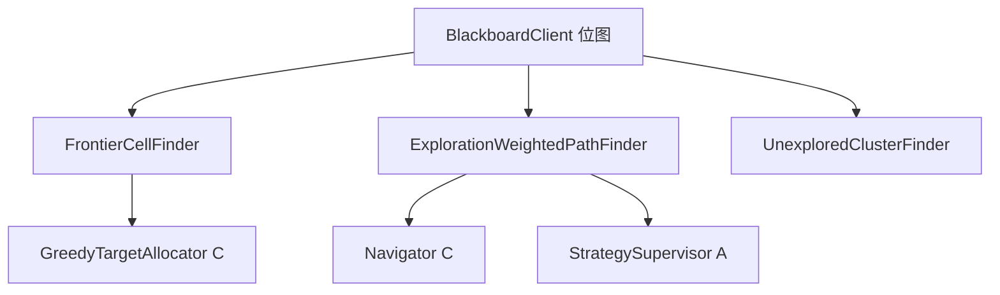

# 探索地图算法（common/map）说明

`common/map` 提供 **探索导向的几何与寻路工具**：找前沿格、加权偏好未探索路径、划分未探索连通块、可达性分析等。主要由 Person A 维护；TargetPlanner（Person C）和 StrategySupervisor 会调用。

---

## 一、什么时候用到？

| 算法 | 调用方 | 时机 |
|------|--------|------|
| `FrontierCellFinder` | `GreedyTargetAllocator`（C） | 给 IDLE 车选探索目标时，从前沿格中贪心选取 |
| `ExplorationWeightedPathFinder` | Navigator、监督器相关逻辑 | 算路时偏好走未探索格 |
| `UnexploredClusterFinder` | 目标分配扩展、分析 | 将剩余未探索区划成块 |
| `ReachabilityAnalyzer` | `TaskInitializer`（C） | 初始化时分析可达性 |
| `SpawnPositionSelector` | `TaskInitializer`（C） | 选出生点 |
| `ShortestHopPathFinder` | 辅助最短跳数 | 距离估算 |

**Person A 主维护**：`FrontierCellFinder`、`ExplorationWeightedPathFinder`、`ExplorationPathCosts`、`UnexploredClusterFinder`。

---

## 二、前沿格（FrontierCellFinder）

**定义**：同时满足

1. 格子 **未探索**
2. 不是障碍、不是 sealed 区
3. **四邻**至少有一格 **已探索**（且非障碍）

即「已探索区与未知区的交界线上的可通行格」——天然适合作为下一探索目标。

```java
List<Point> frontiers = FrontierCellFinder.findFrontierCells(
    explored, obstacles, sealed, width, height);
```

TargetPlanner 的 `GreedyTargetAllocator` 在前沿集合里按距离/负载贪心分配，避免两车抢同一目标（与监督器的路线重合检测互补）。

---

## 三、加权寻路（ExplorationWeightedPathFinder）

**目的**：最短路径不一定最优探索路径；穿过大量已探索走廊会浪费步数。

**代价**（`ExplorationPathCosts`）：

| 格子类型 | 步长代价 |
|----------|----------|
| 未探索 | **1** |
| 已探索 | **5** |

支持两种模式：

- `WEIGHTED_DIJKSTRA`：按累计代价扩展
- `WEIGHTED_ASTAR`：带曼哈顿启发式

```java
List<Point> path = ExplorationWeightedPathFinder.plan(
    start, target, blocked, explored, width, height, SearchMode.WEIGHTED_ASTAR);
```

**与监督器的区别**：

| | common/map | strategy-supervisor `WeightedPathPlanner` |
|---|------------|----------------------------------------|
| 已探索代价 | 5 | 3 |
| 触发 | Navigator 算路 / 被引用 | 仅监督器收到 `SUPERVISE_ROUTE` 时 |
| 目标 | 初次或替换路径 | 静默覆盖已有 `RouteList` |

---

## 四、未探索聚类（UnexploredClusterFinder）

用 BFS/洪水填充把剩余 **未探索、可通行** 格子按四邻接连通性分成若干 `UnexploredCluster`。

用途：

- 分析还剩几块未知区域
- 扩展目标分配策略（大块优先等）

---

## 五、其他工具类（了解即可）

| 类 | 作用 |
|----|------|
| `ReachabilityAnalyzer` | 从出生点出发哪些格可达 |
| `SpawnPositionSelector` | 在可达区内选分散出生点 |
| `ShortestHopPathFinder` | 无权图最短跳数（BFS） |
| `UnexploredCluster` | 聚类结果 record |

初始化链路由 Person C 的 `TaskInitializer` 调用；改 API 需通知 C 跑 `GreedyTargetAllocatorTest`。

---

## 六、数据输入从哪来？

算法本身 **不连 Redis**，调用方负责加载位图：

```java
boolean[][] explored = bb.loadExploredBitmap();
boolean[][] blocked = bb.loadBlockedMap();  // 或 loadBlockedMapWithCars()
boolean[][] sealed = bb.loadSealedBitmap();
int w = bb.getMapWidth();
int h = bb.getMapHeight();
```

保持 **纯函数** 风格，便于单元测试（内存小数组即可）。

---

## 七、算法关系图



---

## 八、改代码注意

| 改动 | 影响 | 测试 |
|------|------|------|
| 前沿格判定条件 | C 的目标分配 | `FrontierCellFinderTest` |
| `EXPLORED_STEP_COST` | Navigator 路径形状 | `ExplorationPathComparisonTest` |
| 聚类逻辑 | 分析/分配扩展 | `UnexploredClusterFinder` 相关测试 |

---

## 九、一句话总结

**common/map = 探索专用的地图几何库**：前沿格告诉车「往哪探」，加权寻路告诉车「怎么绕开已走过的走廊」；与 Controller 调度、监督器路线质检一起提高多车探索效率。

---

## 十、相关源码

| 文件 | 路径 |
|------|------|
| 前沿格 | `common/.../map/FrontierCellFinder.java` |
| 加权寻路 | `common/.../map/ExplorationWeightedPathFinder.java` |
| 代价常量 | `common/.../map/ExplorationPathCosts.java` |
| 未探索聚类 | `common/.../map/UnexploredClusterFinder.java` |
| C 侧调用示例 | `target-planner/.../GreedyTargetAllocator.java` |

测试：

```powershell
.\mvnw.cmd test -pl common -Dtest=FrontierCellFinderTest,ExplorationPathComparisonTest
```
