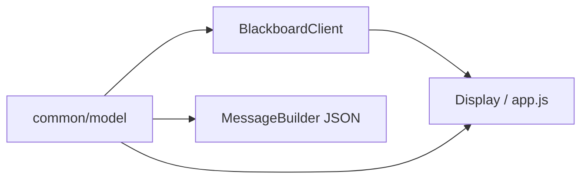

# 数据模型（common/model）说明

`common/model` 是全员共享的 **值类型与枚举**：坐标、车辆状态、算法类型、路径步、前端快照。不含业务逻辑，被 BlackboardClient、MQ 消息、Display 共同引用。

---

## 一、包含哪些类？

| 类 | 职责 |
|----|------|
| `Point` | 二维坐标 `(x, y)`，含曼哈顿距离、JSON 友好 |
| `CarStatus` | 小车五态枚举 + 中文名 + 前端颜色 |
| `AlgorithmType` | 路径算法：`BFS`、`ASTAR` |
| `RouteStep` | 路径中的一步（位置 + 步序） |
| `SimulationState` | 推给前端的整局快照（地图、车辆列表、探索率等） |

路径：`common/src/main/java/com/substation/common/model/`

---

## 二、CarStatus 五态（核心）

| 状态 | 含义 | 主要写入者 |
|------|------|------------|
| `IDLE` | 无目标/路径，或路径已走完 | Car、Controller |
| `WAITING_ROUTE` | 已有目标，等待 Navigator 算路 | **Controller**（`onTargetAssigned`） |
| `READY` | 已有路径，等待本拍 `TICK_MOVE` | Controller、Car |
| `MOVING` | 本拍正在执行移动 | **Car** |
| `BLOCKED` | 下一步被障碍物挡住 | **Car** |

**分工原则**：

- Car **不写** `WAITING_ROUTE`
- Controller **不写** `MOVING`

状态在 Redis 中以字符串存储：`{carId}:Status` → 枚举名（如 `READY`）。

---

## 三、Point

- 不可变 record 风格坐标，`x` 为列，`y` 为行（与地图数组 `explored[row][col]` 对应时注意行列）
- MQ 消息里坐标常用嵌套对象：`{ "x": 3, "y": 5 }`
- `manhattan(Point other)` 用于启发式与距离估算

---

## 四、AlgorithmType

- `BFS`：广度优先最短路径（Navigator 默认之一）
- `ASTAR`：A* 寻路

值存在 `TaskConfig` 的 `algorithm` 字段；Controller 发 `PLAN_ROUTE` 时从黑板读取并带给 Navigator。

---

## 五、SimulationState

Display 的 `WebSocketBridge` 每拍（或收到 `REFRESH_ALL` 后）从黑板组装，通过 WebSocket 推给 `app.js`。

典型字段包括：

- 地图宽高、探索率
- 每辆车的位置、状态、目标、路线预览、步数
- 障碍物/探索位图摘要

**改字段必须通知 Person D**（前端 `app.js` 依赖结构）。

---

## 六、RouteStep

描述路径队列中一步的元数据；日常调度更多直接使用 `List<Point>` 存在 `{carId}:RouteList`。

---

## 七、与其他模块的关系

---

## 八、一句话总结

**数据模型 = 全系统共用的「词汇表」**：五态驱动 Controller 调度，Point 贯穿黑板与 MQ，SimulationState 是前端的唯一数据视图。

---

## 九、相关源码

| 文件 | 路径 |
|------|------|
| 五态 | `common/.../model/CarStatus.java` |
| 坐标 | `common/.../model/Point.java` |
| 前端快照 | `common/.../model/SimulationState.java` |
| 算法枚举 | `common/.../model/AlgorithmType.java` |
