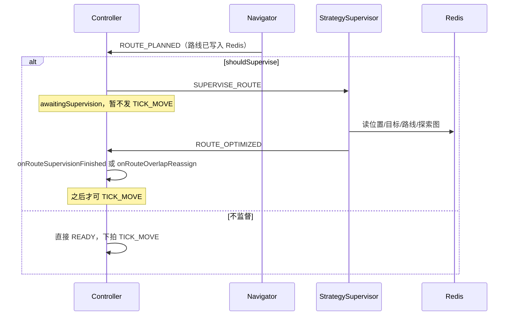

# 策略监督器（strategy-supervisor）说明

策略监督器是仿真里的 **「路线质检员」**：Navigator 算好路之后，在探索早期多查一眼——路线是否太绕已探索区、是否和其他车抢同一段未探索路；需要时 **换一条更利于探索的路**，或 **打回重分目标**。

---

## 一、什么时候会工作？

由 **Controller** 决定，不是每拍都监督。

### 触发条件（`StatusDispatcher.shouldSupervise`）

在收到 **`ROUTE_PLANNED`（算路成功）** 之后，同时满足：

| 条件 | 含义 |
|------|------|
| 全局探索率 **< 85%** | 快探索完了就不折腾路线 |
| 该车距上次监督 **≥ 15 个 tick** | 冷却，避免每算一次路就监督 |
| 任务处于活跃状态 | 已 `TASK_READY`、未结束 |

满足时 Controller：

1. 把车放进 `awaitingSupervision`（本拍 **不发 `TICK_MOVE`**）
2. 状态设为 `READY`
3. 发 **`SUPERVISE_ROUTE`** → 队列 `StrategySupervisorCmd`

对应代码（`StatusDispatcher.onRoutePlanned`）：

```java
if (shouldSupervise(carId)) {
    lastSupervisedTick.put(carId, tick);
    awaitingSupervision.add(carId);
    bb.setCarStatus(carId, CarStatus.READY);
    sendSuperviseRoute(carId);
    return;
}
```

### 不工作的典型情况

- 探索率 ≥ 85%
- 刚监督过不到 15 tick
- 算路失败（直接回 `IDLE`）
- 监督进程没启动 / MQ 无消费者

---

## 二、整体怎么串起来（消息流）



监督器 **被动**：只响应 `SUPERVISE_ROUTE`，不自己定时跑。

入口类：`strategy-supervisor/src/main/java/com/substation/strategysupervisor/StrategySupervisorMain.java`

---

## 三、监督器内部逻辑（`handleSupervise`）

收到 `SUPERVISE_ROUTE` 后，按顺序判断：

### 步骤 0：前置检查

- 有车位置、目标、路线
- 车状态必须是 **`READY`**（还没动）
- 否则直接回 `ROUTE_OPTIMIZED(optimized=false)`，等于「跳过」

### 分支 A：路线重合 → 重分目标（`RouteOverlapEvaluator`）

**问题**：多辆车要去 **同一段还没探索的路**，会互堵、效率低。

**做法**：

- 只看 **未探索格** 上的重合（已探索格不算，避免后期误判）
- 若「本车未探索路径格」里，有 **≥ 50%** 也出现在别车路线上 → **重合过高**

```java
if (shouldReassignForOverlap(carId, tick)
    && overlapEvaluator.isHighlyOverlapped(carId, currentRoute, bb)) {
    bb.clearRoute(carId);
    bb.clearCarTarget(carId);
    sendOverlapReassign(carId, ...);  // overlapReassign=true
}
```

Controller 收到后：`onRouteOverlapReassign` → 车回 **`IDLE`** → 下拍重新 `ASSIGN_TARGET`。

同一车 **10 tick 内** 不会因重合反复重分配（`OVERLAP_REASSIGN_COOLDOWN_TICKS` 冷却）。

相关文件：`RouteOverlapEvaluator.java`

### 分支 B：路线太「旧」→ 加权换路（`RouteEvaluator` + `WeightedPathPlanner`）

**问题**：Navigator 的 BFS/A* 只求最短，可能穿过 **大量已探索格**，探索效率差。

**评估（`RouteEvaluator`）**：

- 统计路线上有多少格 **已经探索过**
- 阈值随全局探索率升高：`threshold ≈ globalRate + 0.05`（约 30%～80%）
- 若「已探索格占比 ≥ 阈值」→ `NEED_OPTIMIZE`

**优化（`WeightedPathPlanner`）**：

- 加权 Dijkstra：**未探索格代价 1，已探索格代价 3**
- 从当前位置到 **原目标** 重新算一条路
- 新路不能比原路长 **2 倍以上**（`MAX_PATH_LENGTH_RATIO = 2.0`）；算不出或车已动 → 放弃

成功则 **`bb.pushRoute` 静默替换** Redis 里的 `RouteList`，车不用停。

```java
bb.pushRoute(carId, newRoute);
sendResult(carId, true, ...);  // optimized=true
```

Controller：`markSupervised` + `onRouteSupervisionFinished` → 去掉 `awaitingSupervision`，下拍可 `TICK_MOVE`。

若只是检查完、不需要改：`optimized=false`，同样 `onRouteSupervisionFinished` 放行。

相关文件：`RouteEvaluator.java`、`WeightedPathPlanner.java`

---

## 四、和 Navigator 的分工

| | Navigator | StrategySupervisor |
|---|-----------|-------------------|
| 何时 | 每次 `PLAN_ROUTE` | 仅 Controller 发 `SUPERVISE_ROUTE` |
| 目标 | 起点→终点 **最短**（BFS/A*） | 同目标，但 **偏好未探索** |
| 算法 | `ExplorationWeightedPathFinder` 等 | 监督器内加权 Dijkstra（代价 1/3） |
| 写黑板 | 初次写 `RouteList` | **可能覆盖** `RouteList` |

监督器是 **算路之后的二次优化**，不是替代 Navigator。

---

## 五、和 Controller 的协作要点

| 机制 | 作用 |
|------|------|
| `awaitingSupervision` | 监督结果回来前 **不发移动令** |
| `awaitingSupervision` 时 `checkAndPlanRoute` 直接 return | 监督中 **不重发 PLAN_ROUTE**（防路线闪烁） |
| `markSupervised` | 下次 `PLAN_ROUTE` 带 `supervised=true` 给 Navigator（标记用） |
| `ROUTE_OPTIMIZED` | 监督结束信号，必须回到 Controller |

`CommandHandler` 处理 `ROUTE_OPTIMIZED`：

- `overlapReassign=true` → `onRouteOverlapReassign`（清路线/目标，回 IDLE）
- 否则若 `optimized=true` → `markSupervised`；最后 `onRouteSupervisionFinished`

---

## 六、关键常量速查

| 常量 | 值 | 位置 |
|------|-----|------|
| `SUPERVISE_RATE_THRESHOLD` | 85 | Controller：探索率 ≥ 85% 不监督 |
| `SUPERVISE_COOLDOWN_TICKS` | 15 | Controller：同车监督冷却 |
| `OVERLAP_THRESHOLD` | 0.5 | 未探索路径重合比例阈值 |
| `OVERLAP_REASSIGN_COOLDOWN_TICKS` | 10 | 重合重分配冷却 |
| `MAX_PATH_LENGTH_RATIO` | 2.0 | 优化后路线最长倍数 |
| `EXPLORED_PENALTY` / `UNEXPLORED_COST` | 3 / 1 | 加权路径代价 |

---

## 七、一句话总结

**什么时候工作**：探索率 < 85%、冷却已过，且 **Navigator 刚算路成功** 时，Controller 发 `SUPERVISE_ROUTE`。

**干什么**：先查多车路线在未探索区是否重合过高 → 是则清目标回 `IDLE` 重分；否则看路线是否太多已探索格 → 是则用 **加权路径** 换一条更省探索的路写回 Redis。

**干完**：发 `ROUTE_OPTIMIZED`，Controller 放行，车才能继续 `TICK_MOVE`。

---

## 八、相关源码路径

| 文件 | 职责 |
|------|------|
| `strategy-supervisor/.../StrategySupervisorMain.java` | 入口、MQ 订阅、`handleSupervise` |
| `strategy-supervisor/.../RouteOverlapEvaluator.java` | 未探索区路线重合检测 |
| `strategy-supervisor/.../RouteEvaluator.java` | 已探索比例评估 |
| `strategy-supervisor/.../WeightedPathPlanner.java` | 加权 Dijkstra 重规划 |
| `controller/.../StatusDispatcher.java` | 触发监督、`awaitingSupervision`、发 `SUPERVISE_ROUTE` |
| `controller/.../CommandHandler.java` | 处理 `ROUTE_OPTIMIZED` 回调 |
