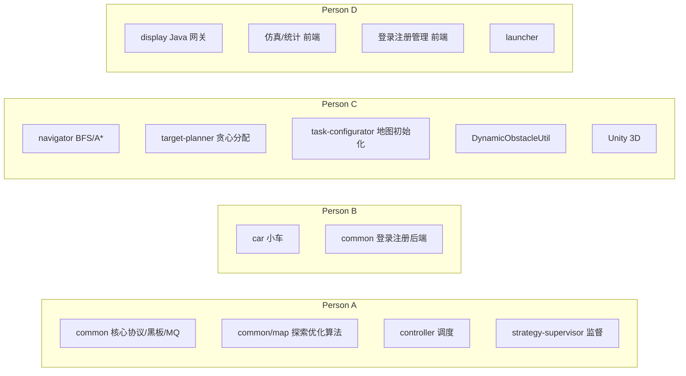

# 变电站巡检仿真系统 — 人员代码阅读指南

> **用途**：四人协作时，每人按分工快速定位「我该看哪、改哪」。  
> **路径根目录**：`d:\car_homework\`（下文省略此前缀，均从项目根写相对路径）  
> **特别约定（按团队最新分工）**：
>
> | 事项 | 负责人 |
> |------|--------|
> | 登录 / 注册 / 用户管理 **网页** | **Person D** |
> | 登录 / 注册 / 用户管理 **后端 API + 数据库** | **Person B** |
> | Unity 3D 视图 | **Person C** |
> | 策略监督器 strategy-supervisor | **Person A** |
> | **common/map 探索优化算法**（加权路径、前沿格子等） | **Person A**（后期优化，非 C 原始分工） |
>
> **与 `人员分工.md` 对齐**：Person C 的原始交付是 **navigator + target-planner + task-configurator + 动态障碍物**（及 Unity）。`common/map` 中与探索效率相关的加权路径、前沿目标等，由 **Person A 在联调阶段优化维护**；C 只调用 API，不负责改实现。

---

## 总览：四人各管哪几块

| 人员 | Git 分支（参考） | 主模块 |
|------|------------------|--------|
| **Person A** | `hzx_common` | common（核心 + **map 探索优化**）+ controller + strategy-supervisor |
| **Person B** | `lyq_car` | car + 用户系统后端 |
| **Person C** | `ylj_navigator` | navigator + target-planner + task-configurator + 动态障碍物 + Unity（见 `人员分工.md` §五） |
| **Person D** | `wsh_test` | display + launcher + 网页前端（含登录注册 UI） |

**所有人都要看的「公约」**（改之前先对齐，改接口要通知全员）：

| 文件 | 为什么都看 |
|------|------------|
| `common/src/main/java/com/substation/common/mq/MessageTypes.java` | 所有消息类型名字 |
| `common/src/main/java/com/substation/common/mq/QueueNames.java` | 队列叫什么 |
| `common/src/main/java/com/substation/common/mq/MessageBuilder.java` | JSON 消息长什么样 |
| `common/src/main/java/com/substation/common/model/CarStatus.java` | 小车五种状态 |
| `PROJECT_CONTEXT.md` | 项目全局说明 |
| `人员分工.md` | 原始分工与接口约定 |

---

## Person A — common 核心 + controller + 策略监督器

> **专题文档**：[`personA/PersonA模块说明索引.md`](./personA/PersonA模块说明索引.md)（模块说明）、[`personA/PersonA代码阅读路线.md`](./personA/PersonA代码阅读路线.md)（阅读顺序）

### 你的职责一句话

**系统大脑 + 公共协议 + 路线监督 + 地图探索优化**：定义消息和黑板怎么读写；Controller 每拍调度全车；StrategySupervisor 检查路线要不要优化；**加权路径、前沿格子等探索算法由你维护**。

### 1. 必看：controller 模块（整模块）

| 路径 | 看什么 |
|------|--------|
| `controller/src/main/java/com/substation/controller/ControllerMain.java` | 入口：连 Redis/MQ、抢单实例锁、订阅 `ControllerCmd` |
| `controller/src/main/java/com/substation/controller/TickScheduler.java` | **节拍定时器**：默认间隔、暂停、stop/start |
| `controller/src/main/java/com/substation/controller/StatusDispatcher.java` | **核心**：`dispatch()` 每拍做什么；发 `ASSIGN_TARGET`/`PLAN_ROUTE`/`TICK_MOVE`；`awaitingSupervision`；`completeTask()`；`broadcastRefresh()` |
| `controller/src/main/java/com/substation/controller/CommandHandler.java` | 处理 MQ 回调：`TASK_READY`、`MOVED`、`ROUTE_PLANNED`、`SET_CONFIG` 等 |

**测试（改 controller 必跑）：**

| 路径 |
|------|
| `controller/src/test/java/com/substation/controller/StatusDispatcherTest.java` |
| `controller/src/test/java/com/substation/controller/CommandHandlerTest.java` |
| `controller/src/test/java/com/substation/controller/ConsoleDemo.java`（联调演示） |

**与监督器相关的 Controller 代码位置**（重点）：

- `StatusDispatcher.java` → `sendSuperviseRoute()`、`onRouteSupervisionFinished()`、`onRouteOverlapReassign()`、`shouldSupervise()`
- `CommandHandler.java` → `ROUTE_OPTIMIZED` 分支

### 2. 必看：strategy-supervisor 模块（整模块，你负责）

| 路径 | 看什么 |
|------|--------|
| `strategy-supervisor/src/main/java/com/substation/strategysupervisor/StrategySupervisorMain.java` | 入口：订阅 `StrategySupervisorCmd`，处理 `SUPERVISE_ROUTE` |
| `strategy-supervisor/src/main/java/com/substation/strategysupervisor/RouteEvaluator.java` | 路线评估接口 |
| `strategy-supervisor/src/main/java/com/substation/strategysupervisor/RouteOverlapEvaluator.java` | 路线是否与其他车重叠 |
| `strategy-supervisor/src/main/java/com/substation/strategysupervisor/WeightedPathPlanner.java` | 加权路径（偏好未探索区域） |
| `strategy-supervisor/pom.xml` | 模块依赖 |

**测试：**

| 路径 |
|------|
| `strategy-supervisor/src/test/java/com/substation/strategysupervisor/RouteOverlapEvaluatorTest.java` |

**队列名**：`StrategySupervisorCmd`（见 `QueueNames.STRATEGY_SUPERVISOR_CMD`）

### 3. 必看：common 里你「拥有」的部分

#### 3.1 Redis 黑板（最重要，全员都依赖你维护接口）

| 路径 | 看什么 |
|------|--------|
| `common/src/main/java/com/substation/common/redis/BlackboardClient.java` | **全项目最核心文件**：地图位图、车辆状态、TaskConfig、`clearSimulationState()`、`beginSimRun()` 等 |
| `common/src/main/java/com/substation/common/redis/MapBitmapSnapshot.java` | 三张地图位图快照 |
| `common/src/main/java/com/substation/common/redis/DistributedLock.java` | 分布式锁（Car 移动用） |

**测试：**

| 路径 |
|------|
| `common/src/test/java/com/substation/common/redis/BlackboardClientTest.java` |

#### 3.2 MQ 消息总线

| 路径 | 看什么 |
|------|--------|
| `common/src/main/java/com/substation/common/mq/MessageBus.java` | 连接、声明队列、发布、订阅 |
| `common/src/main/java/com/substation/common/mq/MessageTypes.java` | 消息类型常量（**改这里要通知全员**） |
| `common/src/main/java/com/substation/common/mq/QueueNames.java` | 队列名常量 |
| `common/src/main/java/com/substation/common/mq/MessageBuilder.java` | 构建标准 JSON 消息 |

**测试：**

| 路径 |
|------|
| `common/src/test/java/com/substation/common/mq/MessageBusTest.java` |
| `common/src/test/java/com/substation/common/mq/MessageBuilderTest.java` |
| `common/src/test/java/com/substation/common/mq/MessageTypesTest.java` |
| `common/src/test/java/com/substation/common/mq/QueueNamesTest.java` |

#### 3.3 公共数据模型

| 路径 | 看什么 |
|------|--------|
| `common/src/main/java/com/substation/common/model/Point.java` | 坐标 |
| `common/src/main/java/com/substation/common/model/CarStatus.java` | 五态枚举 |
| `common/src/main/java/com/substation/common/model/AlgorithmType.java` | BFS / A* |
| `common/src/main/java/com/substation/common/model/RouteStep.java` | 路径步 |
| `common/src/main/java/com/substation/common/model/SimulationState.java` | 推给前端的快照结构（含 `runStartedBy`） |

#### 3.4 分布式配置（联调）

| 路径 | 看什么 |
|------|--------|
| `common/src/main/java/com/substation/common/infra/InfraConnectionConfig.java` | Redis/MQ 地址解析 |
| `common/src/main/java/com/substation/common/infra/DeployConfig.java` | `infra.local.json` 字段 |
| `common/src/main/java/com/substation/common/infra/DeployConfigLoader.java` | 读配置文件 |
| `deploy/infra.local.json` | 本机配置（gitignore，每人一份） |
| `deploy/infra.remote.example.json` | 配置示例 |

#### 3.5 回放 / 归档（与 Display 协作，接口你定）

| 路径 | 看什么 |
|------|--------|
| `common/src/main/java/com/substation/common/replay/ReplayDataBuilder.java` | 从黑板拼回放 JSON |
| `common/src/main/java/com/substation/common/replay/RunArchiver.java` | 场次归档 |
| `common/src/main/java/com/substation/common/replay/SimulationRunStore.java` | SQL 存场次 |
| `common/src/main/java/com/substation/common/replay/ReplayApiHandler.java` | HTTP `/api/replay/*` |
| `common/src/main/java/com/substation/common/replay/model/*.java` | 回放记录模型 |

#### 3.6 common/map — 探索优化算法（你主维护）

> 下列文件与 `人员分工.md` 里 C 的「BFS/A* + 贪心 + 初始化」**不是同一块**：这里是联调阶段为提升探索效率加的 **加权代价、前沿目标** 等，**改这里找 A，不要默认找 C**。

| 路径 | 看什么 |
|------|--------|
| `common/src/main/java/com/substation/common/map/ExplorationWeightedPathFinder.java` | **加权路径**：已探索格代价高，监督器与优化路线用 |
| `common/src/main/java/com/substation/common/map/ExplorationPathCosts.java` | 探索代价常量与计算 |
| `common/src/main/java/com/substation/common/map/FrontierCellFinder.java` | **前沿格子**：未探索区与已探索区交界（`GreedyTargetAllocator` 会调用） |
| `common/src/main/java/com/substation/common/map/UnexploredClusterFinder.java` | 未探索区域聚类 |
| `common/src/main/java/com/substation/common/map/UnexploredCluster.java` | 聚类数据结构 |
| `common/src/main/java/com/substation/common/map/ShortestHopPathFinder.java` | 最短跳路径辅助 |

**测试（改探索算法必跑）：**

| 路径 |
|------|
| `common/src/test/java/com/substation/common/map/FrontierCellFinderTest.java` |
| `common/src/test/java/com/substation/common/map/ExplorationPathComparisonTest.java` |
| `target-planner/src/test/java/com/substation/targetplanner/ExplorationEfficiencyComparisonTest.java`（与 C 模块联调对比） |

**与 C 的交界**：C 的 `GreedyTargetAllocator` **调用** `FrontierCellFinder`；你改前沿/加权逻辑时需 **通知 C** 跑 `GreedyTargetAllocatorTest`。

#### 3.7 common/map — 仅只读（初始化用，主逻辑在 C 的 TaskConfigurator）

| 路径 | 说明 |
|------|------|
| `common/src/main/java/com/substation/common/map/ReachabilityAnalyzer.java` | 密封区计算；**C 的 `TaskInitializer` 使用**，接口变更需通知 C |
| `common/src/main/java/com/substation/common/map/SpawnPositionSelector.java` | 出生点选择；**C 的 `TaskInitializer` 使用** |

### 4. 建议你了解、但少改的部分

| 路径 | 说明 |
|------|------|
| `common/src/main/java/com/substation/common/DynamicObstacleUtil.java` | 动态障碍，**C 负责**（`人员分工.md` §5.4） |
| `common/src/main/java/com/substation/common/auth/**` | **B 负责**，A 不改 |
| `common/src/main/java/com/substation/common/sql/**` | **B 负责** |
| `common/src/main/java/com/substation/common/admin/**` | **B 负责**（管理员 API） |
| `common/src/main/java/com/substation/common/analysis/**` | 统计分析后端；页面是 D，后端改动和 D 对齐 |

### 5. 启动与脚本（联调时用）

| 路径 |
|------|
| `start_all.bat`（A 常维护整机启动顺序） |
| `scripts/start-controller.ps1` |
| `docker-compose.yml` |

---

## Person B — car 小车 + 用户系统后端

### 你的职责一句话

**小车怎么动** + **账号怎么登录注册存数据库**。

### 1. 必看：car 模块（整模块）

| 路径 | 看什么 |
|------|--------|
| `car/src/main/java/com/substation/car/CarMain.java` | 入口：自注册、订阅 `Car_{carId}` 队列 |
| `car/src/main/java/com/substation/car/CarAgent.java` | 消息分发：`TICK_MOVE`、`BLOCKED_TIMEOUT` 等 |
| `car/src/main/java/com/substation/car/MoveExecutor.java` | **真正移动**：改 Position、点亮 mapView、步数、发 `MOVED` |
| `car/pom.xml` | shade 打包；ADD_CAR 用的 jar |
| `car/README.md` | 小车模块说明 |

**测试：**

| 路径 |
|------|
| `car/src/test/java/com/substation/car/MoveExecutorTest.java` |
| `car/src/test/java/com/substation/car/CarAgentTest.java` |
| `car/src/test/java/com/substation/car/CarMainTest.java` |

**队列**：每辆车一个队列 `Car_Car001` …（`QueueNames.carQueue(carId)`）

**与 A 的交界**：你只通过 MQ 收 `TICK_MOVE`、发 `MOVED`；状态写入遵守 `CarStatus` 约定；位置/步数写 `BlackboardClient`（你只调用，不改编黑板键名）。

### 2. 必看：用户系统后端（在 common 里，但归你管）

#### 2.1 认证 API

| 路径 | 看什么 |
|------|--------|
| `common/src/main/java/com/substation/common/auth/AuthApiHandler.java` | **`/api/auth/login`、`/api/auth/register`、改密等** |
| `common/src/main/java/com/substation/common/auth/SessionManager.java` | Token 会话（Redis `auth:session:*`） |
| `common/src/main/java/com/substation/common/auth/AuthFilter.java` | 鉴权过滤逻辑 |
| `common/src/main/java/com/substation/common/auth/AuthResponses.java` | 统一错误响应 |
| `common/src/main/java/com/substation/common/auth/UserStore.java` | 用户存储抽象 |
| `common/src/main/java/com/substation/common/auth/model/LoginRequest.java` | 登录请求体 |
| `common/src/main/java/com/substation/common/auth/model/LoginResponse.java` | 登录返回 |
| `common/src/main/java/com/substation/common/auth/model/UserInfo.java` | 用户信息 |
| `common/src/main/java/com/substation/common/auth/model/SessionInfo.java` | 会话信息 |
| `common/src/main/java/com/substation/common/auth/model/SessionValidation.java` | 校验结果 |

#### 2.2 SQL Server 持久化

| 路径 | 看什么 |
|------|--------|
| `common/src/main/java/com/substation/common/sql/DatabaseManager.java` | **数据库连接、建表、默认管理员** |
| `common/src/main/java/com/substation/common/sql/SqlUserStore.java` | 用户表 CRUD |
| `common/src/main/java/com/substation/common/sql/RegistrationStore.java` | **注册申请**待审核记录 |
| `common/src/main/java/com/substation/common/sql/OperationLogStore.java` | 操作日志 |
| `common/src/main/java/com/substation/common/sql/model/UserRecord.java` | 用户表模型 |
| `common/src/main/java/com/substation/common/sql/model/RegistrationRecord.java` | 注册申请模型 |
| `common/src/main/java/com/substation/common/sql/model/OperationLogRecord.java` | 日志模型 |

#### 2.3 管理员 API（审核注册、管用户）

| 路径 | 看什么 |
|------|--------|
| `common/src/main/java/com/substation/common/admin/AdminApiHandler.java` | **`/api/admin/*`**：审核、用户列表等 |

**测试：**

| 路径 |
|------|
| `common/src/test/java/com/substation/common/auth/UserStoreTest.java` |

#### 2.4 HTTP 路由在哪挂上（只读，别和 D 抢改）

Display 把请求转给你的 Handler：

| 路径 | 看什么 |
|------|--------|
| `display/src/main/java/com/substation/display/DisplayMain.java` | 创建 `AuthApiHandler`、`SqlUserStore`、`AdminApiHandler` |
| `display/src/main/java/com/substation/display/HttpFileServer.java` | 第 71 行起：`/api/auth/` → `authApi`；`/api/admin/` → `adminApi` |

**与 D 的交界**：

- D 做 **页面和 fetch 调用**（`login.html`、`auth.js`、`user-management.html`）
- 你做 **接口实现和数据库**；改 API 路径或 JSON 字段必须通知 D

### 3. 建议你了解

| 路径 | 说明 |
|------|------|
| `common/src/main/java/com/substation/common/redis/DistributedLock.java` | MoveExecutor 用的锁 |
| `display/src/main/java/com/substation/display/DynamicCarLauncher.java` | ADD_CAR 时怎么拉起 jar（联调用） |

### 4. 启动脚本

| 路径 |
|------|
| `scripts/start-cars.ps1` |
| `run_module.bat`（若本机单车调试） |

---

## Person C — navigator + target-planner + task-configurator + 动态障碍 + Unity

> **范围以 `人员分工.md` §五为准**：BFS/A* 路径、贪心目标分配、黑板初始化、动态障碍物工具类，以及本项目的 **Unity 3D**。**不包含** `common/map` 里由 A 后期优化的加权路径、前沿格子等（那些文件 C 只读、只调用）。

### 你的职责一句话

**规划层三模块**（初始化地图、分目标、算路径）+ **动态障碍** + **Unity 三维展示**；探索效率相关的 `common/map` 优化算法 **归 A**。

### 1. 必看：task-configurator（任务配置 / 画地图）

| 路径 | 看什么 |
|------|--------|
| `task-configurator/src/main/java/com/substation/taskconfigurator/TaskConfiguratorMain.java` | 入口：订阅 `TaskConfigCmd`，处理 `FORWARD_CONFIG` / `FORWARD_RESET` |
| `task-configurator/src/main/java/com/substation/taskconfigurator/TaskInitializer.java` | **生成障碍、放车、写密封区、`writeBlockBitmap`** |
| `task-configurator/pom.xml` | |

**测试：**

| 路径 |
|------|
| `task-configurator/src/test/java/com/substation/taskconfigurator/TaskInitializerTest.java` |

**队列**：`TaskConfigCmd`

### 2. 必看：target-planner（分目标）

| 路径 | 看什么 |
|------|--------|
| `target-planner/src/main/java/com/substation/targetplanner/TargetPlannerMain.java` | 入口：订阅 `TargetPlannerCmd` |
| `target-planner/src/main/java/com/substation/targetplanner/GreedyTargetAllocator.java` | **贪心选未探索目标** |
| `target-planner/src/main/java/com/substation/targetplanner/TargetPathEstimator.java` | 路径代价估计 |

**测试：**

| 路径 |
|------|
| `target-planner/src/test/java/com/substation/targetplanner/GreedyTargetAllocatorTest.java` |
| `target-planner/src/test/java/com/substation/targetplanner/TargetPathEstimatorTest.java` |
| `target-planner/src/test/java/com/substation/targetplanner/ExplorationEfficiencyComparisonTest.java` |

**队列**：`TargetPlannerCmd`  
**消息**：收 `ASSIGN_TARGET`，发 `TARGET_ASSIGNED`

### 3. 必看：navigator（路径规划）

| 路径 | 看什么 |
|------|--------|
| `navigator/src/main/java/com/substation/navigator/NavigatorMain.java` | 入口：处理 `PLAN_ROUTE` |
| `navigator/src/main/java/com/substation/navigator/PathPlanner.java` | 规划器接口 |
| `navigator/src/main/java/com/substation/navigator/PathPlannerFactory.java` | BFS / A* 选择 |
| `navigator/src/main/java/com/substation/navigator/BfsPathFinder.java` | 广度优先 |
| `navigator/src/main/java/com/substation/navigator/AStarPathFinder.java` | A* |

**测试：**

| 路径 |
|------|
| `navigator/src/test/java/com/substation/navigator/BfsPathFinderTest.java` |
| `navigator/src/test/java/com/substation/navigator/AStarPathFinderTest.java` |
| `navigator/src/test/java/com/substation/navigator/PathPlannerFactoryTest.java` |

**队列**：`NavigatorCmd`  
**注意**：全组只起 **1 个** Navigator 消费者；多开不会更流畅，会抢消息。

### 4. 必看：动态障碍物（`人员分工.md` §5.4，你负责）

| 路径 | 看什么 |
|------|--------|
| `common/src/main/java/com/substation/common/DynamicObstacleUtil.java` | 运行中随机增删 `mapBlock` 障碍（Controller 在 tick 中调用） |

> 文件在 `common` 模块，但分工文档写明由 **Person C 实现**；改接口需通知 **A**（Controller 调用方）。

### 5. 只读：common/map 里与初始化相关的部分（不要改加权/前沿优化）

TaskConfigurator 初始化时会用到，**实现若需改动请与 A 协商**（密封区/出生点属初始化逻辑，前沿/加权属 A 的优化）：

| 路径 | 你怎么用 |
|------|----------|
| `common/src/main/java/com/substation/common/map/ReachabilityAnalyzer.java` | `TaskInitializer` → `markSealedUnreachableCells` |
| `common/src/main/java/com/substation/common/map/SpawnPositionSelector.java` | `TaskInitializer` → 车辆出生点 |

**以下由 A 优化维护，你只调用、不要当自己的交付范围改：**

| 路径 | 说明 |
|------|------|
| `common/.../map/FrontierCellFinder.java` | `GreedyTargetAllocator` 内部调用 |
| `common/.../map/ExplorationWeightedPathFinder.java` | 监督器加权路径用 |
| `common/.../map/ExplorationPathCosts.java` | 代价配置 |
| `common/.../map/UnexploredClusterFinder.java` 等 | 探索优化扩展 |

### 6. 必看：Unity 3D（你负责）

#### 6.1 网页侧桥接（JS）

| 路径 | 看什么 |
|------|--------|
| `display/src/main/resources/web/js/unity-view.js` | **2D/3D 切换、iframe、摄像机、与 app.js 对接** |
| `display/src/main/resources/web/index.html` | Unity 按钮、`unity-shell`、`unity-frame` 等 DOM |
| `display/src/main/resources/web/css/style.css` | 与地图区域布局相关的样式（改 3D 布局时会动） |

#### 6.2 Unity WebGL 构建产物（整目录）

| 路径 | 说明 |
|------|------|
| `display/src/main/resources/web/unity/index.html` | Unity 页面入口 |
| `display/src/main/resources/web/unity/ws-redirect.js` | WebSocket 地址重定向（分布式时要理解） |
| `display/src/main/resources/web/unity/Build/unity.loader.js` | 加载器 |
| `display/src/main/resources/web/unity/Build/unity.framework.js` | 框架 |
| `display/src/main/resources/web/unity/Build/unity.wasm` | 二进制 |
| `display/src/main/resources/web/unity/Build/unity.data` | 资源包 |
| `display/src/main/resources/web/unity/TemplateData/*` | 进度条、Logo 等 UI 素材 |

**与 D 的交界**：

- `app.js` 里通过 `UnityView.init({...})` 传数据；**改接口要和 D 对齐**
- D 负责 `app.js` 主仿真逻辑；你负责 `unity-view.js` + `unity/` 目录内 WebGL 工程产出

#### 6.3 Unity 与仿真的数据从哪来（只读）

| 路径 | 说明 |
|------|------|
| `display/src/main/resources/web/js/app.js` | 搜索 `UnityView`，看 `getLiveData` 怎么传 |
| `display/src/main/java/com/substation/display/WebSocketBridge.java` | 推送给浏览器的状态 JSON 从哪来 |

### 7. 建议你了解（少改）

| 路径 | 说明 |
|------|------|
| `controller/.../StatusDispatcher.java` | 何时发 `ASSIGN_TARGET` / `PLAN_ROUTE` |
| `strategy-supervisor/**` | **A 负责**（含加权路径 `WeightedPathPlanner`） |
| `common/.../BlackboardClient.java` | 读写 RouteList、Target 的 API |

### 8. 启动脚本

| 路径 |
|------|
| `scripts/start-planner.ps1`（含 TC / TP / Nav / SS 时按脚本实际为准） |
| `scripts/start-navigator.ps1` |

---

## Person D — display + launcher + 网页前端

### 你的职责一句话

**用户看得见的全部网页**（含登录注册管理 UI）+ **WebSocket/HTTP 网关 Java 代码** + **一键启动**；登录注册的后端实现找 **B**。

### 1. 必看：登录 / 注册 / 用户管理前端（你负责）

| 路径 | 看什么 |
|------|--------|
| `display/src/main/resources/web/login.html` | **登录页 + 注册表单**（同一页切换） |
| `display/src/main/resources/web/js/auth.js` | **登录、注册、改密、Token、`/api/auth/me`、导航栏权限** |
| `display/src/main/resources/web/user-management.html` | **管理员：审核注册、用户列表** |
| `display/src/main/resources/web/dashboard.html` | 登录后入口（进仿真 / 统计 / 管理） |

**调用的后端 API（实现都在 B 的 common 里，你只对接）：**

| 前端调用 | 后端实现位置 |
|----------|----------------|
| `POST /api/auth/login` | `AuthApiHandler.java` |
| `POST /api/auth/register` | `AuthApiHandler.java` |
| `GET /api/auth/me` | `AuthApiHandler.java` |
| `POST /api/auth/change-password` | `AuthApiHandler.java` |
| `/api/admin/*` | `AdminApiHandler.java` |

**不要改**：`common/.../auth/**`、`common/.../sql/**`（那是 B 的地盘）

### 2. 必看：仿真主界面 2D（你负责）

| 路径 | 看什么 |
|------|--------|
| `display/src/main/resources/web/index.html` | 仿真页结构：地图区、控制面板、按钮 |
| `display/src/main/resources/web/js/app.js` | **核心前端**：WebSocket、Canvas 绘制、开始/暂停/重置、保存弹窗、回放、节拍同步 |
| `display/src/main/resources/web/css/style.css` | 全局样式、侧栏按钮、三栏布局 |
| `display/src/main/resources/web/js/particles.js` | 登录页粒子背景（若有） |

**Unity 相关只读/协作**（主维护 C）：

| 路径 |
|------|
| `display/src/main/resources/web/js/unity-view.js` |
| `display/src/main/resources/web/unity/**` |

### 3. 必看：统计分析前端（你负责）

| 路径 | 看什么 |
|------|--------|
| `display/src/main/resources/web/analysis.html` | 统计页布局 |
| `display/src/main/resources/web/js/analysis.js` | 记录列表、对比、图表、导入导出 |
| `display/src/main/resources/web/统计分析模块设计文档.md` | 统计产品设计 |

**后端 API（在 common，改接口和 A/B 对齐）：**

| 路径 |
|------|
| `common/src/main/java/com/substation/common/analysis/AnalysisApiHandler.java` |
| `common/src/main/java/com/substation/common/analysis/SimulationRecordService.java` |

### 4. 必看：display Java 模块（网关，你负责）

| 路径 | 看什么 |
|------|--------|
| `display/src/main/java/com/substation/display/DisplayMain.java` | **总入口**：连 Redis/MQ/SQL、起 HTTP+WS |
| `display/src/main/java/com/substation/display/HttpFileServer.java` | 静态文件 + API 路由分发 |
| `display/src/main/java/com/substation/display/WebSocketBridge.java` | **WebSocket**：收浏览器命令、推 `SimulationState`、ADD_CAR |
| `display/src/main/java/com/substation/display/ReplayCoordinator.java` | 回放请求、`beginSimRun` |
| `display/src/main/java/com/substation/display/DynamicCarLauncher.java` | 动态添加小车进程 |
| `display/src/main/java/com/substation/display/DynamicCarIdResolver.java` | 解析下一辆新车 ID |
| `display/src/main/java/com/substation/display/DynamicCarProcessKiller.java` | 重置时杀动态车进程 |
| `display/pom.xml` | |

**测试：**

| 路径 |
|------|
| `display/src/test/java/com/substation/display/WebSocketBridgeTest.java` |
| `display/src/test/java/com/substation/display/HttpFileServerTest.java` |
| `display/src/test/java/com/substation/display/DynamicCarLauncherTest.java` |
| `display/src/test/java/com/substation/display/DynamicCarIdResolverTest.java` |
| `display/src/test/java/com/substation/display/DynamicCarProcessKillerTest.java` |

**端口（默认）**：

- HTTP：`8887` → `login.html`、`index.html` …
- WebSocket：`8888` → `app.js` 连接

### 5. 必看：launcher（一键启动）

| 路径 | 看什么 |
|------|--------|
| `launcher/src/main/java/com/substation/launcher/LauncherMain.java` | 按序拉起各模块 |
| `launcher/src/test/java/com/substation/launcher/LauncherMainTest.java` | |
| `start_all.bat` | Windows 分窗启动（与 A 协作维护） |

### 6. 建议你了解（只读）

| 路径 | 说明 |
|------|------|
| `common/.../model/SimulationState.java` | WebSocket 推的 JSON 结构（A 维护） |
| `controller/.../StatusDispatcher.java` | `REFRESH_ALL` 何时发 |
| `common/.../replay/ReplayApiHandler.java` | 回放 HTTP API |

### 7. 启动脚本

| 路径 |
|------|
| `scripts/start-display.ps1` |
| `scripts/setup-config.ps1` |

---

## 跨人员协作：谁改什么要喊一声

| 改动类型 | 谁发起 | 必须通知 |
|----------|--------|----------|
| 新增/改名 MQ 消息或队列 | A | 全员 |
| 新增/改名 Redis 键 | A | B/C（写黑板的人） |
| 改 `SimulationState` JSON 字段 | A | D（前端） |
| 改 `common/map` 探索优化（加权、前沿等） | A | C（TargetPlanner / 监督器调用方） |
| 改 `FrontierCellFinder` 等接口 | A | C |
| 改 `/api/auth/*` 请求或响应 | B | D（login/auth.js） |
| 改 `/api/admin/*` | B | D（user-management.html） |
| 改 Unity 与 `app.js` 的接口 | C | D |
| 改 WebSocket 消息 type（SET_CONFIG 等） | D | A（Controller） |
| 改 TaskConfig 表单字段 | D | A + C（TC 初始化） |

---

## 按「我想查 XXX」快速索引

| 我想查… | 去看 |
|---------|------|
| 点开始后地图怎么生成 | C → `TaskInitializer.java` |
| 车为什么不动 | A → `StatusDispatcher.java`；B → `CarAgent.java` |
| 路径怎么算（BFS/A*） | C → `BfsPathFinder.java` / `AStarPathFinder.java` |
| 目标怎么选（贪心） | C → `GreedyTargetAllocator.java` |
| 加权路径 / 前沿格子 / 探索效率优化 | **A** → `ExplorationWeightedPathFinder.java`、`FrontierCellFinder.java` |
| 动态障碍 | C → `DynamicObstacleUtil.java` |
| 路线为什么要优化 | A → `StrategySupervisorMain.java` + `WeightedPathPlanner.java` |
| 网页为什么不动 | D → `app.js` + `WebSocketBridge.java` |
| 登录失败 | B → `AuthApiHandler.java`；D → `auth.js` |
| 注册审核 | B → `RegistrationStore.java`；D → `user-management.html` |
| 3D 视图黑屏 | C → `unity/` + `unity-view.js` |
| 分布式连不上 Redis | A → `InfraConnectionConfig.java` + `deploy/infra.local.json` |
| 一键启动顺序 | D/A → `start_all.bat`、`LauncherMain.java` |

---

## 相关文档

| 文档 | 适合谁 |
|------|--------|
| `项目设计文档（小白版）.md` | 零基础通读 |
| `PROJECT_CONTEXT.md` | 全员技术速览 |
| `系统设计文档.md` | A/C 深入 |
| `人员分工.md` | 原始接口清单 |
| `分布式联调使用指南.md` | 联调时全员 |

---

**文档版本**：2026-06-24（修订：common/map 探索优化归 A；C 对齐 `人员分工.md` 原始范围）  
**维护**：分工变更时同步更新本文与 `人员分工.md`。
