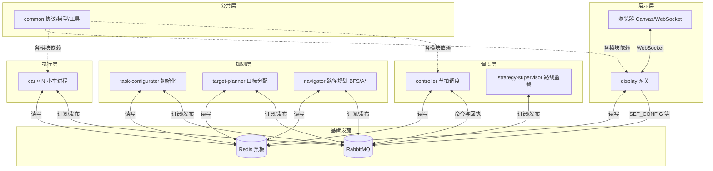

# 变电站巡检仿真系统 — 软件工程课程答辩讲稿

> **用途**：向软件工程课程老师说明本项目的架构、分工与协作方式。  
> **建议用法**：先通读全文，答辩时按 §一 → §二 → §三 口述，§四、§五 用于应对追问。  
> **项目仓库**：https://github.com/a3030765513-oss/Car_homework.git

---

## 一、30 秒项目介绍（开场白）

老师好。我们四人小组做的是 **变电站巡检仿真系统**：多台小车在二维网格地图上 **协作探索**，避开障碍物，尽量覆盖全部可达区域。

技术上采用 **Java 17 + Maven 多模块**，用 **Redis 做共享黑板、RabbitMQ 做异步消息总线**，各功能拆成 **多个独立进程**（Controller、Car、Navigator 等），通过 **Web 页面** 实时展示地图和小车状态。这符合课程里强调的 **模块化、松耦合、可协作开发** 的要求。

---

## 二、使用了什么架构（重点）

### 2.1 一句话概括

我们采用的是 **「黑板架构 + 事件驱动 + 多进程仿真」** 的组合：

- **黑板（Blackboard）**：全局状态放在 Redis，各模块只读写约定好的 key，不直接互相调用。
- **事件驱动**：模块之间通过 RabbitMQ 发 **命令与回执**（如 `ASSIGN_TARGET`、`MOVED`），Controller 按节拍和回执推进状态机。
- **多进程**：每个模块单独 JVM 进程，可分布式部署到多台电脑，更接近真实分布式系统联调。

从软件工程角度，这属于 **面向接口的松耦合架构**：模块间接口是 **MQ 消息格式 + Redis 数据约定**（定义在 `common` 模块），而不是 Java 方法直接调用。

### 2.2 架构图（可投屏或画在白板上）

### 2.3 分层说明（对应软件工程「分层架构」）

| 层次 | 模块 | 职责 |
|------|------|------|
| **公共层** | `common` | 消息类型、队列名、Redis 封装（`BlackboardClient`）、MQ 封装（`MessageBus`）、坐标/状态等模型 |
| **调度层** | `controller`、`strategy-supervisor` | 系统「大脑」：按 tick 驱动五态状态机；可选路线监督与优化 |
| **规划层** | `task-configurator`、`target-planner`、`navigator` | 地图初始化、探索目标分配、路径搜索 |
| **执行层** | `car`（可多实例） | 接收 `TICK_MOVE`，原子移动一格，更新探索与步数 |
| **展示层** | `display`、`launcher` | HTTP/WebSocket、前端 Canvas；一键按序启动各进程 |

**依赖规则**：业务模块 **只依赖 `common`**，模块之间 **禁止直接 import 调用**，只能通过 **MQ + Redis** 协作。这样四人可以并行开发、独立测试。

### 2.4 用到的设计思想 / 模式（老师若问「设计模式」）

| 名称 | 在本项目中的体现 |
|------|------------------|
| **黑板模式** | Redis 存地图、车辆状态、任务配置；大家「看黑板干活」 |
| **发布-订阅** | RabbitMQ 队列与 Fanout 广播（如 `REFRESH_ALL` 推前端） |
| **命令模式** | `MessageTypes` 定义 `ASSIGN_TARGET`、`TICK_MOVE` 等统一 JSON 命令 |
| **状态模式** | 小车五态：`IDLE` → `WAITING_ROUTE` → `READY` → `MOVING` / `BLOCKED` |
| **策略模式** | 路径算法 BFS / A* 可切换（`PathPlanner` + 工厂） |
| **外观模式** | `BlackboardClient`、`MessageBus` 隐藏 Redis/RabbitMQ 细节 |
| **工厂模式** | `PathPlannerFactory` 按配置创建规划器 |
| **单一职责** | Controller 只调度不算路；Navigator 只算路不移动小车 |

### 2.5 一次仿真的数据流（体现「怎么跑起来」）

1. 用户点「开始」→ Display 发 `SET_CONFIG` → Controller 转发 → TaskConfigurator 写黑板 → 发 **`TASK_READY`**
2. Controller 启动节拍（默认 500ms），每拍按状态发令：
   - `IDLE` → `ASSIGN_TARGET` → TargetPlanner
   - `WAITING_ROUTE` → `PLAN_ROUTE` → Navigator
   - `READY` → `TICK_MOVE` → Car
3. 各模块完成后 **MQ 回执**（如 `MOVED`、`ROUTE_PLANNED`），Controller 更新状态，下一拍继续
4. 每拍结束 `REFRESH_ALL` → Display 读黑板 → WebSocket 推浏览器

### 2.6 技术栈与工程化

| 类别 | 选型 |
|------|------|
| 语言 / 构建 | Java 17，Maven 多模块（`pom.xml` 父工程） |
| 中间件 | Redis 7、RabbitMQ 3.12（`docker compose` 统一环境） |
| 前端 | HTML / CSS / JavaScript，Canvas 二维地图 |
| 持久化 | SQL Server（用户登录、操作日志）；仿真态主要在 Redis |
| 测试 | 各模块 JUnit 单元测试；联调阶段集成验证 |
| 协作 | Git 多分支 + `main` 集成 |

---

## 三、四人分工是什么

### 3.1 分工总表（答辩直接背这张）

| 成员 | Git 分支（参考） | 负责模块 | 核心工作 |
|------|------------------|----------|----------|
| **Person A** | `hzx_common` | `common`（核心协议与黑板）+ `controller` + `strategy-supervisor` + 地图探索优化算法 | 定义全员依赖的 MQ/Redis 接口；实现唯一调度器；路线监督；联调与分布式配置 |
| **Person B** | `lyq_car` | `car` + 用户系统后端（`common/auth`、`sql`） | 小车五态与原子移动、分布式锁；登录注册与管理 API |
| **Person C** | `ylj_navigator` | `navigator` + `target-planner` + `task-configurator` + Unity 3D | BFS/A* 路径、贪心目标、地图初始化；三维视图 |
| **Person D** | `wsh_test` | `display` + `launcher` + 网页前端（仿真页、登录注册 UI、统计分析） | WebSocket 网关、Canvas 渲染、一键启动脚本 |

### 3.2 为什么这样分（老师问「依据」时答）

1. **`common` + `controller` 同一人（A）**  
   公共库和调度器是 **接口制定者 + 系统大脑**，若两人分属不同人，MQ 消息格式、Redis key、状态机语义会反复扯皮。软件工程上这叫 **控制变更边界**。

2. **`car` 独立一人（B）**  
   执行端逻辑密：移动、锁、占格、History，和调度器解耦，便于单进程多实例（`Car001`…`Car00N`）。

3. **规划三模块同一人（C）**  
   初始化、分目标、算路径都依赖同一张地图语义，一人负责 **规划域** 更连贯。

4. **`display` + 前端一人（D）**  
   技术栈不同（Java 网关 + 浏览器），且 launcher 要在最后 **集成全员模块**，由展示负责人收尾合理。

### 3.3 与原始《人员分工》的演进（如实说明）

立项文档以 `navigator + target-planner + task-configurator` 为 C 的边界；联调阶段 **A 补充** 了 `strategy-supervisor` 与 `common/map` 探索效率优化；**B 补充** 了用户系统后端；**C/D 补充** 了 Unity 与登录页。  
分工原则是：**原始模块边界不变，增强功能按技能归口，接口仍通过 `common` 统一**。

---

## 四、我们怎么讨论、怎么协作

### 4.1 阶段化开发（来自《开发计划》）

| 阶段 | 内容 | 协作方式 |
|------|------|----------|
| 第 1 阶段 | `common` 定稿、Docker 环境统一 | **A 主笔接口，全员 review 后冻结** |
| 第 2 阶段 | Controller 骨架 + Car 单步移动 | A↔B 先跑通 `TICK_MOVE` / `MOVED` |
| 第 2b 阶段 | Navigator + TargetPlanner | A↔C 跑通分目标→算路→移动 |
| 第 3 阶段 | Display + 全模块联调 | D 集成，**A 协调联调问题清单** |
| 第 4 阶段 | 测试与文档 | 各自单元测试；实验报告 D 主笔，各人写本模块章节 |

### 4.2 书面约定（《人员分工》§十）

我们在项目初期就写进文档的规则，答辩可原话引用：

| 规则 | 做法 |
|------|------|
| **common 接口定稿** | 第 1 天初版完成后 **全员 review**，确认后才开发业务模块 |
| **接口变更** | 群内说明动机与影响，**全员同意**再改 `MessageTypes` / `BlackboardClient` |
| **Redis key / MQ 格式** | 变更必须更新《人员分工》并通知全员 |
| **代码仓库** | 每人 feature 分支开发，`common` 先合 `main`，他人 rebase 后再开发 |
| **每日对齐** | 收工前约 15 分钟：进度 + 阻塞项 |
| **互为 backup** | 至少另一人能在联调时帮忙看日志、查 MQ 队列 |

### 4.3 实际讨论方式（口述模板）

可以这样跟老师说：

> 我们采用 **「文档先行 + 接口先行 + 分支并行」**。  
> 第一周先把《人员分工》和 `common` 里的消息类型、Redis key 定下来，四人分别在自己的分支上写 Main 入口和单元测试，**不互相等编译通过整个系统**。  
> 联调时由 Person A 牵头，用 **RabbitMQ 管理台看队列消费者是否唯一**、用 **Redis 看车辆状态**，问题记在群里逐条关闭。  
> 争议点（例如状态该谁写、消息要不要加字段）以 **《人员分工》状态矩阵** 和 **单元测试** 为准，避免口头约定不一致。

### 4.4 集成与联调要点（体现工程经验）

- **环境统一**：全员 `docker compose up -d` 起 Redis/RabbitMQ，避免本机版本不一。
- **启动顺序**：TaskConfigurator → Navigator → TargetPlanner → StrategySupervisor → Car×N → Display → **Controller 最后**。
- **单实例约束**：Controller、TaskConfigurator 各只允许一个消费者，否则 `TASK_READY` 或 tick 会乱。
- **测试闭环**：改 `common` 或 Controller 必跑对应 JUnit；联调通过才算该阶段完成。

---

## 五、答辩口述提纲（3～5 分钟版）

**建议顺序**：

1. **项目是什么**（§一，30 秒）  
2. **架构**（§二）：黑板 + 事件驱动 + 多进程；画图指 Redis/MQ/Controller  
3. **分工**（§三表）：四人各管哪几块，为什么 `common` 和 `controller` 在同一人  
4. **协作**（§四）：文档定接口、分支并行、每日对齐、A 协调联调  
5. **演示**（若有）：`start_all.bat` → 浏览器点「开始」→ 看探索率与多车协作  

**收束句（可背）**：

> 我们把系统拆成 **只依赖 common 的多个进程**，用 **Redis 黑板共享状态、RabbitMQ 传递命令与回执**，由 **Controller 统一节拍调度**，从而在四人并行开发下仍保证 **接口清晰、职责单一、可测试可联调**。这就是本项目的软件架构与工程协作方式。

---

## 六、老师可能追问 — 简答参考

| 问题 | 建议回答 |
|------|----------|
| 为什么不用单体 Spring Boot？ | 课程要求模拟 **分布式多智能体**；多进程 + MQ 更贴近「黑板 + 消息传递」架构，且可拆到多台机器联调。 |
| 模块之间怎么通信？ | **不直接调方法**；发 RabbitMQ JSON 消息，共享数据写 Redis。接口在 `MessageTypes`、`BlackboardClient`。 |
| 如何保证数据一致？ | Controller **发令-回执**（如 `pendingMoveRequests` 等 `MOVED`）；Car 移动用 **分布式锁 + 格子预约**；关键状态 **约定写入者**（见分工文档状态矩阵）。 |
| 如何并行开发？ | 先冻结 `common`；各人 mock MQ/Redis 写单元测试；约定消息格式后 **接口不变、实现并行**。 |
| 用了哪些设计模式？ | 见 §2.4：黑板、发布订阅、命令、状态、策略、外观等。 |
| 测试怎么做？ | 模块级 JUnit（如 `StatusDispatcherTest`、`MoveExecutorTest`）；集成阶段全进程联调 + 手工/脚本验收。 |
| 最大难点？ | **异步联调**（消息顺序、多消费者、状态卡死）；通过 **单消费者、统一环境、日志与 Redis 排查** 解决。 |

---

## 七、相关文档索引（老师若要材料）

| 文档 | 路径 |
|------|------|
| 人员分工与接口约定 | `md/人员分工.md` |
| 开发阶段与测试要求 | `md/开发计划.md` |
| 项目全局速览 | `PROJECT_CONTEXT.md` |
| 人员代码阅读指南 | `md/人员代码阅读指南.md` |
| 小白版设计说明 | `md/项目设计文档（小白版）.md` |

---

**文档版本**：2026-06-24  
**维护**：四人小组答辩用，可根据实际姓名替换 Person A/B/C/D。
