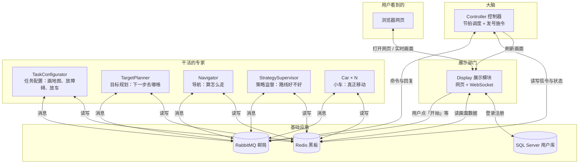
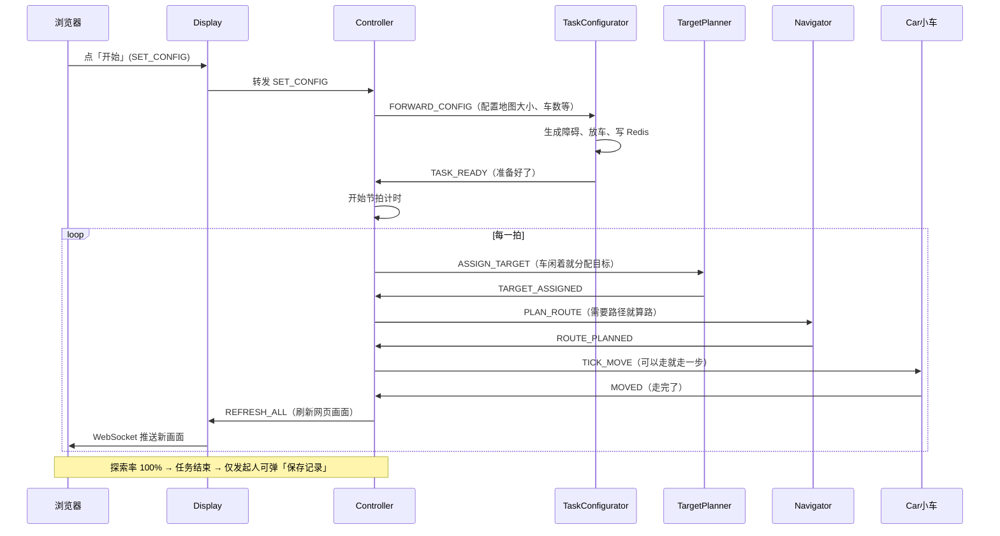
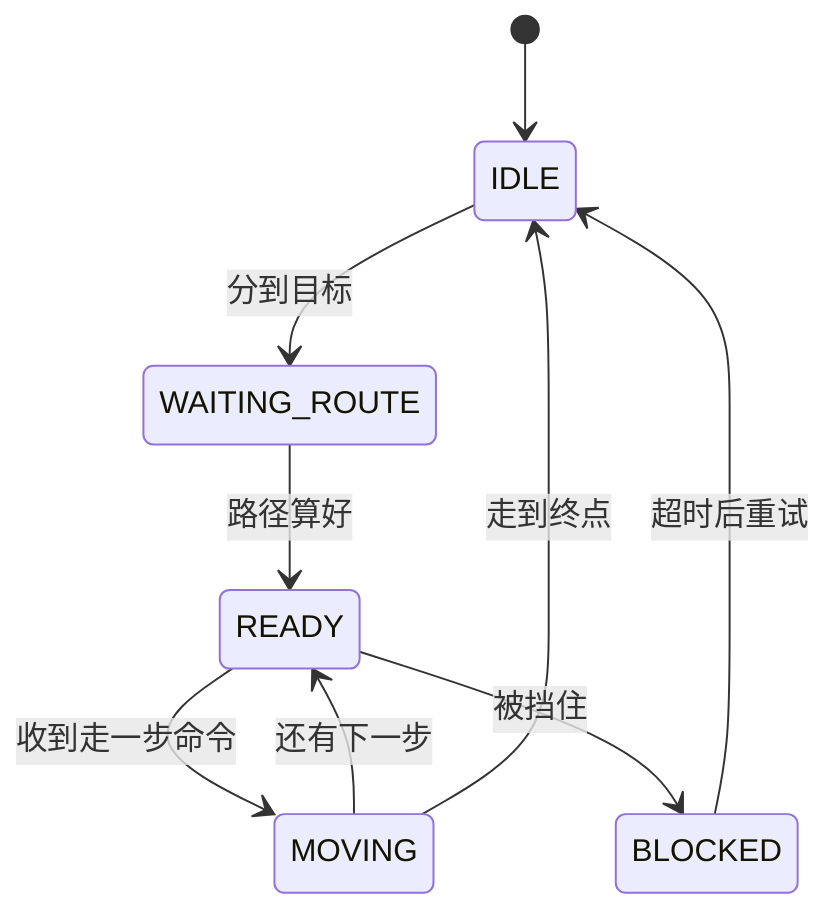

# 变电站巡检仿真系统 — 项目设计文档（小白版）

> **写给谁看**：完全没接触过本项目、甚至不太熟悉编程的读者。  
> **读完你能明白**：这是个什么软件、由哪些部分组成、数据怎么流动、怎么启动、出问题该查哪里。  
> **技术栈**：Java 17 + Redis + RabbitMQ + SQL Server + 网页（HTML/JavaScript）

---

## 目录

1. [用一句话说清楚这是什么](#1-用一句话说清楚这是什么)
2. [为什么要做成这样](#2-为什么要做成这样)
3. [先认识几个「外来词」](#3-先认识几个外来词)
4. [整体架构：像一家公司怎么分工](#4-整体架构像一家公司怎么分工)
5. [十大模块各自干什么](#5-十大模块各自干什么)
6. [两块「公共基础设施」](#6-两块公共基础设施)
7. [一次完整仿真从头到尾](#7-一次完整仿真从头到尾)
8. [小车的五种状态（必懂）](#8-小车的五种状态必懂)
9. [Redis 黑板：大家共享的记事本](#9-redis-黑板大家共享的记事本)
10. [RabbitMQ：内部邮局](#10-rabbitmq内部邮局)
11. [网页端：你能看到和点什么](#11-网页端你能看到和点什么)
12. [用户登录与权限](#12-用户登录与权限)
13. [地图、障碍、探索是怎么表示的](#13-地图障碍探索是怎么表示的)
14. [路径规划与目标分配（简化版）](#14-路径规划与目标分配简化版)
15. [节拍：仿真的心跳](#15-节拍仿真的心跳)
16. [单机启动指南](#16-单机启动指南)
17. [多人 / 多电脑联调（分布式）](#17-多人--多电脑联调分布式)
18. [配置文件说明](#18-配置文件说明)
19. [常见故障与解决办法](#19-常见故障与解决办法)
20. [项目文件夹结构](#20-项目文件夹结构)
21. [团队协作与 Git 分支](#21-团队协作与-git-分支)
22. [附录：消息类型速查表](#22-附录消息类型速查表)

---

## 1. 用一句话说清楚这是什么

这是一个 **「多台小车在二维网格地图上协作巡逻」的电脑仿真程序**。

- 地图有很多小方格，像下象棋的棋盘。
- 地图上有 **障碍物**（不能走）。
- 有多辆 **小车**，每辆车自动决定往哪走，尽量 **走遍所有能到达的格子**。
- 你在 **网页** 上能看到地图、小车移动、探索进度，还能点按钮开始、暂停、重置。

可以把它想成：**一个迷你版的「变电站巡检机器人编队」演示**，用软件模拟机器人怎么分工探索未知区域。

---

## 2. 为什么要做成这样

### 2.1 教学与课程设计

课程要求用 **「黑板风格」的分布式架构**：

- 多个独立程序（进程）同时运行；
- 它们 **不直接互相调用**，而是通过 **共享数据** 和 **发消息** 协作；
- 就像多个学生看同一块黑板、用纸条传话，而不是围在一起喊。

### 2.2 为什么不写成一个「大程序」

| 做成一个大程序 | 本项目做法（多模块） |
|----------------|----------------------|
| 改一处可能全崩 | 各模块相对独立，分工开发 |
| 只能在一台电脑跑 | 可以把不同模块放到不同电脑 |
| 难以理解「分布式」 | 贴近真实工业/互联网系统 |

---

## 3. 先认识几个「外来词」

| 词 | 大白话解释 | 在本项目里 |
|----|------------|------------|
| **进程 / 模块** | 一个单独运行的程序 | 如 Controller、Car001、Display 各是一个窗口里的 Java 程序 |
| **Redis** | 极快的「共享内存数据库」 | 存地图、小车位置、状态等，叫 **黑板** |
| **RabbitMQ** | 消息队列，像邮局 | 模块之间发「信件」（JSON 消息），不用面对面说话 |
| **WebSocket** | 网页和服务器的长连接 | 仿真画面实时刷新，不用你不停按 F5 |
| **SQL Server** | 常规关系型数据库 | 存用户账号、登录、部分统计记录 |
| **Docker** | 轻量级「装软件的盒子」 | 一键启动 Redis 和 RabbitMQ |
| **节拍 / tick** | 仿真里的「一帧」时间 | 默认每 500 毫秒系统推进一拍 |
| **探索率** | 能走的格子走了百分之几 | 到 100% 表示任务完成 |

---

## 4. 整体架构：像一家公司怎么分工



**记住三条铁律：**

1. **状态只写在 Redis 里**（黑板），各模块不各自记一份「真相」。
2. **模块之间不直接打电话**，只通过 RabbitMQ 传 JSON 消息。
3. **Controller 是唯一调度中心**，像交通指挥中心，决定什么时候该谁干活。

---

## 5. 十大模块各自干什么

项目用 Maven 分成多个 **子工程（模块）**，都在文件夹 `d:\car_homework` 下。

| 模块文件夹 | 角色比喻 | 干什么 |
|------------|----------|--------|
| **common** | 字典 + 工具箱 | 大家共用的代码：连 Redis、发 MQ、坐标、消息格式等。**不单独运行。** |
| **controller** | 总指挥 | 每隔一段时间（节拍）检查每辆车，发「分配目标」「算路」「走一步」等命令。 |
| **task-configurator** | 场地布置员 | 你点「开始」后：清空旧地图、随机放障碍、放小车出生点、写配置。 |
| **target-planner** | 侦察参谋 | 给空闲的车选一个「还没去过」的目标格子。 |
| **navigator** | 导航员 | 根据算法（BFS 或 A*）算从当前位置到目标的路径。 |
| **strategy-supervisor** | 质检员 | 检查路线是否绕路、是否和其他车重叠，必要时建议改路。 |
| **car** | 司机 | 收到「走一步」就真的动一格，更新位置、点亮探索区域、记步数。通常起多个（Car001、Car002…）。 |
| **display** | 大屏 + 遥控器 | 提供网页；把用户点击变成 MQ 消息；把仿真状态推给浏览器。 |
| **launcher** | 一键开机按钮（可选） | 按顺序帮你在本机拉起多个模块。 |
| **根目录 pom.xml** | 总工程单 | 把上面所有模块编在一起。 |

**谁依赖谁？**

- 所有业务模块都依赖 **common**。
- 业务模块 **彼此之间没有 Java 代码依赖**，只靠 Redis + MQ 配合。

---

## 6. 两块公共基础设施

### 6.1 必须用 Docker 启动的（项目自带配置）

文件：`docker-compose.yml`

| 服务 | 端口 | 作用 |
|------|------|------|
| **Redis** | 6379 | 黑板 |
| **RabbitMQ** | 5672（通信）/ 15672（管理网页） | 邮局；浏览器打开 http://localhost:15672 ，账号密码都是 `guest` |

启动命令（在项目根目录）：

```powershell
docker compose up -d
```

### 6.2 需要单独安装的

| 服务 | 端口 | 作用 |
|------|------|------|
| **SQL Server** | 1433 | 用户登录、注册审核、操作日志；Display 启动时会连它 |

连接信息在：`common/src/main/java/com/substation/common/sql/DatabaseManager.java`  
默认库名：`CarHomework`，首次启动会自动建表，并创建管理员账号。

### 6.3 本机还需要什么

- **JDK 17**（运行 Java）
- **Maven**（编译项目；可用项目自带的 `mvnw.cmd`，不必自己装 Maven）
- 浏览器（Chrome / Edge 等）

---

## 7. 一次完整仿真从头到尾

下面是你点「开始」之后，系统内部发生的事（简化版）。



**步骤文字版：**

1. **你在网页点「开始」** → Display 收到 WebSocket 消息。
2. Display 把配置发给 **Controller**。
3. Controller 转给 **TaskConfigurator** 去 **初始化地图**。
4. TaskConfigurator 完成后发 **TASK_READY**，Controller **开始按节拍运转**。
5. 每一拍，Controller 看每辆车处于什么状态，该分配目标就找 TargetPlanner，该算路就找 Navigator，该移动就给 Car 发 TICK_MOVE。
6. Car 移动后更新 Redis，并告诉 Controller「我动完了」。
7. Controller 广播 **REFRESH_ALL**，Display 从 Redis 读出最新画面，**推给你的浏览器**。
8. 当 **探索率达到 100%**，任务结束；**点「开始」的那个人** 会看到是否保存记录的弹窗。

---

## 8. 小车的五种状态（必懂）

每辆车同一时刻只有一种状态，存在 Redis 的 `Car001:Status` 这类键里。

| 状态 | 中文含义 | 什么时候 |
|------|----------|----------|
| **IDLE** | 闲着 | 没目标、或刚走完一条路 |
| **WAITING_ROUTE** | 等导航 | 已有目标点，但路径还没算出来 |
| **READY** | 准备好了 | 路径有了，等 Controller 说「这一步可以走」 |
| **MOVING** | 正在走 | 这一拍正在移动（很快会变回 READY 或 IDLE） |
| **BLOCKED** | 堵住了 | 下一步被障碍或其他车挡住 |



**重要约定（避免乱套）：**

- **Car（司机）** 负责：移动、改 MOVING/BLOCKED、走完变 IDLE。
- **Controller（指挥）** 负责：分配目标后的 WAITING_ROUTE、路径好了变 READY、发 TICK_MOVE。
- 双方 **不能抢对方该写的状态**，否则系统会卡死或乱跳。

---

## 9. Redis 黑板：大家共享的记事本

Redis 里存的是 **键值对**。与本仿真相关的主要有：

### 9.1 地图类（三张「位图」）

把地图想成很多小格子，每个格子只占 **1 个比特（0 或 1）**：

| 键名 | 含义 | 谁写 |
|------|------|------|
| `mapView` | 哪些格子 **已经探索过** | Car 走过时点亮 |
| `mapBlock` | 哪些格子是 **障碍物** | TaskConfigurator 初始化时生成 |
| `mapSealed` | 哪些空格被障碍 **封死、永远到不了** | TaskConfigurator 初始化时计算 |

### 9.2 每辆车一套（把 `Car001` 换成实际车号）

| 键名示例 | 内容 |
|----------|------|
| `Car001:Position` | 当前坐标 (x, y) |
| `Car001:Target` | 目标格坐标 |
| `Car001:RouteList` | 还要走哪些格（队列） |
| `Car001:Status` | 五种状态之一 |
| `Car001:Steps` | 总共走了多少步 |
| `Car001:EffectiveSteps` | **有效步数**（踩进「以前没走过」的格子才算） |
| `Car001:History` | 历史轨迹（回放用） |

### 9.3 全局配置

| 键名 | 内容 |
|------|------|
| `TaskConfig` | 地图宽、高、车数、障碍比例、算法 BFS/A*、节拍间隔、是否进行中 |
| `sim:run:startedBy` | 谁点的「开始」（用来决定谁弹保存框） |

### 9.4 登录相关（仿真重置时不能删）

| 键名 | 内容 |
|------|------|
| `auth:session:...` | 登录会话 |
| `auth:user_session:...` | 用户与 token 对应关系 |

**设计要点：** 点「开始」会清空 **仿真数据**，但 **不会清空登录信息**，否则你会被踢回登录页。

---

## 10. RabbitMQ：内部邮局

### 10.1 为什么需要邮局

模块分布在不同进程、甚至不同电脑，不能直接 `obj.method()` 调用。  
于是约定：**谁有什么事，就往指定「队列」里塞一条 JSON 短信**。

### 10.2 主要队列（信箱名）

| 队列名 | 谁收 | 典型消息 |
|--------|------|----------|
| `ControllerCmd` | Controller | 小车回复、任务就绪、用户命令 |
| `TaskConfigCmd` | TaskConfigurator | 开始 / 重置配置 |
| `TargetPlannerCmd` | TargetPlanner | 分配目标 |
| `NavigatorCmd` | Navigator | 算路径 |
| `StrategySupervisorCmd` | StrategySupervisor | 监督路线 |
| `Car_Car001` … | 对应那辆车 | 走一步、超时处理 |
| `UpdateView`（广播） | Display 等 | 刷新网页画面 |

### 10.3 消息长什么样

统一 JSON 格式（概念上）：

```json
{
  "type": "TICK_MOVE",
  "tick": 42,
  "carId": "Car001",
  "timestamp": 1717400000000,
  "data": { }
}
```

- **type**：消息种类（见附录）
- **tick**：第几拍
- **carId**：哪辆车（不一定每条都有）
- **data**：附加参数

### 10.4 ⚠️ 小白必知：一个队列只能有「一套」消费者在抢

如果 **同一队列挂了 2 个以上的消费者**（比如不小心开了两个 Navigator）：

- 消息会被 **随机分给其中某一个**；
- 死掉的那个也会「分到」消息但处理不了 → **小车不走、画面卡顿、点开始没反应**。

**正确做法：** 全组电脑加起来，每种模块通常只起 **1 份**（Car 除外，每辆车 1 份）。

---

## 11. 网页端：你能看到和点什么

网页文件在：`display/src/main/resources/web/`

| 页面 | 地址 | 作用 |
|------|------|------|
| 登录 | `http://localhost:8887/login.html` | 登录 / 注册申请 |
| 控制台 | `dashboard.html` | 登录后选：进仿真 / 看统计 / 管用户 |
| **仿真主界面** | `index.html` | 地图、按钮、排行榜 |
| 统计分析 | `analysis.html` | 历史记录、对比 |
| 用户管理 | `user-management.html` | 管理员审核账号 |

### 11.1 仿真页主要按钮

| 按钮 | 效果 |
|------|------|
| **开始** | 按左侧配置生成新地图并开始探索 |
| **暂停 / 继续** | 节拍停 / 恢复 |
| **重置** | 清空当前仿真，回到可再开始状态 |
| **添加小车** | 动态再起一辆车（需已编译 car 的 jar） |
| **2D / 3D 视图** | 切换平面地图或 Unity 三维视图 |

### 11.2 左侧可配置项

| 配置 | 说明 |
|------|------|
| 地图宽 / 高 | 格子数量；**越大越吃性能** |
| 小车数量 | 默认 3；与 `start_all.bat` 里起的 Car 数量最好一致 |
| 障碍比例 | 地图里多少格是障碍 |
| 算法 | BFS 或 A* |
| 节拍间隔 | 多少毫秒一拍；**100ms 很快但大地图会卡**，建议 300～500ms |

### 11.3 画面是怎么来的

1. Controller 发 `REFRESH_ALL`。
2. Display 从 Redis **读一整张快照**（地图 + 所有车）。
3. 通过 **WebSocket（端口 8888）** 发给浏览器。
4. `app.js` 用 **Canvas** 在画布上画格子、障碍、小车。

大地图（例如 100×100）每拍传很多数据，浏览器解码累，就会 **看起来一卡一卡**——这是性能问题，不是车「不会走」。

---

## 12. 用户登录与权限

- 账号数据在 **SQL Server**。
- 登录成功后浏览器存 **token**，之后访问页面、调 API 会带上。
- 常见角色：
  - **管理员**：可进用户管理、审核注册。
  - **普通用户**：可仿真、可看自己的统计。

默认管理员（首次建库后）：`admin` / `admin123`（以实际部署为准，请及时改密码）。

---

## 13. 地图、障碍、探索是怎么表示的

### 13.1 坐标

- 格子用 `(x, y)` 表示，`x` 横向，`y` 纵向，从 0 开始。
- 小车每次 **走一格**（上下左右，不走斜线）。

### 13.2 障碍物怎么生成

1. 你点开始后，TaskConfigurator 按 **障碍比例** 在地图内部随机撒点。
2. 一次性写入 Redis 的 `mapBlock`（批量写入，避免一格一格写导致分布式环境下很慢）。
3. 再算出 **被封死的死区** 写入 `mapSealed`。

### 13.3 探索怎么算

- 车走到某格，会把该格在 `mapView` 里标为已探索。
- **探索率** ≈ 已探索 ÷（总格子 − 障碍 − 死区）。
- **100%** 时任务完成。

### 13.4 有效步数 vs 总步数

- **总步数**：车一共走了多少步。
- **有效步数**：其中有多少步是踩进 **以前从未被任何车探索过** 的格子。  
  排行榜按有效步数排，更能体现「谁贡献了大片新区域」。

---

## 14. 路径规划与目标分配（简化版）

### 14.1 TargetPlanner（目标从哪来）

- 看地图上 **还没去过、能到达** 的格子。
- 用 **贪心** 思路：给每辆车挑一个合适的前沿目标。
- 把目标坐标写入 `Car00x:Target`。

### 14.2 Navigator（路怎么算）

- 读当前坐标 + 目标坐标 + 障碍地图。
- 用 **BFS**（广度优先，最短步数）或 **A\***（带启发式，通常更快）算一条路径。
- 路径写入 `Car00x:RouteList`。

### 14.3 StrategySupervisor（路线质检）

- 在探索早期，可能检查路线是否绕路、是否和其他车路径重叠。
- 若需要优化，会触发重新规划。

**关于「多台电脑各起一个 Navigator」：**  
不会让小车的 **走路画面** 更流畅；只可能在 **很多车同时等算路** 时略快一点。多开反而容易造成队列消费者重复，**更卡**。详见联调文档。

---

## 15. 节拍：仿真的心跳

- Controller 里有一个 **定时器**（默认 500ms 一次）。
- 每响一次叫做 **tick +1**。
- 每次 tick 会：
  1. 检查任务是否该结束；
  2. 按状态处理每辆车；
  3. 给 READY 的车发 TICK_MOVE（等上一轮 MOVED 都确认后再刷新画面）。

你可以把节拍理解成：**回合制游戏里的「一回合」**，不是真实世界的连续时间。

---

## 16. 单机启动指南

适合 **所有模块都在你自己这一台电脑** 上跑。

### 16.1 第一次准备

```powershell
cd D:\car_homework
docker compose up -d          # 启动 Redis + RabbitMQ
# 确认 SQL Server 已运行
.\mvnw.cmd install -DskipTests   # 编译（可选，改代码后要做）
```

### 16.2 一键启动（推荐）

```powershell
.\start_all.bat
```

脚本会：

1. **等待** Redis（6379）和 RabbitMQ 管理接口就绪；
2. 依次打开 9 个命令行窗口：
   - TaskConfigurator → Navigator → TargetPlanner → StrategySupervisor  
   - Car001、Car002、Car003 → Display → **Controller（必须最后）**

### 16.3 打开网页

1. 浏览器访问：**http://localhost:8887**
2. 登录 → 进入仿真页
3. 配置地图（新手建议 **30×30**，节拍 **500ms**）
4. 点 **开始**

### 16.4 怎么算启动成功

| 窗口 / 检查项 | 正常表现 |
|---------------|----------|
| TaskConfigurator | 日志有「启动完成，等待配置命令」 |
| Controller | 「控制器已启动，等待任务配置」 |
| Display | 「Display 模块启动完成」 |
| RabbitMQ 管理台 | `TaskConfigCmd`、`ControllerCmd` 等队列 **各 1 个 consumer** |
| 点开始后 | 地图出现、小车动、探索率上涨 |

### 16.5 停止

- 关掉 9 个模块窗口；或任务管理器结束 `java.exe`。
- `docker compose down` 可停 Redis/RabbitMQ（可选）。

---

## 17. 多人 / 多电脑联调（分布式）

### 17.1 什么意思

- **一台电脑**跑 Redis + RabbitMQ（+ 往往还有 Controller、Display）。
- **别的电脑**只跑自己负责的模块（例如只跑 Car，或只跑 Navigator）。
- 大家通过 **网线 / 同一 WiFi / Tailscale 虚拟网** 访问同一套 Redis 和 MQ。

### 17.2 配置文件

每台机器一份：`deploy/infra.local.json`（不提交 Git，每人本地不同）

示例（跑基础设施的那台）：

```json
{
  "redisHost": "localhost",
  "mqHost": "localhost",
  "redisPort": 6379,
  "mqPort": 5672,
  "displayHost": "localhost",
  "displayHttpPort": 8887,
  "displayWsPort": 8888,
  "cars": ["Car001", "Car002", "Car003"]
}
```

别的机器把 `redisHost`、`mqHost` 改成 **主机 IP**。

更细步骤见：`分布式联调使用指南.md`、`同一WiFi分布式联调指南.md`。

### 17.3 分布式铁律（背下来）

| 规则 | 原因 |
|------|------|
| **全组只有 1 个 Controller** | 两个大脑会乱发命令 |
| **全组只有 1 个 Display**（观众可多个浏览器标签） | 一个入口即可 |
| **全组只有 1 个 TaskConfigurator 在消费队列** | 两个会抢消息，点开始没反应 |
| **每种规划模块通常 1 份** | 多份会造成消费者重复 |
| **Car 每台车 1 个进程** | Car001 不能起两个 |

---

## 18. 配置文件说明

### 18.1 `deploy/infra.local.json`

| 字段 | 含义 |
|------|------|
| `redisHost` / `redisPort` | Redis 在哪 |
| `mqHost` / `mqPort` | RabbitMQ 在哪 |
| `role` | 提示用，脚本可读 |
| `displayHost` / `displayHttpPort` / `displayWsPort` | 告诉用户浏览器访问哪 |
| `cars` | 本机要启动哪些车（脚本用） |

### 18.2 `docker-compose.yml`

只定义 Redis 和 RabbitMQ，**不包含** Java 模块和 SQL Server。

### 18.3 环境优先级

模块连接地址：**命令行参数** > **infra.local.json** > **localhost 默认**

---

## 19. 常见故障与解决办法

| 现象 | 可能原因 | 怎么办 |
|------|----------|--------|
| 点「开始」没反应 | TaskConfigurator 没起来；MQ 队列 0 个消费者 | 看 TaskConfigurator 窗口；RabbitMQ 管理台查 `TaskConfigCmd` |
| TaskConfigurator 启动报错 EOF | RabbitMQ 还没就绪 | 先 `docker compose up -d`，等 15 秒再 `start_all.bat` |
| 车不动 / 探索率 0% | 多个 Controller 或重复消费者抢消息 | 杀光 Java，只起一套；查队列 consumer 数量 |
| 画面一卡一卡 | 地图太大 + 节拍太快 + 每拍传整图 | 改 30×30、节拍 500ms；勿多开模块 |
| 障碍一点点长出来（远程） | 旧版逐格写 Redis；现版已批量写 | 更新代码；TaskConfigurator 与 Redis 同机更快 |
| 登录后仿真页又跳登录 | 误用 `flushDB` 清掉会话 | 应用 `clearSimulationState`，不要全库清空 |
| 只有观看的人弹保存框 | 设计如此 | 只有 `sim:run:startedBy` 对应用户弹窗 |
| 没人弹保存框 | 发起人标记被初始化清掉 | 已修复：初始化保留/重写 startedBy |
| `mvn clean` 失败 | car 的 jar 被占用 | 先关小车进程，或用 `install -rf :car` |

**自助排查三板斧：**

1. RabbitMQ http://localhost:15672 → Queues → 看 **consumers 是否恰好多 1**。  
2. Redis：点开始后是否有 `Car001:Position` 等键。  
3. 每个模块窗口是否 **BUILD FAILURE** 或红色异常栈。

---

## 20. 项目文件夹结构

```
car_homework/
├── common/              # 公共库（黑板、MQ、模型、登录 API…）
├── controller/          # 控制器
├── car/                 # 小车
├── navigator/           # 导航
├── target-planner/      # 目标规划
├── task-configurator/   # 任务配置
├── strategy-supervisor/ # 策略监督
├── display/             # 网页 + WebSocket
├── launcher/            # 一键启动器
├── deploy/              # infra.local.json 等部署配置
├── scripts/             # PowerShell 分布式启动脚本
├── docker-compose.yml   # Redis + RabbitMQ
├── start_all.bat        # 单机一键启动
├── mvnw.cmd             # Maven 包装（编译用）
├── pom.xml              # 总工程
├── PROJECT_CONTEXT.md   # 开发者速览（偏技术）
├── 系统设计文档.md       # 开发者详细设计
└── 项目设计文档（小白版）.md  # 本文档
```

---

## 21. 团队协作与 Git 分支

四人分工（简化）：

| 同学 | 分支示例 | 主要负责 |
|------|----------|----------|
| A | `hzx_common` | common、controller、联调修复 |
| B | `lyq_car` | car |
| C | `ylj_navigator` | navigator、target-planner、task-configurator |
| D | `wsh_test` | display、launcher |

集成在 **`main`** 分支。  
每人改自己模块，通过 **common 里约定的消息格式和 Redis 键** 对接，而不是互相改对方代码。

---

## 22. 附录：消息类型速查表

| 消息 type | 谁发 → 谁收 | 干什么 |
|-----------|-------------|--------|
| `SET_CONFIG` | Display → Controller | 用户点「开始」 |
| `FORWARD_CONFIG` | Controller → TaskConfigurator | 去初始化地图 |
| `TASK_READY` | TaskConfigurator → Controller | 初始化完成，可以跑节拍 |
| `RESET` / `FORWARD_RESET` | 用户重置 | 清空仿真 |
| `ASSIGN_TARGET` | Controller → TargetPlanner | 请分配目标 |
| `TARGET_ASSIGNED` | TargetPlanner → Controller | 目标分好了 |
| `PLAN_ROUTE` | Controller → Navigator | 请算路 |
| `ROUTE_PLANNED` | Navigator → Controller | 路径算好了 |
| `SUPERVISE_ROUTE` | Controller → StrategySupervisor | 请检查路线 |
| `ROUTE_OPTIMIZED` | StrategySupervisor → Controller | 监督结果 |
| `TICK_MOVE` | Controller → Car | 走一步 |
| `MOVED` | Car → Controller | 这一步走完了 |
| `ROUTE_DONE` | Car → Controller | 这条路走完了 |
| `BLOCKED` | Car → Controller | 被挡住了 |
| `BLOCKED_TIMEOUT` | Controller → Car | 堵太久，清路重试 |
| `REFRESH_ALL` | Controller → Display（广播） | 刷新网页 |
| `TOGGLE_PAUSE` | Display → Controller | 暂停/继续 |
| `SET_TICK_INTERVAL` | Display → Controller | 改节拍间隔 |

---

## 延伸阅读（给想深入的人）

| 文档 | 适合 |
|------|------|
| `PROJECT_CONTEXT.md` | 开发者快速上手 |
| `系统设计文档.md` | 架构与算法细节 |
| `人员分工.md` | 各模块接口清单 |
| `分布式联调使用指南.md` | 多机联调操作 |
| `CLAUDE.md` | 代码规范与测试要求 |

---

**文档版本**：2026-06-24  
**维护**：随项目功能更新；若与代码不一致，以仓库内 Java 源码与 `MessageTypes.java` 为准。
