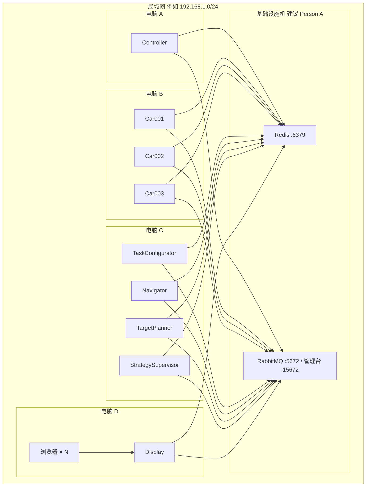
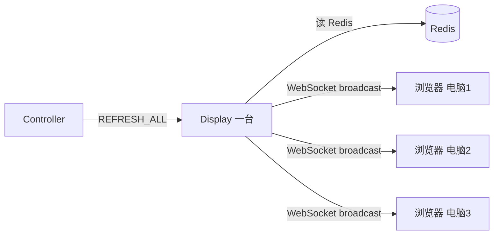

# 变电站巡检仿真 — 分布式部署指南

> **用途**：课程「黑板风格（分布式）」演示、多机分工联调、答辩材料参考。  
> **对应文档**：`人员分工.md`、`PROJECT_CONTEXT.md`、`参考架构plan_all_v3.md`  
> **更新**：2026-06-22

---

## 1. 课程要求与项目对应关系

| 课程 / 黑板文档要求 | 本项目实现 |
|---------------------|------------|
| 黑板 = 共享数据空间 | Redis（`mapView`、`CarID:Position`、`RouteList` 等） |
| 知识源独立进程 | 各模块独立 `*Main.java` |
| 知识源之间不直接通信 | 只读写 Redis + 接收 Controller 经 MQ 下发的命令 |
| Controller 唯一调度 | `controller` 模块 `TickScheduler` + `StatusDispatcher` |
| 展示终端独立 | `display`（HTTP 8887 + WebSocket 8888） |
| 支持分布式部署 | 架构已支持；各机需连接**同一套** Redis + RabbitMQ |

### 四人分工 → 多机映射

| 人员 | 负责模块 | 建议部署机器 |
|------|----------|--------------|
| Person A | `controller`（可兼管基础设施） | 电脑 A |
| Person B | `car` × N（每车一个进程） | 电脑 B |
| Person C | `task-configurator`、`navigator`、`target-planner`、`strategy-supervisor` | 电脑 C（Navigator 可扩展到更多机器） |
| Person D | `display` + 浏览器 | 电脑 D |

也可每台电脑只跑一个模块，原理相同。

---

## 2. 总体网络拓扑



### 硬约束

1. **全组只有一套** Redis + **一套** RabbitMQ（黑板与消息总线必须共享）。
2. **只能有一个 Controller** 进程（Redis `controller:instance` 锁；多开会退出）。
3. 所有机器 **JDK 17**，代码版本一致（同一 Git 分支）。
4. **TaskConfigurator** 不要多实例同时初始化（会 `flushDB` 抢黑板）。

---

## 3. 基础设施：Redis + RabbitMQ

在**一台固定机器**上（建议 Person A 或实验室服务器，下文 IP 示例 `192.168.1.100`）：

```powershell
cd D:\car_homework
docker compose up -d
```

验证端口：

```powershell
Test-NetConnection 192.168.1.100 -Port 6379
Test-NetConnection 192.168.1.100 -Port 5672
```

### 防火墙（基础设施机）

```powershell
New-NetFirewallRule -DisplayName "Redis6379" -Direction Inbound -Protocol TCP -LocalPort 6379 -Action Allow
New-NetFirewallRule -DisplayName "RabbitMQ5672" -Direction Inbound -Protocol TCP -LocalPort 5672 -Action Allow
New-NetFirewallRule -DisplayName "RabbitMQ15672" -Direction Inbound -Protocol TCP -LocalPort 15672 -Action Allow
```

记录全组共用地址：

| 服务 | 示例地址 |
|------|----------|
| Redis | `192.168.1.100:6379` |
| RabbitMQ AMQP | `192.168.1.100:5672` |
| RabbitMQ 管理台 | `http://192.168.1.100:15672`（guest/guest） |

---

## 4. 各模块连接 Redis/MQ 的方式

### 4.1 现状

- 各类 `*Main` 的**构造函数**支持 `redisHost` / `mqHost`（`LauncherMain` 已使用）。
- 多数模块的 **`main()` 写死 `localhost`**（如 `ControllerMain`、`DisplayMain`、`NavigatorMain` 等）。
- `CarMain.main` 仅支持改 Redis **端口**，主机仍为 `localhost`。

### 4.2 不改 Java 代码时的推荐做法：端口转发

在 **Person B/C/D** 等工作机上，把本机 `localhost` 转发到基础设施机（管理员 PowerShell，IP 换成实际值）：

```powershell
netsh interface portproxy add v4tov4 listenaddress=127.0.0.1 listenport=6379 connectaddress=192.168.1.100 connectport=6379
netsh interface portproxy add v4tov4 listenport=5672 connectaddress=192.168.1.100 connectport=5672
```

验证：

```powershell
Test-NetConnection 127.0.0.1 -Port 6379
```

之后各机可直接使用 `mvnw exec:java` / `start_all.bat` 中的命令，程序连 `localhost` 即等于连中心服务器。

查看 / 删除转发规则：

```powershell
netsh interface portproxy show all
netsh interface portproxy delete v4tov4 listenaddress=127.0.0.1 listenport=6379
```

### 4.3 LauncherMain 的远程参数（单机起全部模块时用）

```text
.\mvnw.cmd exec:java -pl launcher -Dexec.mainClass=com.substation.launcher.LauncherMain -Dexec.args="--redis-host 192.168.1.100 --mq-host 192.168.1.100"
```

适合**一台机器拉起全部进程**的开发调试，不适合「每人只跑自己模块」的分工演示。

---

## 5. 各机编译准备

每台参与机器：

```powershell
git clone <仓库地址>
cd D:\car_homework
.\mvnw.cmd install -DskipTests
```

或只编自己模块：`.\mvnw.cmd install -pl <模块名> -am`

---

## 6. 启动顺序（跨机器也适用）

```
1. Redis + RabbitMQ（基础设施）
2. TaskConfigurator
3. Navigator（可多台、多进程）
4. TargetPlanner
5. StrategySupervisor
6. Car001 … Car00N
7. Display
8. Controller（必须最后）
```

---

## 7. 分角色启动命令

以下假设已 `cd D:\car_homework`，且本机已做端口转发（或基础设施在本机）。

### Person C — 规划 / 初始化

```powershell
start "TaskConfigurator" cmd /k .\mvnw.cmd exec:java -pl task-configurator -Dexec.mainClass=com.substation.taskconfigurator.TaskConfiguratorMain
timeout /t 3

start "Navigator" cmd /k .\mvnw.cmd exec:java -pl navigator -Dexec.mainClass=com.substation.navigator.NavigatorMain

start "TargetPlanner" cmd /k .\mvnw.cmd exec:java -pl target-planner -Dexec.mainClass=com.substation.targetplanner.TargetPlannerMain

start "StrategySupervisor" cmd /k .\mvnw.cmd exec:java -pl strategy-supervisor -Dexec.mainClass=com.substation.strategysupervisor.StrategySupervisorMain
```

### Person B — 小车

```powershell
start "Car001" cmd /k .\mvnw.cmd exec:java -pl car -Dexec.mainClass=com.substation.car.CarMain -Dexec.args=Car001
start "Car002" cmd /k .\mvnw.cmd exec:java -pl car -Dexec.mainClass=com.substation.car.CarMain -Dexec.args=Car002
start "Car003" cmd /k .\mvnw.cmd exec:java -pl car -Dexec.mainClass=com.substation.car.CarMain -Dexec.args=Car003
```

### Person D — 展示层

1. 本机安装 **SQL Server**（登录功能依赖，连接见 `common/.../sql/DatabaseManager.java`）。
2. 启动 Display：

```powershell
start "Display" cmd /k .\mvnw.cmd exec:java -pl display -Dexec.mainClass=com.substation.display.DisplayMain
```

3. 防火墙放行（若他人访问本机页面）：

```powershell
New-NetFirewallRule -DisplayName "DisplayHTTP" -Direction Inbound -Protocol TCP -LocalPort 8887 -Action Allow
New-NetFirewallRule -DisplayName "DisplayWS" -Direction Inbound -Protocol TCP -LocalPort 8888 -Action Allow
```

### Person A — Controller（最后）

```powershell
start "Controller" cmd /k .\mvnw.cmd exec:java -pl controller -Dexec.mainClass=com.substation.controller.ControllerMain
```

日志应出现：`[Controller] 控制器已启动，等待任务配置...`

### 单机开发快捷方式

```powershell
docker compose up -d
.\start_all.bat
```

浏览器：`http://localhost:8887`

---

## 8. 多台电脑同步看浏览器画面

### 8.1 正确模型：一个 Display，多个浏览器

`WebSocketBridge` 维护 `clients` 集合，每拍 `pushSimulationState` 对**所有已连接浏览器** `broadcast` 同一 JSON。



**不要**每台电脑各跑一个 Display（控制命令会分裂，难以保证同步）。

### 8.2 当前限制

`display/src/main/resources/web/js/app.js` 中：

```javascript
ws = new WebSocket('ws://localhost:8888');
```

| 访问方式 | 结果 |
|----------|------|
| 在 Display 所在电脑打开 `http://localhost:8887` | 正常 |
| 在其他电脑打开 `http://<D的IP>:8887` | 页面可加载，但 WS 仍连**访问者本机**的 8888 → **不同步** |

### 8.3 不改代码时的权宜之计

| 方式 | 说明 |
|------|------|
| 远程桌面 / 投屏到 Display 那台 | 全班看同一画面，但只有一台在操作浏览器 |
| 每人本机浏览器 | **需改 WS 地址**（见下节「后续改进」） |

### 8.4 改代码后的目标用法（后续可做）

- 所有人访问：`http://<PersonD的IP>:8887`
- WebSocket 连：`ws://<PersonD的IP>:8888`（或与页面同 host）
- 每人画面随 `REFRESH_ALL` 同步刷新

### 8.5 操作权建议

- **观看**：多人可同时打开页面（改 WS 后）。
- **点「开始 / 重置 / 加车」**：建议**只指定一人**操作，避免重复 `SET_CONFIG` / `RESET`。

---

## 9. 多台电脑跑 Navigator 扩展算力

### 9.1 原理：RabbitMQ 竞争消费

Navigator 订阅**同一队列** `NavigatorCmd`。多个 `NavigatorMain` 进程（可分布在多台电脑）= 多个消费者，**每条 `PLAN_ROUTE` 只由一个实例处理**。

```
Controller ──► [ NavigatorCmd 队列 ] ──┬── Navigator@电脑1
                                       ├── Navigator@电脑2
                                       └── Navigator@电脑3
```

**无需改代码**即可水平扩展 Navigator 实例。

同样模式适用于：`TargetPlanner`、`StrategySupervisor`（单队列多消费者）。

**不要多开**：`Controller`、`TaskConfigurator`、同一 `Car001` 的两个进程。

### 9.2 操作步骤

在多台机器上各执行（需共用 Redis/MQ，通常配合端口转发）：

```powershell
.\mvnw.cmd exec:java -pl navigator -Dexec.mainClass=com.substation.navigator.NavigatorMain
```

一台机器也可起多个 Navigator 进程（多个终端窗口）。

### 9.3 验证

RabbitMQ 管理台 → 队列 `NavigatorCmd` → **Consumers** 数量 = 已启动的 Navigator 数。

### 9.4 实际收益

| 有帮助 | 帮助有限 |
|--------|----------|
| 多车同时请求路径、队列堆积时 | 单车单次 30×30 规划（本身很快） |
| 答辩展示「知识源水平扩展」 | 无法替代增加小车数量；主耗时在移动步数 |

### 9.5 注意点

1. 各 Navigator 代码版本一致。
2. 全部连接同一 Redis/MQ。
3. 同一车极短时间内连续两条 `PLAN_ROUTE` 可能被不同实例处理，存在写 `RouteList` 竞态（课设规模下少见）。

---

## 10. 推荐完整部署示例

| 机器 | IP 示例 | 运行内容 |
|------|---------|----------|
| 服务器 S | 192.168.1.100 | Redis + RabbitMQ |
| A | 192.168.1.101 | Controller |
| B | 192.168.1.106 | Car001～003 |
| C1 | 192.168.1.102 | TaskConfigurator、TargetPlanner、StrategySupervisor |
| C2、C3 | 192.168.1.103、105 | 各 1～2 个 Navigator（算力扩展） |
| D | 192.168.1.104 | Display + SQL Server + 浏览器 |

---

## 11. 联调检查清单

| 步骤 | 检查 |
|------|------|
| Redis 可达 | `Test-NetConnection 127.0.0.1 -Port 6379`（端口转发后） |
| MQ 可达 | 浏览器打开 `http://192.168.1.100:15672` |
| 模块存活 | 各终端无报错、处于等待状态 |
| Display | `http://localhost:8887` 或 `http://<D_IP>:8887` 可开页 |
| 仿真运行 | 点开始后地图刷新、小车移动、探索率上升 |
| 单 Controller | 仅一台机器起 Controller |
| 多 Navigator | MQ 管理台 `NavigatorCmd` 消费者数 ≥ 2 |

Redis 键检查：`redis-cli -h 192.168.1.100 keys "*"` 应有 `Car001:Status`、`mapView` 等。

---

## 12. 常见问题

| 现象 | 原因 | 处理 |
|------|------|------|
| 连不上 Redis | 防火墙 / 未做端口转发 | 检查基础设施机防火墙 + 各机 portproxy |
| Controller 立刻退出 | 已有实例 | 全组只保留一个 Controller |
| 车不动 | Controller 未起或起太早 | 最后启动 Controller |
| 页面无数据 | Display 未起或 WS 断开 | 看 Display 日志；浏览器尽量在 Display 本机 |
| 远程浏览器不同步 | `app.js` WS 写死 localhost | 见 §8；或暂用远程桌面 |
| 登录失败 | SQL Server 不在 Display 机 | 在 D 机安装 SQL Server |
| 探索率不涨 | TaskConfigurator 未起 | 先起 C 侧模块 |

---

## 13. 答辩 / 报告表述要点

1. **黑板**：Redis，知识源仅通过 `BlackboardClient` 读写，无进程间直接调用。
2. **控制**：Controller 经 MQ 发令；知识源回复 `ControllerCmd`；知识源之间不互发业务消息。
3. **独立部署**：Car / Navigator / Display 等可分布在不同主机，单进程可独立重启。
4. **多显示终端**：多个浏览器连接同一 Display WebSocket，接收同一黑板快照广播。
5. **水平扩展**：Navigator 等多实例订阅同一命令队列，RabbitMQ 负载均衡。
6. **与 C2 区别**：调度权集中在 Controller；知识源不指挥其他知识源。

---

## 14. 后续改进（可选）

若需「每台电脑本机浏览器同步」且不改 Java，最小改动通常为：

1. `app.js`：`ws://${location.hostname}:8888`（或配置项指定 Display IP）。
2. 各 `*Main` 增加 `--redis-host` / `--mq-host` 命令行参数（`LauncherMain` 已有范例），省掉 portproxy。

---

## 15. 相关文件索引

| 文件 | 说明 |
|------|------|
| `start_all.bat` | 单机一键分窗启动全部模块 |
| `docker-compose.yml` | Redis + RabbitMQ |
| `launcher/.../LauncherMain.java` | 支持 `--redis-host` 等参数 |
| `人员分工.md` | 四人模块分工 |
| `PROJECT_CONTEXT.md` | 项目全局说明与启动顺序 |
