# 变电站巡检仿真系统 — 完整设计方案（v3）

> 版本：v3.3（修订版4）  
> 日期：2026-06-02  
> 架构风格：黑板模式（Blackboard Architecture）  
> 修订记录：基于 v3.2 的8项修订

---

## 修订摘要（v3.2→v3.3）

| # | 修订项 | 方案 |
|---|--------|------|
| 1 | Car BLOCKED 状态简化 | 去掉 BLOCKED→WAITING_ROUTE 变迁；受阻等2节拍后仅转 IDLE，不重规划 |
| 2 | Car 状态自主性分析 | 分析 Car 各状态变迁的归属；Controller 负责调度型变迁，Car 负责执行型变迁；消除 TP/Nav 直接写 Status 的耦合 |
| 3 | 架构约束强化 | 知识源只接受 Controller 的消息/控制；WSB 命令经 Controller 转发至 TaskConfigurator；知识源间只通过黑板共享数据 |
| 4 | 黑板并发控制 | 新增组件-黑板读写矩阵、并发写冲突分析、Redis 分布式锁 + 乐观锁机制 |
| 5 | MQ 队列类型分析 | 每个队列标注类型选型理由；待完成任务用 Classic Queue，广播用 Fanout |
| 6 | 知识源消息格式设计 | 每个知识源的输入/输出消息 JSON 格式完整定义 |
| 7 | 独立进程部署 | 所有知识源支持独立进程部署，各模块含独立 Main 入口 |
| 8 | 版本升级 | v3.2 → v3.3 |

---

## 一、系统概述

### 1.1 项目背景

模拟变电站巡检的仿真系统，将变电站建模为二维网格地图，多台巡检机器人（小车）协作巡逻整个变电站，走过所有地图点并点亮周围 3×3 格子区域，实现变电站全区域覆盖巡检。

### 1.2 核心需求

| 需求项 | 描述 |
|--------|------|
| 二维地图建模 | 30×30 网格地图，随机生成障碍物，小车行走后点亮周围 3×3 区域 |
| 多车协作巡逻 | 5 台巡检机器人自主探索，路径冲突检测与避让，障碍物动态感知与路径重规划 |
| 黑板风格架构 | 所有知识源独立部署，仅通过 RabbitMQ 消息中间件与 Controller 通信，**知识源之间禁止直接通信** |
| Controller 节拍驱动 | Controller 是唯一调度器，按节拍（tick）循环驱动所有业务，**所有知识源只受 Controller 调度** |
| Web 可视化终端 | 浏览器实时查看地图、障碍物、小车位置及**规划路径**，支持参数配置与控制 |

### 1.3 技术选型

| 技术栈 | 选型 | 说明 |
|--------|------|------|
| 编程语言 | Java 17+ | 主开发语言 |
| 构建工具 | Maven 多模块 | 每个知识源为独立可部署模块 |
| 黑板存储 | Redis 5.x+ (Jedis) | bitmap/hash/list 数据结构，支持分布式锁 |
| 消息中间件 | RabbitMQ 3.x+ (amqp-client) | Classic Queue 点对点 + Fanout 广播 |
| WebSocket 服务端 | Java-WebSocket 1.5.6 | HTTP 静态文件 + WebSocket 双向通信 |
| Web 前端 | HTML5 + CSS3 + JavaScript | Canvas 渲染 + WebSocket 通信 |
| 日志框架 | SLF4J 2.0 + Logback 1.5 | 结构化日志 |
| 序列化 | **fastjson2 2.0.x** | `com.alibaba.fastjson2`，消息与路径点 JSON 序列化 |

---

## 二、软件架构

### 2.1 架构风格：黑板模式

本系统严格遵循黑板架构风格，核心要素为：

1. **黑板（Blackboard）**：Redis 共享数据空间，所有知识源通过读写黑板交互
2. **知识源（Knowledge Sources）**：独立的业务处理单元，各自侦听 MQ 队列、读写黑板
3. **控制器（Controller）**：唯一调度者，按节拍驱动知识源工作
4. **消息总线（Message Bus）**：RabbitMQ 消息中间件，知识源与控制器之间的唯一通信通道

**关键约束**：
- ⚠️ **所有知识源只受 Controller 调度，知识源之间禁止直接通信**
- ⚠️ **知识源只接受来自 Controller 的消息/控制**，不接受其他知识源的消息，否则造成耦合，不利于独立部署与扩展
- 知识源与控制器之间 **仅通过 MQ 消息** 通信
- 知识源通过 **读写黑板** 共享数据——这是知识源之间唯一的间接交互方式（共享数据，非共享控制）
- 知识源 **不知道彼此的存在**，不知道谁生产了黑板上的数据，只根据 Controller 的调度命令和黑板数据进行工作
- **知识源间不共享控制流**，只共享数据——否则就退化为 C2 风格

### 2.2 架构总览图（简化版）

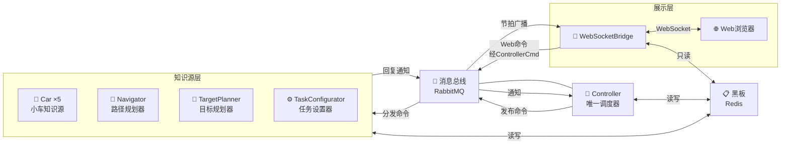
```mermaid
graph LR
    MQ["📨 消息总线<br/>RabbitMQ"]
    BB["📋 黑板<br/>Redis"]
    CTRL["🔲 Controller<br/>唯一调度器"]
    
    subgraph KS["知识源层"]
        CAR["🚗 Car ×5<br/>小车知识源"]
        NAV["🧭 Navigator<br/>路径规划器"]
        TP["🎯 TargetPlanner<br/>目标规划器"]
        TCF["⚙ TaskConfigurator<br/>任务设置器"]
    end
    
    subgraph DISPLAY["展示层"]
        WSB["🔌 WebSocketBridge"]
        WEB["🌐 Web浏览器"]
    end
    
    MQ --- CTRL
    CTRL -->|"发布命令"| MQ
    MQ -->|"分发命令"| KS
    KS -->|"回复通知"| MQ
    MQ -->|"通知"| CTRL
    KS <-->|"读写"| BB
    CTRL <-->|"读写"| BB
    MQ -->|"节拍广播"| WSB
    WSB -->|"Web命令<br/>经ControllerCmd"| MQ
    WSB <-->|"WebSocket"| WEB
    WSB <-->|"只读"| BB
```

> **架构约束说明**：WebSocketBridge 发送的 Web 命令（SET_CONFIG/RESET）不再直接发送到 TaskConfigCmd，而是发送到 ControllerCmd，由 Controller 转发至 TaskConfigurator。这确保了所有知识源只接受 Controller 的消息。

### 2.3 架构分图一：消息总线 + 黑板 + 知识源层

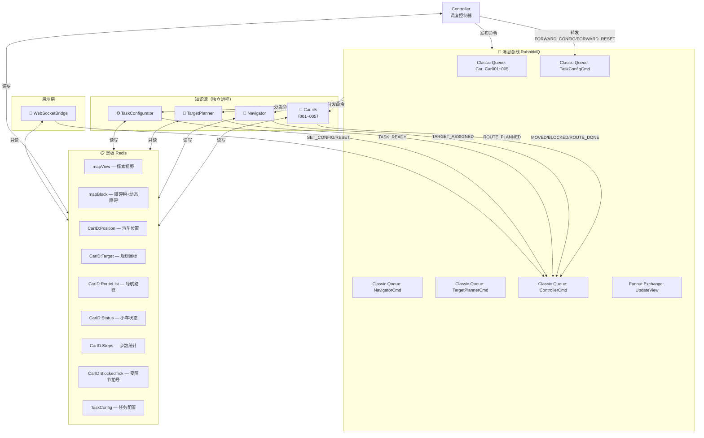
```mermaid
graph TB
    subgraph MQ["📨 消息总线 RabbitMQ"]
        direction TB
        Q_CARS["Classic Queue: Car_Car001~005"]
        Q_NAV["Classic Queue: NavigatorCmd"]
        Q_TP["Classic Queue: TargetPlannerCmd"]
        Q_TCF["Classic Queue: TaskConfigCmd"]
        Q_CTRL["Classic Queue: ControllerCmd"]
        Q_FAN["Fanout Exchange: UpdateView"]
    end

    subgraph Blackboard["📋 黑板 Redis"]
        MV["mapView — 探索视野"]
        MB["mapBlock — 障碍物+动态障碍"]
        CP["CarID:Position — 汽车位置"]
        CT["CarID:Target — 规划目标"]
        RL["CarID:RouteList — 导航路径"]
        CS["CarID:Status — 小车状态"]
        CST["CarID:Steps — 步数统计"]
        CBT["CarID:BlockedTick — 受阻节拍号"]
        TC["TaskConfig — 任务配置"]
    end

    CTRL["Controller<br/>调度控制器"]

    subgraph KS["知识源（独立进程）"]
        CAR["🚗 Car ×5<br/>（001~005）"]
        NAV["🧭 Navigator"]
        TP["🎯 TargetPlanner"]
        TCF["⚙ TaskConfigurator"]
    end

    subgraph DISPLAY["展示层"]
        WSB["🔌 WebSocketBridge"]
    end

    %% Controller与MQ
    CTRL -->|"发布命令"| MQ
    MQ -->|"分发命令"| CAR
    MQ -->|"分发命令"| NAV
    MQ -->|"分发命令"| TP
    MQ -->|"分发命令"| TCF

    %% 知识源回复Controller
    CAR -->|"MOVED/BLOCKED/ROUTE_DONE"| Q_CTRL
    NAV -->|"ROUTE_PLANNED"| Q_CTRL
    TP -->|"TARGET_ASSIGNED"| Q_CTRL
    TCF -->|"TASK_READY"| Q_CTRL

    %% Web命令经Controller转发
    WSB -->|"SET_CONFIG/RESET"| Q_CTRL
    CTRL -->|"转发FORWARD_CONFIG/FORWARD_RESET"| Q_TCF

    %% 知识源与黑板交互
    CAR <-->|"读写"| Blackboard
    NAV <-->|"读写"| Blackboard
    TP <-->|"只读"| Blackboard
    TCF <-->|"读写"| Blackboard
    CTRL <-->|"读写"| Blackboard
    WSB <-->|"只读"| Blackboard
```

> ⚠️ **通信约束**：知识源之间无直接连线，所有通信均通过 MQ → Controller 中转。知识源只知道自己被 Controller 调度，不知道其他知识源的存在。**特别注意**：WebSocketBridge 的 Web 命令通过 ControllerCmd 队列发给 Controller，由 Controller 转发给 TaskConfigurator，确保 TaskConfigurator 只接受来自 Controller 的命令。

### 2.4 架构分图二：展示层

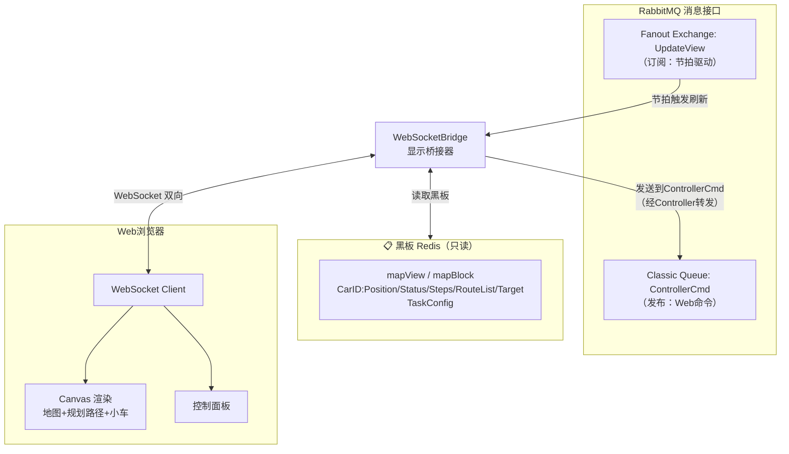
```mermaid
graph TB
    subgraph MQ_Bridge["RabbitMQ 消息接口"]
        Q_FAN_IN["Fanout Exchange: UpdateView<br/>（订阅：节拍驱动）"]
        Q_CTRL_OUT["Classic Queue: ControllerCmd<br/>（发布：Web命令）"]
    end

    WSB["WebSocketBridge<br/>显示桥接器"]

    subgraph Blackboard_RO["📋 黑板 Redis（只读）"]
        BB_DATA["mapView / mapBlock<br/>CarID:Position/Status/Steps/RouteList/Target<br/>TaskConfig"]
    end

    subgraph Web["Web浏览器"]
        WS["WebSocket Client"]
        CV["Canvas 渲染<br/>地图+规划路径+小车"]
        CTRL_PANEL["控制面板"]
    end

    Q_FAN_IN -->|"节拍触发刷新"| WSB
    WSB <-->|"读取黑板"| Blackboard_RO
    WSB -->|"发送到ControllerCmd<br/>（经Controller转发）"| Q_CTRL_OUT
    WSB <-->|"WebSocket 双向"| WS
    WS --> CV
    WS --> CTRL_PANEL
```

> **刷新机制**：WebSocketBridge 不再定时轮询黑板，而是在收到 Controller 的 UpdateView 节拍广播后才读取黑板并推送至浏览器，实现 **Controller 节拍统一驱动刷新**。

### 2.5 组件职责矩阵

| 组件 | 类型 | 职责 | 黑板访问 | MQ 队列 | 可独立部署 |
|------|------|------|----------|---------|-----------|
| **Controller** | 调度器 | 按节拍驱动全流程：查任务→查状态→分配目标→规划路径→广播移动→广播刷新；转发Web命令 | 读写 | 发布到所有知识源队列，订阅 ControllerCmd | 是 |
| **Car** | 知识源 | 5 状态状态机，移动+点亮 3×3+障碍检测 | 读写 | 仅订阅 Car_CarID，仅发布到 ControllerCmd | 是 |
| **Navigator** | 知识源 | BFS/A* 路径搜索，避开障碍物，写入路径到黑板 | 读写 | 仅订阅 NavigatorCmd，仅发布到 ControllerCmd | 是 |
| **TargetPlanner** | 知识源 | 读取未探索区域，贪心算法分配目标（距离 ≥ 10，最后区域除外） | 只读 | 仅订阅 TargetPlannerCmd，仅发布到 ControllerCmd | 是 |
| **TaskConfigurator** | 知识源 | 接收配置→初始化黑板（地图/障碍物/小车位置/任务配置） | 读写 | 仅订阅 TaskConfigCmd，仅发布到 ControllerCmd | 是 |
| **WebSocketBridge** | 桥接器 | 接收节拍广播后读取黑板推送至浏览器；反向接收 Web 命令转发到 ControllerCmd | 只读 | 订阅 UpdateView，发布到 ControllerCmd | 是 |
| **Web 前端** | 显示终端 | Canvas 渲染地图+规划路径+小车；控制面板；节拍驱动刷新 | 无 | 通过 WebSocketBridge 间接通信 | N/A |

> **独立进程部署**：每个组件均可作为独立 Java 进程运行，拥有独立的 `Main` 入口类。组件间通过 Redis（黑板）和 RabbitMQ（消息总线）通信，无进程间直接调用。

---

## 三、Controller 节拍驱动流程

### 3.1 节拍主流程（简化版）

Controller 是系统唯一调度器，所有业务按节拍（tick）循环驱动：

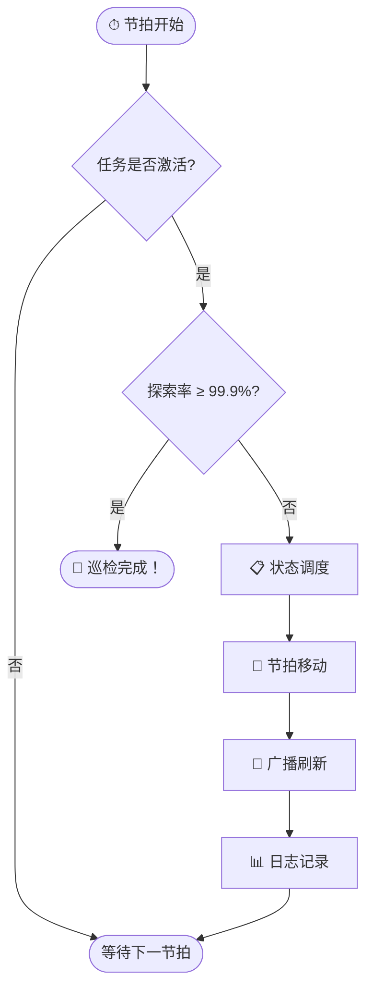
```mermaid
flowchart TD
    START(["⏱ 节拍开始"]) --> CHECK{"任务是否激活?"}
    CHECK -->|"否"| WAIT(["等待下一节拍"])
    CHECK -->|"是"| DONE{"探索率 ≥ 99.9%?"}
    DONE -->|"是"| COMPLETE(["🏁 巡检完成！"])
    DONE -->|"否"| DISPATCH["📋 状态调度"]
    DISPATCH --> MOVE["🚗 节拍移动"]
    MOVE --> NOTIFY["📢 广播刷新"]
    NOTIFY --> LOG["📊 日志记录"]
    LOG --> WAIT
```

> **布局说明**：节拍开始 `START` 在顶部；巡检完成 `COMPLETE` 在左边分支；任务未激活时直接等待下一节拍。

### 3.2 状态调度子图（时序图）

遍历每辆小车，按状态分发命令：

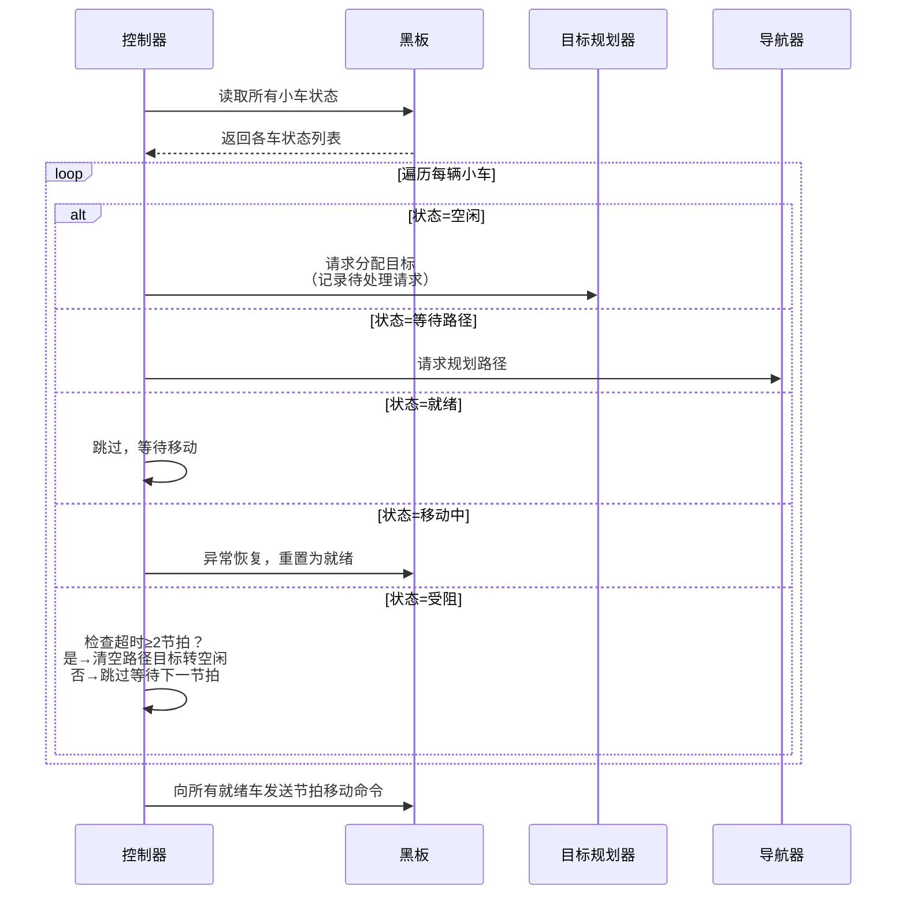
```mermaid
sequenceDiagram
    participant CTRL as 控制器
    participant BB as 黑板
    participant TP as 目标规划器
    participant NAV as 导航器

    CTRL->>BB: 读取所有小车状态
    BB-->>CTRL: 返回各车状态列表

    loop 遍历每辆小车
        alt 状态=空闲
            CTRL->>TP: 请求分配目标<br/>（记录待处理请求）
        else 状态=等待路径
            CTRL->>NAV: 请求规划路径
        else 状态=就绪
            CTRL->>CTRL: 跳过，等待移动
        else 状态=移动中
            CTRL->>BB: 异常恢复，重置为就绪
        else 状态=受阻
            CTRL->>CTRL: 检查超时≥2节拍？<br/>是→清空路径目标转空闲<br/>否→跳过等待下一节拍
        end
    end

    CTRL->>BB: 向所有就绪车发送节拍移动命令
```

> **IDLE 状态说明**：车状态为 IDLE 时，Controller 向 TargetPlanner 发送 ASSIGN_TARGET，同时将 carId 加入内部 `pendingTargetRequests` 集合。TargetPlanner 完成后写入黑板 Target（不写 Status），Controller 收到 TARGET_ASSIGNED 后自行写入 Status=WAITING_ROUTE。

> **BLOCKED 状态说明**：Car 受阻后仅通知 Controller BLOCKED，不触发重规划。Controller 在后续节拍检查受阻时长：若超过 2 个节拍仍为 BLOCKED，则清空路径和目标，将 Status 改为 IDLE，等待重新分配。

### 3.3 节拍时序说明

1. **检查任务**：读取黑板 `TaskConfig` 的 `taskActive` 字段，无任务则等待下一节拍
2. **完成判定**：读取黑板 `mapView` bitmap 计算探索率，≥99.9% 视为巡检完成
3. **状态调度**：遍历所有小车，根据 5 种状态分发不同 MQ 命令
4. **节拍移动**：所有调度完成后，向 READY 状态的小车发送 `TICK_MOVE`
5. **广播刷新**：通过 UpdateView fanout 广播通知 Display 更新（**节拍驱动**，非定时轮询）
6. **处理Web命令**：检查 ControllerCmd 队列中是否有 WebSocketBridge 转发的 Web 命令，若有则转发至 TaskConfigurator

---

## 四、关键类状态图

### 4.1 Car 小车状态图（横向布局）

Car 是最核心的知识源，拥有 5 种状态的完整状态机：

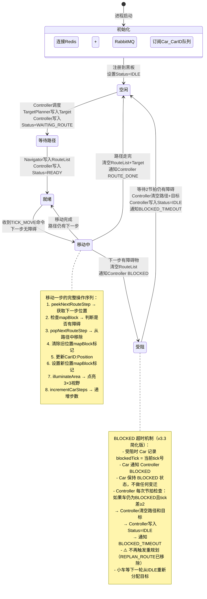
```mermaid
stateDiagram-v2
    [*] --> 初始化 : 进程启动

    state 初始化 {
        连接Redis + RabbitMQ
        订阅Car_CarID队列
    }

    初始化 --> 空闲 : 注册到黑板<br/>设置Status=IDLE

    空闲 --> 等待路径 : Controller调度<br/>TargetPlanner写入Target<br/>Controller写入Status=WAITING_ROUTE

    等待路径 --> 就绪 : Navigator写入RouteList<br/>Controller写入Status=READY

    就绪 --> 移动中 : 收到TICK_MOVE命令<br/>下一步无障碍

    移动中 --> 就绪 : 移动完成<br/>路径仍有下一步

    移动中 --> 空闲 : 路径走完<br/>清空RouteList+Target<br/>通知Controller ROUTE_DONE

    移动中 --> 受阻 : 下一步有障碍物<br/>清空RouteList<br/>通知Controller BLOCKED

    受阻 --> 空闲 : 等待2节拍仍有障碍<br/>Controller清空路径+目标<br/>Controller写入Status=IDLE<br/>通知BLOCKED_TIMEOUT

    note right of 移动中
        移动一步的完整操作序列：
        1. peekNextRouteStep → 获取下一步位置
        2. 检查mapBlock → 判断是否有障碍
        3. popNextRouteStep → 从路径中移除
        4. 清除旧位置mapBlock标记
        5. 更新CarID:Position
        6. 设置新位置mapBlock标记
        7. illuminateArea → 点亮3×3视野
        8. incrementCarSteps → 递增步数
    end note

    note right of 受阻
        BLOCKED 超时机制（v3.3简化版）：
        - 受阻时 Car 记录 blockedTick = 当前tick号
        - Car 通知 Controller BLOCKED
        - Car 保持 BLOCKED 状态，不做任何变迁
        - Controller 每次节拍检查：
          如果车仍为BLOCKED且tick差≥2
          → Controller清空路径和目标
          → Controller写入Status=IDLE
          → 通知BLOCKED_TIMEOUT
        - ⚠️ 不再触发重规划（REPLAN_ROUTE已移除）
        - 小车等下一轮从IDLE重新分配目标
    end note
```

> **状态颜色对照**（界面显示时使用）：
> | 状态 | 颜色 | 色值 | 含义 |
> |------|------|------|------|
> | 空闲 (IDLE) | 灰色 | `#9E9E9E` | 空闲，无目标无路径 |
> | 等待路径 (WAITING_ROUTE) | 蓝色 | `#2196F3` | 等待路径规划 |
> | 就绪 (READY) | 绿色 | `#4CAF50` | 就绪，有目标有路径 |
> | 移动中 (MOVING) | 橙色 | `#FF9800` | 正在移动 |
> | 受阻 (BLOCKED) | 红色 | `#F44336` | 受阻，等待超时转空闲 |

> **小车编号**：界面显示时，小车编号为 `001~005`，圆形车辆图标上方/内部显示编号。

### 4.2 Car 状态自主性分析与并发控制

#### 4.2.1 状态变迁归属分析

Car 的 5 种状态变迁分为两类：**Car 自主控制的变迁**和**Controller 控制的变迁**。

| 变迁 | 触发者 | 归属 | 说明 |
|------|--------|------|------|
| 初始化 → 空闲 | Car 自己 | **Car自主** | 注册到黑板，写 Status=IDLE |
| 空闲 → 等待路径 | Controller | **Controller控制** | TP 写入 Target 后，Controller 写 Status=WAITING_ROUTE |
| 等待路径 → 就绪 | Controller | **Controller控制** | Nav 写入 RouteList 后，Controller 写 Status=READY |
| 就绪 → 移动中 | Car 自己 | **Car自主** | 收到 TICK_MOVE，检查无障碍，写 Status=MOVING |
| 移动中 → 就绪 | Car 自己 | **Car自主** | 移动一步完成，路径有下一步，写 Status=READY |
| 移动中 → 空闲 | Car 自己 | **Car自主** | 路径走完，写 Status=IDLE |
| 移动中 → 受阻 | Car 自己 | **Car自主** | 遇到障碍，写 Status=BLOCKED |
| 受阻 → 空闲 | Controller | **Controller控制** | 超时≥2节拍，Controller 写 Status=IDLE |

**核心原则**：
- ✅ **Car 自主写入**：Car 在处理 TICK_MOVE 时写入的变迁（MOVING/READY/IDLE/BLOCKED）
- ✅ **Controller 写入**：Car 不在处理 TICK_MOVE 时，由 Controller 写入的变迁（WAITING_ROUTE/READY/IDLE）
- ⚠️ **TargetPlanner 和 Navigator 不再写入 CarID:Status**——它们只写自己的领域数据（Target、RouteList），状态变迁由 Controller 统一控制

#### 4.2.2 并发写冲突分析

**问题**：Controller 和 Car 都可能写 CarID:Status，是否存在并发冲突？

**时序分析**：

```
节拍N:
  1. Controller 读取所有 Car:Status（快照）
  2. Controller 调度：发 ASSIGN_TARGET/PLAN_ROUTE 给 TP/Nav
  3. TP/Nav 处理，写入 Target/RouteList（不写 Status）
  4. TP/Nav 通知 Controller → Controller 写入 Status 变迁
  5. Controller 发 TICK_MOVE 给 READY 的车
  6. Car 处理 TICK_MOVE，写入 Status 变迁
  7. Controller 广播 UpdateView
```

**冲突场景**：

| 场景 | 冲突 | 分析 | 风险 |
|------|------|------|------|
| Controller 写 WAITING_ROUTE/READY（步骤4） vs Car 写 MOVING/READY（步骤6） | 时序冲突 | Controller 先写，后发 TICK_MOVE。若 Controller 确认 TP/Nav 完成后再发 TICK_MOVE，则无冲突 | **低**（Controller 发 TICK_MOVE 在 Status 写入之后） |
| Controller 写 IDLE（BLOCKED 超时） vs Car 正在写 BLOCKED | 写-写冲突 | Car 写 BLOCKED 后通知 Controller，Controller 在**后续节拍**才检查超时，不会同时写 | **无** |
| Navigator 写 RouteList vs Car 读 RouteList | 读写冲突 | Navigator 在步骤3写，Car 在步骤6读，时序上不会重叠 | **无** |

**结论**：在当前节拍驱动的架构下，Controller 写 Status 变迁发生在发送 TICK_MOVE 之前，Car 写 Status 变迁发生在处理 TICK_MOVE 时，二者时序上不重叠，**不存在实质性的并发写冲突**。

**防护措施**（代码级防御）：
1. **Redis 乐观锁**：对 CarID:Status 使用 WATCH/MULTI/EXEC，写前 WATCH，若被修改则重试
2. **状态前置校验**：Car 写 Status 前先读取当前状态，仅当状态符合预期时才写入（CAS 语义）
3. **Car 级别复合操作加锁**：Car 处理 TICK_MOVE 时，使用 Redis 分布式锁 `lock:CarID` 保护 "读状态→移动→写状态" 的复合操作

> 详细加锁机制见第六节"黑板并发控制"。

### 4.3 Controller 控制器状态图

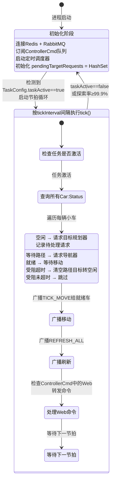
```mermaid
stateDiagram-v2
    [*] --> 空闲 : 进程启动

    空闲 : 初始化阶段
    空闲 : 连接Redis + RabbitMQ
    空闲 : 订阅ControllerCmd队列
    空闲 : 启动定时调度器
    空闲 : 初始化 pendingTargetRequests = HashSet

    空闲 --> 节拍循环 : 检测到TaskConfig.taskActive==true<br/>启动节拍循环

    节拍循环 : 按tickInterval间隔执行tick()

    state 节拍循环 {
        [*] --> 检查任务
        检查任务 : 检查任务是否激活
        检查任务 --> 查询小车 : 任务激活
        查询小车 : 查询所有Car:Status
        查询小车 --> 按状态分发 : 遍历每辆小车
        按状态分发 : 空闲 → 请求目标规划器<br/>记录待处理请求
        按状态分发 : 等待路径 → 请求导航器
        按状态分发 : 就绪 → 等待移动
        按状态分发 : 受阻超时 → 清空路径目标转空闲
        按状态分发 : 受阻未超时 → 跳过
        按状态分发 --> 广播移动 : 广播TICK_MOVE给就绪车
        广播移动 --> 广播刷新 : 广播REFRESH_ALL
        广播刷新 --> 处理Web命令 : 检查ControllerCmd中的Web转发命令
        处理Web命令 --> 等待下一节拍 : 等待下一节拍
    }

    节拍循环 --> 空闲 : taskActive==false<br/>或探索率≥99.9%
```

### 4.4 TargetPlanner 目标规划器状态图

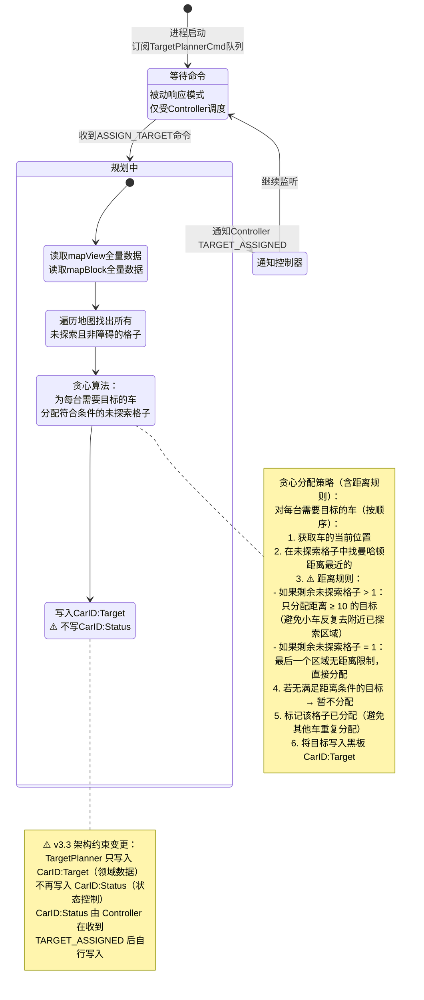
```mermaid
stateDiagram-v2
    [*] --> 监听 : 进程启动<br/>订阅TargetPlannerCmd队列

    监听 : 等待命令
    监听 : 被动响应模式
    监听 : 仅受Controller调度

    监听 --> 规划中 : 收到ASSIGN_TARGET命令

    state 规划中 {
        [*] --> 读取地图
        读取地图 : 读取mapView全量数据<br/>读取mapBlock全量数据
        读取地图 --> 查找未探索
        查找未探索 : 遍历地图找出所有<br/>未探索且非障碍的格子
        查找未探索 --> 计算
        计算 : 贪心算法：<br/>为每台需要目标的车<br/>分配符合条件的未探索格子
        计算 --> 写入目标
        写入目标 : 写入CarID:Target<br/>⚠️ 不写CarID:Status
    }

    规划中 --> 通知控制器 : 通知Controller TARGET_ASSIGNED
    通知控制器 --> 监听 : 继续监听

    note right of 计算
        贪心分配策略（含距离规则）：
        对每台需要目标的车（按顺序）：
        1. 获取车的当前位置
        2. 在未探索格子中找曼哈顿距离最近的
        3. ⚠️ 距离规则：
           - 如果剩余未探索格子 > 1：
             只分配距离 ≥ 10 的目标
             （避免小车反复去附近已探索区域）
           - 如果剩余未探索格子 = 1：
             最后一个区域无距离限制，直接分配
        4. 若无满足距离条件的目标 → 暂不分配
        5. 标记该格子已分配（避免其他车重复分配）
        6. 将目标写入黑板 CarID:Target
    end note

    note right of 写入目标
        ⚠️ v3.3 架构约束变更：
        TargetPlanner 只写入 CarID:Target（领域数据）
        不再写入 CarID:Status（状态控制）
        CarID:Status 由 Controller 在收到
        TARGET_ASSIGNED 后自行写入
    end note
```

### 4.5 Navigator 导航器状态图

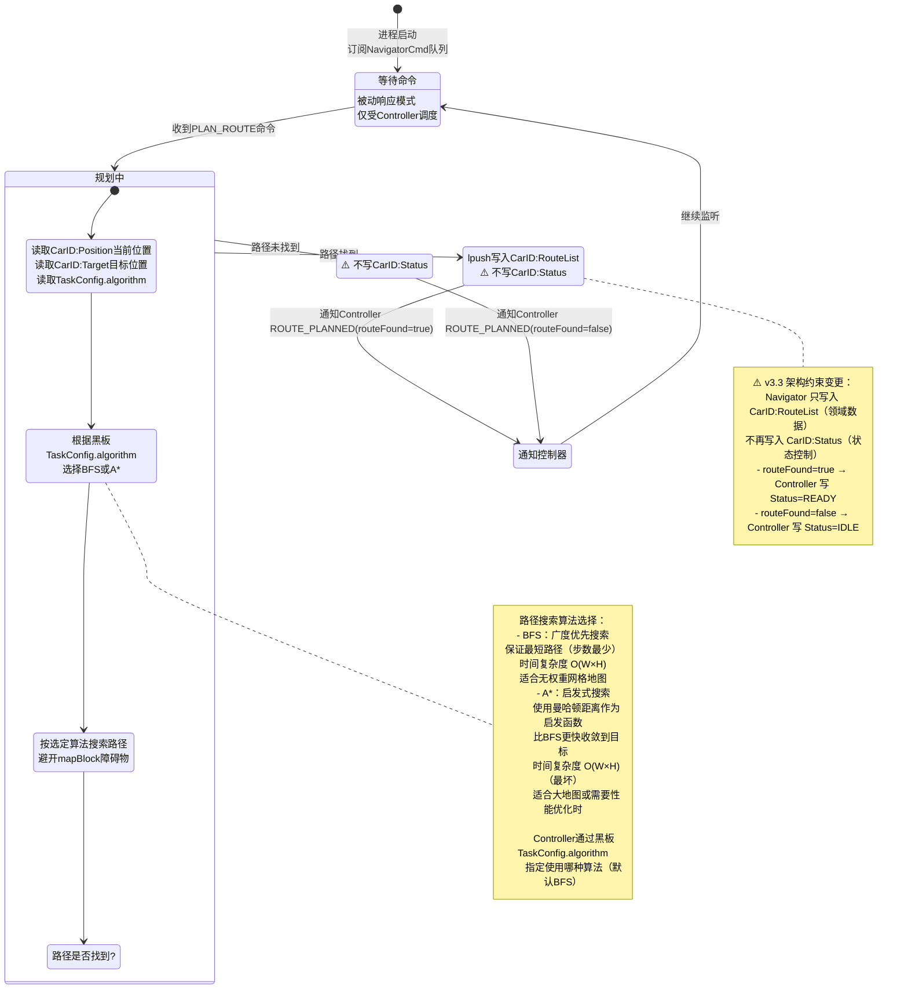
```mermaid
stateDiagram-v2
    [*] --> 监听 : 进程启动<br/>订阅NavigatorCmd队列

    监听 : 等待命令
    监听 : 被动响应模式
    监听 : 仅受Controller调度

    监听 --> 规划中 : 收到PLAN_ROUTE命令

    state 规划中 {
        [*] --> 读取数据
        读取数据 : 读取CarID:Position当前位置<br/>读取CarID:Target目标位置<br/>读取TaskConfig.algorithm
        读取数据 --> 选择算法
        选择算法 : 根据黑板TaskConfig.algorithm<br/>选择BFS或A*
        选择算法 --> 执行搜索
        执行搜索 : 按选定算法搜索路径<br/>避开mapBlock障碍物
        执行搜索 --> 检查结果
        检查结果 : 路径是否找到?
    }

    规划中 --> 写入路径 : 路径找到
    写入路径 : lpush写入CarID:RouteList<br/>⚠️ 不写CarID:Status

    规划中 --> 无路径 : 路径未找到
    无路径 : ⚠️ 不写CarID:Status

    写入路径 --> 通知控制器 : 通知Controller ROUTE_PLANNED(routeFound=true)
    无路径 --> 通知控制器 : 通知Controller ROUTE_PLANNED(routeFound=false)
    通知控制器 --> 监听 : 继续监听

    note right of 写入路径
        ⚠️ v3.3 架构约束变更：
        Navigator 只写入 CarID:RouteList（领域数据）
        不再写入 CarID:Status（状态控制）
        - routeFound=true → Controller 写 Status=READY
        - routeFound=false → Controller 写 Status=IDLE
    end note

    note right of 选择算法
        路径搜索算法选择：
        - BFS：广度优先搜索
          保证最短路径（步数最少）
          时间复杂度 O(W×H)
          适合无权重网格地图
        
        - A*：启发式搜索
          使用曼哈顿距离作为启发函数
          比BFS更快收敛到目标
          时间复杂度 O(W×H)（最坏）
          适合大地图或需要性能优化时
        
        Controller通过黑板TaskConfig.algorithm
        指定使用哪种算法（默认BFS）
    end note
```

> **v3.3 变更**：移除 REPLAN_ROUTE 命令。受阻小车不再触发重规划，而是等 Controller 超时转 IDLE 后重新走完整流程（ASSIGN_TARGET → PLAN_ROUTE）。

### 4.6 TaskConfigurator 任务设置器状态图

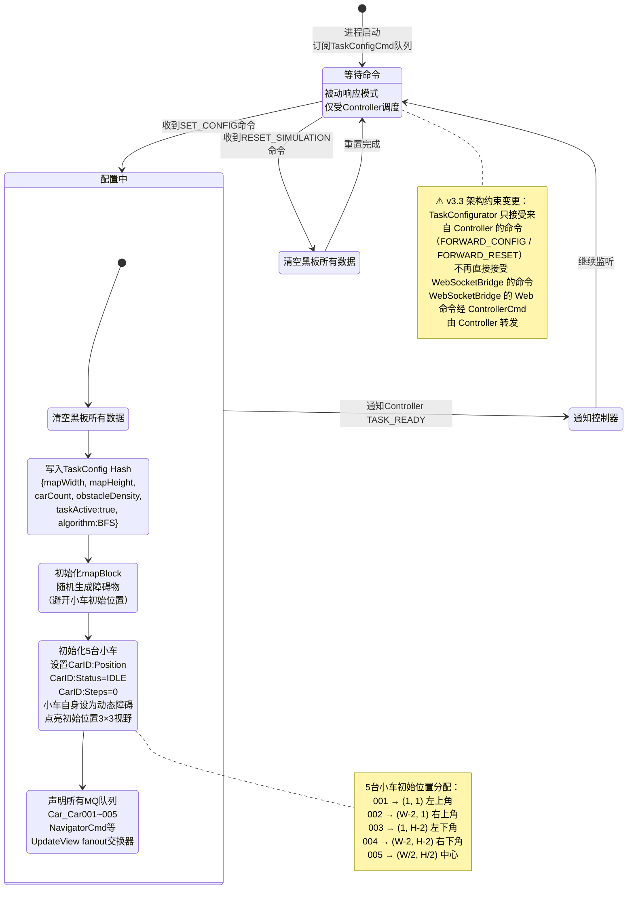
```mermaid
stateDiagram-v2
    [*] --> 监听 : 进程启动<br/>订阅TaskConfigCmd队列

    监听 : 等待命令
    监听 : 被动响应模式
    监听 : 仅受Controller调度

    监听 --> 配置中 : 收到SET_CONFIG命令
    监听 --> 重置中 : 收到RESET_SIMULATION命令

    重置中 : 清空黑板所有数据
    重置中 --> 监听 : 重置完成

    state 配置中 {
        [*] --> 清空黑板
        清空黑板 : 清空黑板所有数据
        清空黑板 --> 写入配置
        写入配置 : 写入TaskConfig Hash<br/>{mapWidth, mapHeight,<br/>carCount, obstacleDensity,<br/>taskActive:true, algorithm:BFS}
        写入配置 --> 初始化地图
        初始化地图 : 初始化mapBlock<br/>随机生成障碍物<br/>（避开小车初始位置）
        初始化地图 --> 初始化小车
        初始化小车 : 初始化5台小车<br/>设置CarID:Position<br/>CarID:Status=IDLE<br/>CarID:Steps=0<br/>小车自身设为动态障碍<br/>点亮初始位置3×3视野
        初始化小车 --> 声明队列
        声明队列 : 声明所有MQ队列<br/>Car_Car001~005<br/>NavigatorCmd等<br/>UpdateView fanout交换器
    }

    配置中 --> 通知控制器 : 通知Controller TASK_READY
    通知控制器 --> 监听 : 继续监听

    note right of 监听
        ⚠️ v3.3 架构约束变更：
        TaskConfigurator 只接受来自 Controller 的命令
        （FORWARD_CONFIG / FORWARD_RESET）
        不再直接接受 WebSocketBridge 的命令
        WebSocketBridge 的 Web 命令经 ControllerCmd
        由 Controller 转发
    end note

    note right of 初始化小车
        5台小车初始位置分配：
        001 → (1, 1) 左上角
        002 → (W-2, 1) 右上角
        003 → (1, H-2) 左下角
        004 → (W-2, H-2) 右下角
        005 → (W/2, H/2) 中心
    end note
```

### 4.7 WebSocketBridge 显示桥接器状态图

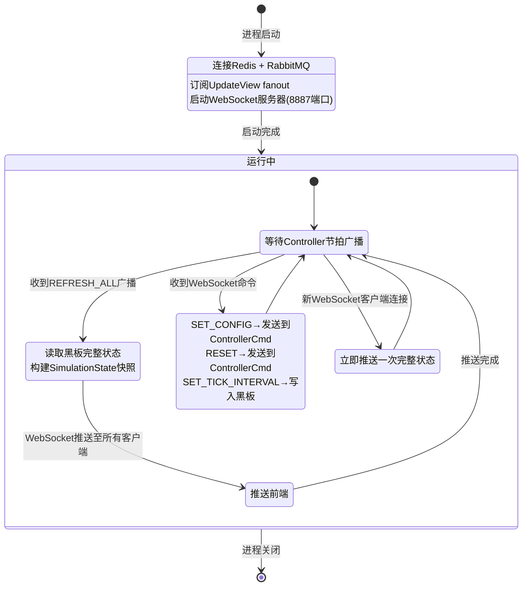
```mermaid
stateDiagram-v2
    [*] --> 初始化 : 进程启动

    初始化 : 连接Redis + RabbitMQ
    初始化 : 订阅UpdateView fanout
    初始化 : 启动WebSocket服务器(8887端口)

    初始化 --> 运行中 : 启动完成

    state 运行中 {
        [*] --> 等待节拍
        等待节拍 : 等待Controller节拍广播
        等待节拍 --> 读取黑板 : 收到REFRESH_ALL广播
        读取黑板 : 读取黑板完整状态<br/>构建SimulationState快照
        读取黑板 --> 推送前端 : WebSocket推送至所有客户端
        推送前端 --> 等待节拍 : 推送完成
        等待节拍 --> 处理命令 : 收到WebSocket命令
        处理命令 : SET_CONFIG→发送到ControllerCmd<br/>RESET→发送到ControllerCmd<br/>SET_TICK_INTERVAL→写入黑板
        处理命令 --> 等待节拍
        等待节拍 --> 新连接 : 新WebSocket客户端连接
        新连接 : 立即推送一次完整状态
        新连接 --> 等待节拍
    }

    运行中 --> [*] : 进程关闭
```

> **v3.3 变更**：WebSocketBridge 的 SET_CONFIG/RESET 命令不再直接发送到 TaskConfigCmd，而是发送到 ControllerCmd，由 Controller 转发给 TaskConfigurator。确保 TaskConfigurator 只接受来自 Controller 的命令。

---

## 五、时序协作图

### 5.1 时序总览关系图

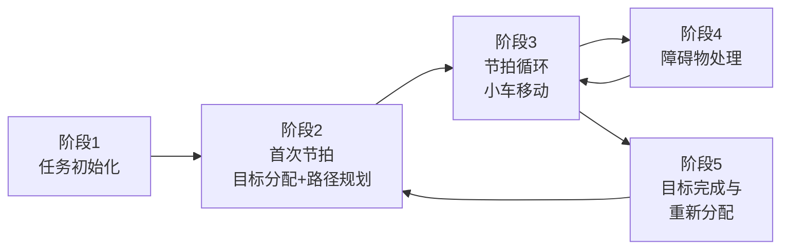
```mermaid
graph LR
    P1["阶段1<br/>任务初始化"] --> P2["阶段2<br/>首次节拍<br/>目标分配+路径规划"]
    P2 --> P3["阶段3<br/>节拍循环<br/>小车移动"]
    P3 --> P4["阶段4<br/>障碍物处理"]
    P4 --> P3
    P3 --> P5["阶段5<br/>目标完成与<br/>重新分配"]
    P5 --> P2
```

### 5.2 阶段1：任务初始化

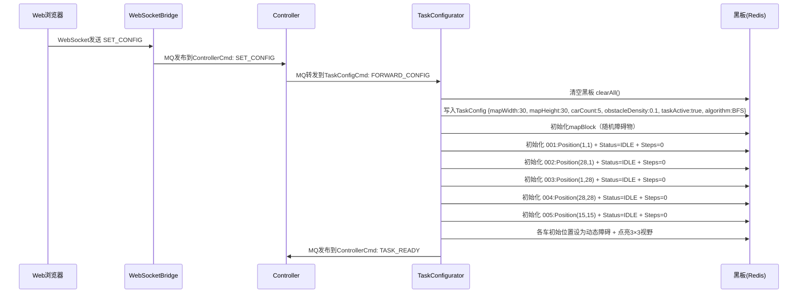
```mermaid
sequenceDiagram
    participant WEB as Web浏览器
    participant WSB as WebSocketBridge
    participant CTRL as Controller
    participant TC as TaskConfigurator
    participant BB as 黑板(Redis)

    WEB->>WSB: WebSocket发送 SET_CONFIG
    WSB->>CTRL: MQ发布到ControllerCmd: SET_CONFIG
    CTRL->>TC: MQ转发到TaskConfigCmd: FORWARD_CONFIG
    TC->>BB: 清空黑板 clearAll()
    TC->>BB: 写入TaskConfig {mapWidth:30, mapHeight:30, carCount:5, obstacleDensity:0.1, taskActive:true, algorithm:BFS}
    TC->>BB: 初始化mapBlock（随机障碍物）
    TC->>BB: 初始化 001:Position(1,1) + Status=IDLE + Steps=0
    TC->>BB: 初始化 002:Position(28,1) + Status=IDLE + Steps=0
    TC->>BB: 初始化 003:Position(1,28) + Status=IDLE + Steps=0
    TC->>BB: 初始化 004:Position(28,28) + Status=IDLE + Steps=0
    TC->>BB: 初始化 005:Position(15,15) + Status=IDLE + Steps=0
    TC->>BB: 各车初始位置设为动态障碍 + 点亮3×3视野
    TC->>CTRL: MQ发布到ControllerCmd: TASK_READY
```

### 5.3 阶段2：首次节拍（目标分配+路径规划）

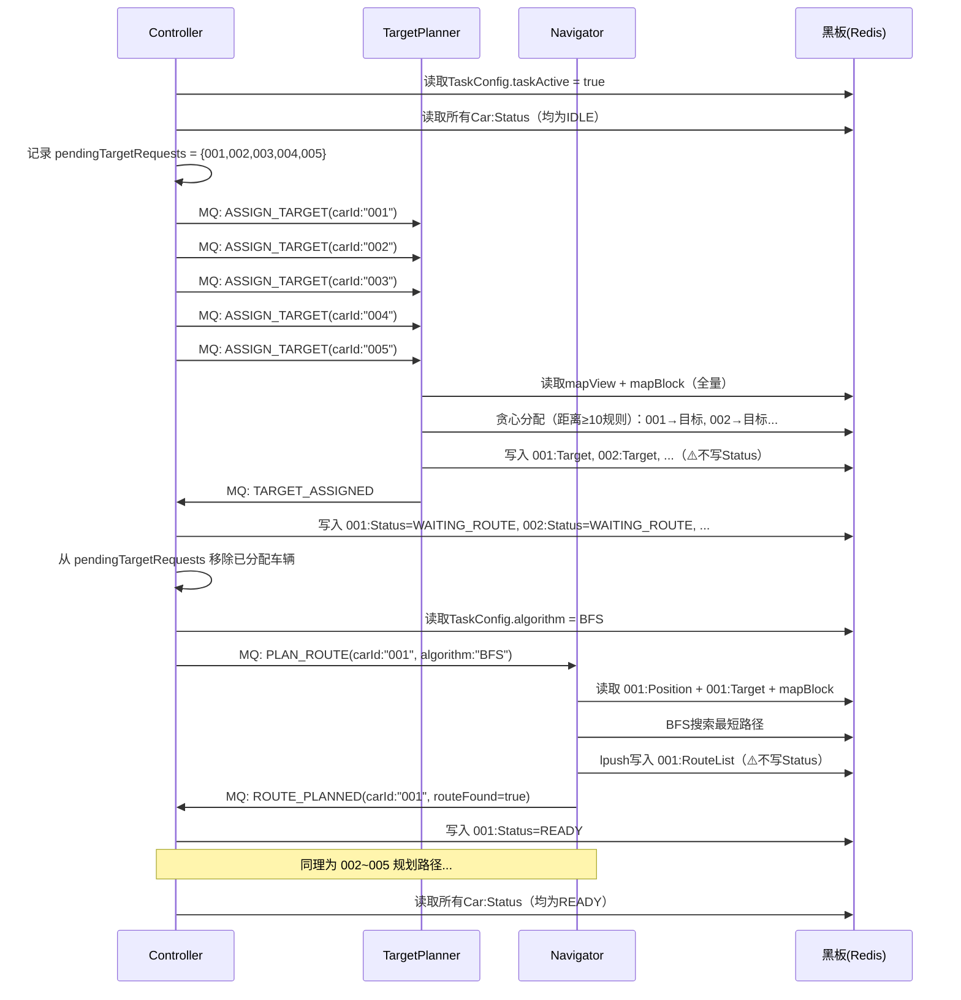
```mermaid
sequenceDiagram
    participant CTRL as Controller
    participant TP as TargetPlanner
    participant NAV as Navigator
    participant BB as 黑板(Redis)

    CTRL->>BB: 读取TaskConfig.taskActive = true
    CTRL->>BB: 读取所有Car:Status（均为IDLE）
    CTRL->>CTRL: 记录 pendingTargetRequests = {001,002,003,004,005}

    CTRL->>TP: MQ: ASSIGN_TARGET(carId:"001")
    CTRL->>TP: MQ: ASSIGN_TARGET(carId:"002")
    CTRL->>TP: MQ: ASSIGN_TARGET(carId:"003")
    CTRL->>TP: MQ: ASSIGN_TARGET(carId:"004")
    CTRL->>TP: MQ: ASSIGN_TARGET(carId:"005")

    TP->>BB: 读取mapView + mapBlock（全量）
    TP->>BB: 贪心分配（距离≥10规则）：001→目标, 002→目标...
    TP->>BB: 写入 001:Target, 002:Target, ...（⚠️不写Status）
    TP->>CTRL: MQ: TARGET_ASSIGNED

    CTRL->>BB: 写入 001:Status=WAITING_ROUTE, 002:Status=WAITING_ROUTE, ...
    CTRL->>CTRL: 从 pendingTargetRequests 移除已分配车辆

    CTRL->>BB: 读取TaskConfig.algorithm = BFS
    CTRL->>NAV: MQ: PLAN_ROUTE(carId:"001", algorithm:"BFS")
    NAV->>BB: 读取 001:Position + 001:Target + mapBlock
    NAV->>BB: BFS搜索最短路径
    NAV->>BB: lpush写入 001:RouteList（⚠️不写Status）
    NAV->>CTRL: MQ: ROUTE_PLANNED(carId:"001", routeFound=true)

    CTRL->>BB: 写入 001:Status=READY

    Note over CTRL,NAV: 同理为 002~005 规划路径...

    CTRL->>BB: 读取所有Car:Status（均为READY）
```

### 5.4 阶段3：节拍循环（小车移动）

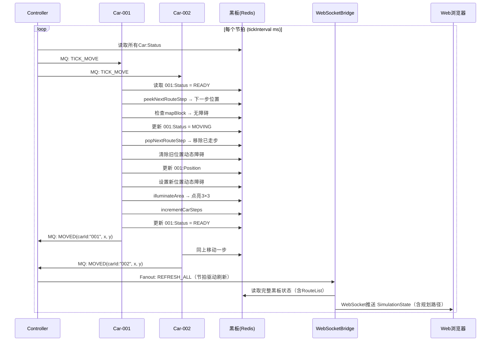
```mermaid
sequenceDiagram
    participant CTRL as Controller
    participant C1 as Car-001
    participant C2 as Car-002
    participant BB as 黑板(Redis)
    participant WSB as WebSocketBridge
    participant WEB as Web浏览器

    loop 每个节拍 (tickInterval ms)
        CTRL->>BB: 读取所有Car:Status
        CTRL->>C1: MQ: TICK_MOVE
        CTRL->>C2: MQ: TICK_MOVE

        C1->>BB: 读取 001:Status = READY
        C1->>BB: peekNextRouteStep → 下一步位置
        C1->>BB: 检查mapBlock → 无障碍
        C1->>BB: 更新 001:Status = MOVING
        C1->>BB: popNextRouteStep → 移除已走步
        C1->>BB: 清除旧位置动态障碍
        C1->>BB: 更新 001:Position
        C1->>BB: 设置新位置动态障碍
        C1->>BB: illuminateArea → 点亮3×3
        C1->>BB: incrementCarSteps
        C1->>BB: 更新 001:Status = READY
        C1->>CTRL: MQ: MOVED(carId:"001", x, y)

        C2->>BB: 同上移动一步
        C2->>CTRL: MQ: MOVED(carId:"002", x, y)

        CTRL->>WSB: Fanout: REFRESH_ALL（节拍驱动刷新）
        WSB->>BB: 读取完整黑板状态（含RouteList）
        WSB->>WEB: WebSocket推送 SimulationState（含规划路径）
    end
```

### 5.5 阶段4：障碍物处理（超时转IDLE）

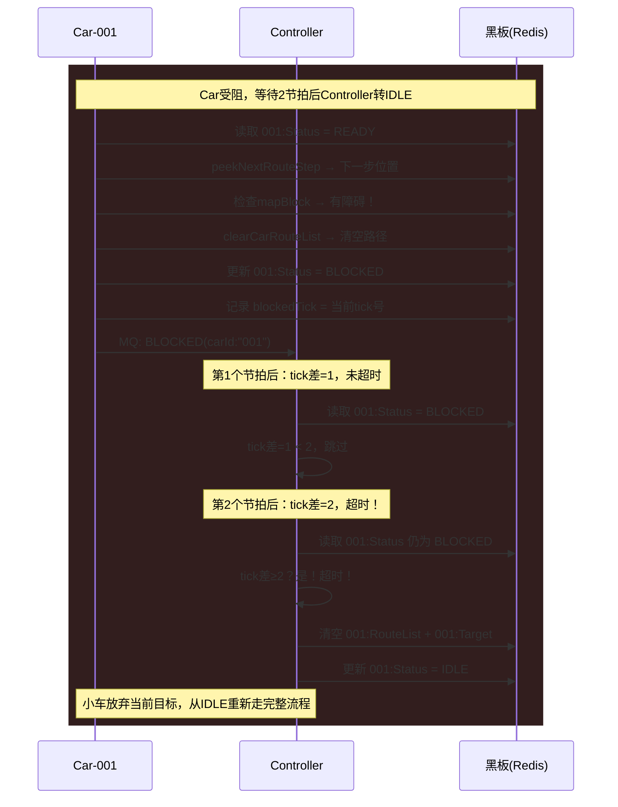
```mermaid
sequenceDiagram
    participant C1 as Car-001
    participant CTRL as Controller
    participant BB as 黑板(Redis)

    rect rgb(50, 30, 30)
        Note over C1,BB: Car受阻，等待2节拍后Controller转IDLE
        C1->>BB: 读取 001:Status = READY
        C1->>BB: peekNextRouteStep → 下一步位置
        C1->>BB: 检查mapBlock → 有障碍！
        C1->>BB: clearCarRouteList → 清空路径
        C1->>BB: 更新 001:Status = BLOCKED
        C1->>BB: 记录 blockedTick = 当前tick号
        C1->>CTRL: MQ: BLOCKED(carId:"001")

        Note over CTRL: 第1个节拍后：tick差=1，未超时
        CTRL->>BB: 读取 001:Status = BLOCKED
        CTRL->>CTRL: tick差=1 < 2，跳过

        Note over CTRL: 第2个节拍后：tick差=2，超时！
        CTRL->>BB: 读取 001:Status 仍为 BLOCKED
        CTRL->>CTRL: tick差≥2？是！超时！
        CTRL->>BB: 清空 001:RouteList + 001:Target
        CTRL->>BB: 更新 001:Status = IDLE
        Note over C1,CTRL: 小车放弃当前目标，从IDLE重新走完整流程
    end
```

> **v3.3 变更**：不再有 REPLAN_ROUTE 重规划场景。受阻小车仅等待超时转 IDLE，然后重新走 ASSIGN_TARGET → PLAN_ROUTE 完整流程。

### 5.6 阶段5：目标完成与重新分配

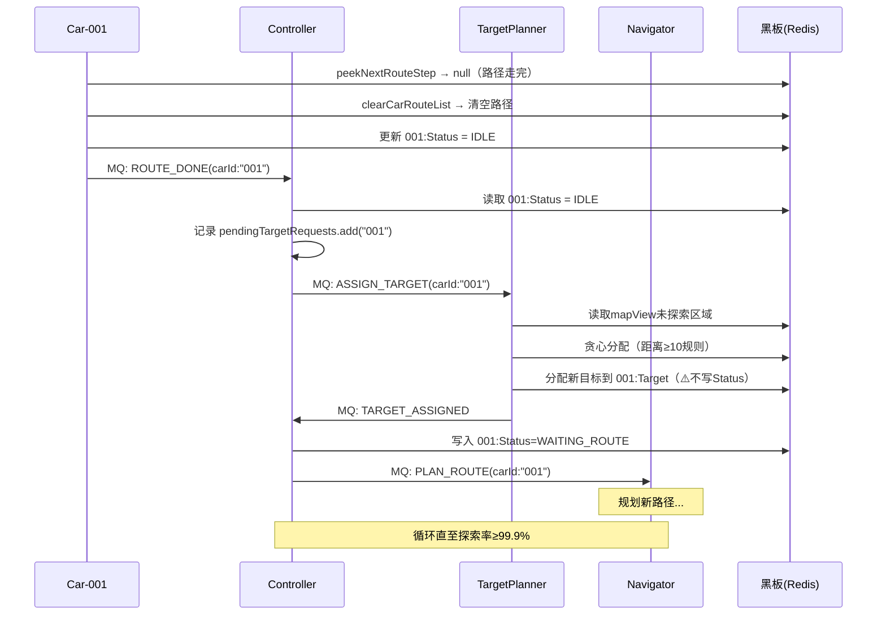
```mermaid
sequenceDiagram
    participant C1 as Car-001
    participant CTRL as Controller
    participant TP as TargetPlanner
    participant NAV as Navigator
    participant BB as 黑板(Redis)

    C1->>BB: peekNextRouteStep → null（路径走完）
    C1->>BB: clearCarRouteList → 清空路径
    C1->>BB: 更新 001:Status = IDLE
    C1->>CTRL: MQ: ROUTE_DONE(carId:"001")

    CTRL->>BB: 读取 001:Status = IDLE
    CTRL->>CTRL: 记录 pendingTargetRequests.add("001")
    CTRL->>TP: MQ: ASSIGN_TARGET(carId:"001")
    TP->>BB: 读取mapView未探索区域
    TP->>BB: 贪心分配（距离≥10规则）
    TP->>BB: 分配新目标到 001:Target（⚠️不写Status）
    TP->>CTRL: MQ: TARGET_ASSIGNED

    CTRL->>BB: 写入 001:Status=WAITING_ROUTE

    CTRL->>NAV: MQ: PLAN_ROUTE(carId:"001")
    Note over NAV: 规划新路径...

    Note over CTRL,NAV: 循环直至探索率≥99.9%
```

### 5.7 知识源间消息通信汇总图

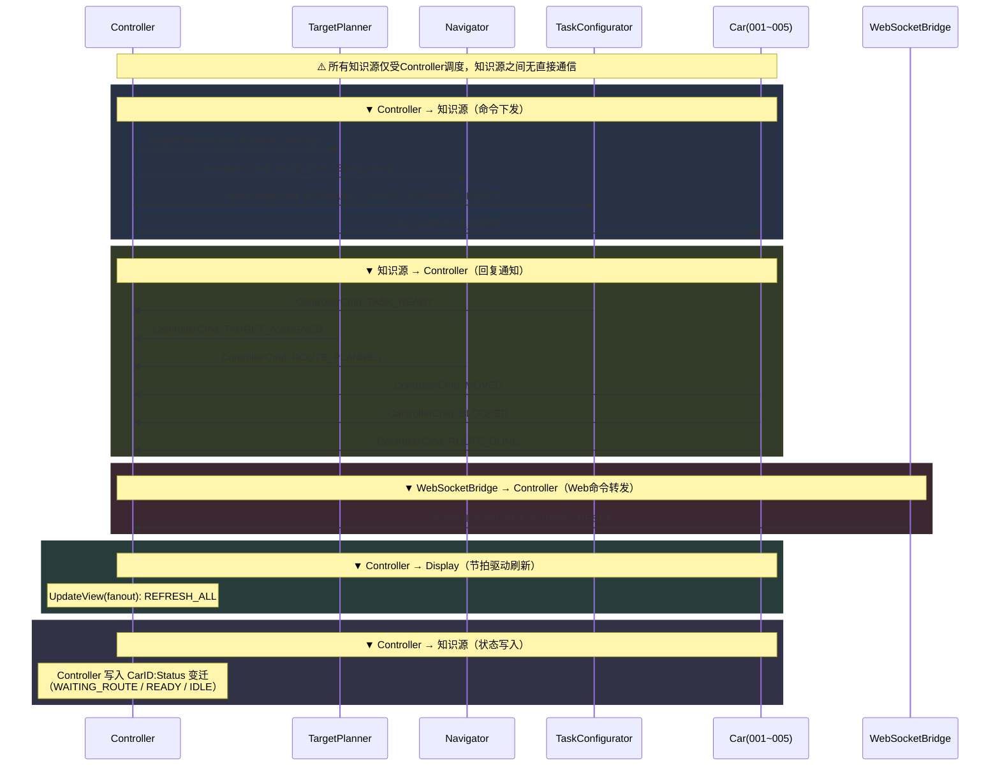
```mermaid
sequenceDiagram
    participant CTRL as Controller
    participant TP as TargetPlanner
    participant NAV as Navigator
    participant TC as TaskConfigurator
    participant C as Car(001~005)
    participant WSB as WebSocketBridge

    Note over CTRL,C: ⚠️ 所有知识源仅受Controller调度，知识源之间无直接通信

    rect rgb(40, 50, 70)
        Note over CTRL,C: ▼ Controller → 知识源（命令下发）
        CTRL->>TP: TargetPlannerCmd: ASSIGN_TARGET
        CTRL->>NAV: NavigatorCmd: PLAN_ROUTE(algorithm)
        CTRL->>TC: TaskConfigCmd: FORWARD_CONFIG / FORWARD_RESET
        CTRL->>C: Car_CarID: TICK_MOVE
    end

    rect rgb(50, 60, 40)
        Note over CTRL,C: ▼ 知识源 → Controller（回复通知）
        TC->>CTRL: ControllerCmd: TASK_READY
        TP->>CTRL: ControllerCmd: TARGET_ASSIGNED
        NAV->>CTRL: ControllerCmd: ROUTE_PLANNED
        C->>CTRL: ControllerCmd: MOVED
        C->>CTRL: ControllerCmd: BLOCKED
        C->>CTRL: ControllerCmd: ROUTE_DONE
    end

    rect rgb(60, 40, 50)
        Note over CTRL,WSB: ▼ WebSocketBridge → Controller（Web命令转发）
        WSB->>CTRL: ControllerCmd: SET_CONFIG / RESET
    end

    rect rgb(40, 60, 60)
        Note over CTRL,C: ▼ Controller → Display（节拍驱动刷新）
        Note over CTRL: UpdateView(fanout): REFRESH_ALL
    end

    rect rgb(50, 50, 70)
        Note over CTRL,C: ▼ Controller → 知识源（状态写入）
        Note over CTRL: Controller 写入 CarID:Status 变迁<br/>（WAITING_ROUTE / READY / IDLE）
    end
```

---

## 六、黑板数据结构设计

### 6.1 Redis Key-Value 映射

| Redis Key | 数据类型 | 说明 | 示例值 |
|-----------|----------|------|--------|
| `mapView` | Bitmap | 探索视野，offset = y × mapWidth + x，0=未探索 / 1=已探索 | SETBIT mapView 0 1 |
| `mapBlock` | Bitmap | 障碍物+动态障碍（小车位置），同上索引 | SETBIT mapBlock 93 1 |
| `Car001:Position` | Hash | {x: n, y: m} 当前位置 | {x: 5, y: 3} |
| `Car001:Target` | String | {x: n, y: m} 目标位置 JSON | {"x":20,"y":15} |
| `Car001:RouteList` | List | 路径 JSON 序列，lpush 压入（最后元素=下一步），rpop 取出 | [{"x":6,"y":3},...] |
| `Car001:Status` | String | **5 种状态枚举** | IDLE / WAITING_ROUTE / READY / MOVING / BLOCKED |
| `Car001:Steps` | String | 步数统计 | 42 |
| `Car001:BlockedTick` | String | 受阻时的tick号（用于超时判断） | 15 |
| `TaskConfig` | Hash | 任务配置 | {mapWidth:30, mapHeight:30, carCount:5, obstacleDensity:0.1, taskActive:true, tickInterval:500, algorithm:BFS} |
| `lock:Car001`~`lock:Car005` | String | Car级别分布式锁，SET NX PX 5000 | 唯一请求ID |

### 6.2 Bitmap 索引计算

```
offset = y × mapWidth + x

示例（30×30地图）：
  位置(0,0) → offset = 0×30+0 = 0
  位置(5,3) → offset = 3×30+5 = 95
  位置(29,29) → offset = 29×30+29 = 899

总bit数 = 30×30 = 900 bit = 113 bytes
```

### 6.3 3×3 视野点亮范围

```
小车位置 = (cx, cy)，VISION_RANGE = 1
点亮范围 = (cx-1, cy-1) 到 (cx+1, cy+1)，共 9 个格子

边界处理：
  nx ∈ [0, mapWidth-1]
  ny ∈ [0, mapHeight-1]
```

### 6.4 组件-黑板读写矩阵

| 黑板 Key | Controller | Car | TargetPlanner | Navigator | TaskConfigurator | WebSocketBridge |
|----------|:---:|:---:|:---:|:---:|:---:|:---:|
| `mapView` | R | **W** (点亮) | R | - | - | R |
| `mapBlock` | R | **R/W** (移动+动态障碍) | R | R | **W** (初始化) | R |
| `CarID:Position` | R | **W** (移动) | R | R | **W** (初始化) | R |
| `CarID:Target` | **R/W** (超时清空) | R | **W** (分配) | R | - | R |
| `CarID:RouteList` | **R/W** (超时清空) | **R/W** (消费) | - | **W** (规划) | - | R |
| `CarID:Status` | **R/W** (调度变迁) | **R/W** (执行变迁) | ⛔ **不写** | ⛔ **不写** | **W** (初始化) | R |
| `CarID:Steps` | R | **W** (递增) | - | - | **W** (初始化) | R |
| `CarID:BlockedTick` | **R/W** (超时检查) | **W** (记录) | - | - | - | R |
| `TaskConfig` | **R/W** (转发配置) | - | R | R | **W** (初始化) | **R/W** (tickInterval) |
| `lock:CarID` | **R/W** (加锁) | **R/W** (加锁) | - | **R/W** (加锁) | - | - |

> **关键约束**：⚠️ TargetPlanner 和 Navigator **不再写入 CarID:Status**，只有 Controller 和 Car 可以写 CarID:Status。

### 6.5 黑板并发控制

#### 6.5.1 并发写冲突识别

| 冲突场景 | 写者A | 写者B | 数据 | 风险等级 | 说明 |
|----------|-------|-------|------|----------|------|
| C1 | Controller | Car | `CarID:Status` | **中** | Controller 写 WAITING_ROUTE/READY/IDLE；Car 写 MOVING/READY/IDLE/BLOCKED |
| C2 | Navigator | Car | `CarID:RouteList` | **低** | Navigator 写完整路径；Car 消费（rpop）路径。时序上不重叠（Nav先写，Car后读） |
| C3 | TargetPlanner | Controller | `CarID:Target` | **低** | TP 写 Target；Controller 清空 Target。不会同时操作同一 Car（TP 写在调度阶段，Controller 清空在下一轮） |
| C4 | 多个 Car | - | `mapBlock` | **低** | 不同 Car 操作不同 bit 位，无冲突 |

#### 6.5.2 加锁机制设计

**原则**：以 Car 为粒度加锁，不同 Car 之间不互相阻塞。

**方案一：Car 级别分布式锁**（推荐，用于复合操作）

```
锁Key：lock:CarID
获取：SET lock:CarID <requestId> NX PX 5000  （5秒超时自动释放）
释放：Lua脚本（校验requestId后DEL）
```

**加锁场景**：

| 操作者 | 加锁时机 | 保护范围 |
|--------|----------|----------|
| Car | 处理 TICK_MOVE 全过程 | 读Status→移动→写Position→写Status→点亮→写Steps |
| Controller | 写入 Status 调度变迁 | 读Status→写Status（WAITING_ROUTE/READY/IDLE） |
| Navigator | 写入 RouteList | 清空旧RouteList→lpush新RouteList |
| TargetPlanner | 写入 Target | 写入CarID:Target |

**锁操作模板**：

```java
public boolean executeWithCarLock(String carId, Runnable operation) {
    String lockKey = "lock:" + carId;
    String requestId = UUID.randomUUID().toString();
    // 1. 获取锁
    boolean locked = jedis.set(lockKey, requestId, "NX", "PX", 5000) != null;
    if (!locked) return false;
    try {
        // 2. 执行复合操作
        operation.run();
        return true;
    } finally {
        // 3. 释放锁（Lua脚本保证原子性）
        String script = "if redis.call('get',KEYS[1]) == ARGV[1] then return redis.call('del',KEYS[1]) else return 0 end";
        jedis.eval(script, 1, lockKey, requestId);
    }
}
```

**方案二：Redis 乐观锁**（用于简单写操作）

```
WATCH CarID:Status
GET CarID:Status → 校验预期值
MULTI
  SET CarID:Status <newValue>
EXEC → 如果被修改则返回nil，需重试
```

**适用场景**：Controller 写 Status 变迁时，先 WATCH 当前状态，仅当状态符合预期时才写入。

**方案选择**：

| 场景 | 方案 | 理由 |
|------|------|------|
| Car 处理 TICK_MOVE | 分布式锁 | 涉及多Key复合读写（Status+Position+mapBlock+Steps+RouteList） |
| Controller 写 Status 变迁 | 乐观锁 | 仅写单个Key，先WATCH再写，简单高效 |
| Navigator 写 RouteList | 分布式锁 | 涉及清空+写入复合操作 |
| TargetPlanner 写 Target | 无锁/乐观锁 | 仅写单个Key，冲突概率极低 |

---

## 七、RabbitMQ 消息队列设计

### 7.1 队列定义

| 队列名 | 交换器类型 | 理由 | 生产者 | 消费者 | 持久化 | 说明 |
|--------|-----------|------|--------|--------|--------|------|
| `Car_Car001`~`Car005` | Classic Queue（默认交换器） | 点对点命令，每车独立队列，保证命令顺序消费 | Controller | 对应 Car | 是 | 小车命令队列，一次只发给一台车 |
| `NavigatorCmd` | Classic Queue（默认交换器） | 待完成任务用 Queue，保证顺序处理，FIFO | Controller | Navigator | 是 | 路径规划任务队列 |
| `TargetPlannerCmd` | Classic Queue（默认交换器） | 待完成任务用 Queue，保证顺序处理 | Controller | TargetPlanner | 是 | 目标分配任务队列 |
| `TaskConfigCmd` | Classic Queue（默认交换器） | 待完成任务用 Queue，配置命令需顺序执行 | Controller | TaskConfigurator | 是 | 任务配置命令队列 |
| `ControllerCmd` | Classic Queue（默认交换器） | 所有知识源回复经此队列汇聚，Controller 顺序消费处理 | 所有知识源 + WSB | Controller | 是 | 知识源回复 + Web命令转发队列 |
| `UpdateView` | Fanout Exchange | 广播通知所有订阅者（当前仅 WSB），一对多推送 | Controller | WebSocketBridge | 是 | 视图刷新广播交换器 |

> **类型选型理由**：
> - **Classic Queue + 默认交换器**：用于点对点命令/任务分发。每条消息只被一个消费者处理，保证命令的顺序性和唯一性。知识源的待处理任务必须用 Queue 类型，避免消息丢失或重复处理。
> - **Fanout Exchange**：用于广播通知。一条消息需要被所有订阅者接收（如视图刷新）。不路由到具体队列，而是广播到所有绑定的队列。

### 7.2 统一消息格式

所有消息采用统一 JSON 格式，使用 **fastjson2** 序列化：

```json
{
  "cmd": "TICK_MOVE",
  "data": {
    "carId": "Car001"
  },
  "timestamp": 1717234567890
}
```

### 7.3 消息类型汇总

| 消息类型 | 方向 | cmd | data 字段 |
|----------|------|-----|-----------|
| 节拍移动 | Controller→Car | `TICK_MOVE` | `{}` |
| 目标分配 | Controller→TargetPlanner | `ASSIGN_TARGET` | `{carId}` |
| 路径规划 | Controller→Navigator | `PLAN_ROUTE` | `{carId, algorithm}` |
| 配置转发 | Controller→TaskConfigurator | `FORWARD_CONFIG` | `{mapWidth, mapHeight, carCount, obstacleDensity, algorithm}` |
| 重置转发 | Controller→TaskConfigurator | `FORWARD_RESET` | `{}` |
| 任务就绪 | TaskConfigurator→Controller | `TASK_READY` | `{carCount, mapWidth, mapHeight}` |
| 目标已分配 | TargetPlanner→Controller | `TARGET_ASSIGNED` | `{carIds: [...]}` |
| 路径已规划 | Navigator→Controller | `ROUTE_PLANNED` | `{carId, routeFound}` |
| 已移动 | Car→Controller | `MOVED` | `{carId, x, y}` |
| 受阻 | Car→Controller | `BLOCKED` | `{carId, x, y}` |
| 路径完成 | Car→Controller | `ROUTE_DONE` | `{carId, x, y}` |
| 视图刷新 | Controller→Display(broadcast) | `REFRESH_ALL` | `{tick}` |
| Web配置 | WebSocketBridge→Controller | `SET_CONFIG` | `{mapWidth, mapHeight, carCount, obstacleDensity, algorithm}` |
| Web重置 | WebSocketBridge→Controller | `RESET` | `{}` |

> **v3.3 变更**：
> - 移除 `INIT_CAR`（初始化由 TaskConfigurator 直接写黑板）
> - 移除 `REPLAN_ROUTE`（受阻不再重规划，超时转 IDLE 后重新走完整流程）
> - 移除 `BLOCKED_TIMEOUT`（不再由 Car 发送，改为 Controller 自行检测超时并写 Status=IDLE）
> - 新增 `FORWARD_CONFIG` / `FORWARD_RESET`（Controller 转发 Web 命令给 TaskConfigurator）
> - 新增 `SET_CONFIG` / `RESET`（WebSocketBridge 发送给 Controller）

### 7.4 各知识源消息格式详细设计

#### 7.4.1 Car 消息格式

**输入消息（订阅 Car_CarID 队列）**：

```json
// TICK_MOVE — 节拍移动命令
{
  "cmd": "TICK_MOVE",
  "data": {},
  "timestamp": 1717234567890
}
```

**输出消息（发布到 ControllerCmd 队列）**：

```json
// MOVED — 移动完成通知
{
  "cmd": "MOVED",
  "data": {
    "carId": "Car001",
    "x": 6,
    "y": 3
  },
  "timestamp": 1717234567890
}

// BLOCKED — 受阻通知
{
  "cmd": "BLOCKED",
  "data": {
    "carId": "Car001",
    "x": 5,
    "y": 3,
    "blockedX": 6,
    "blockedY": 3
  },
  "timestamp": 1717234567890
}

// ROUTE_DONE — 路径走完通知
{
  "cmd": "ROUTE_DONE",
  "data": {
    "carId": "Car001",
    "x": 20,
    "y": 15
  },
  "timestamp": 1717234567890
}
```

#### 7.4.2 TargetPlanner 消息格式

**输入消息（订阅 TargetPlannerCmd 队列）**：

```json
// ASSIGN_TARGET — 分配目标命令
{
  "cmd": "ASSIGN_TARGET",
  "data": {
    "carId": "Car001"
  },
  "timestamp": 1717234567890
}
```

**输出消息（发布到 ControllerCmd 队列）**：

```json
// TARGET_ASSIGNED — 目标已分配通知
{
  "cmd": "TARGET_ASSIGNED",
  "data": {
    "assignedCars": [
      {"carId": "Car001", "targetX": 20, "targetY": 15},
      {"carId": "Car002", "targetX": 8, "targetY": 22}
    ]
  },
  "timestamp": 1717234567890
}
```

#### 7.4.3 Navigator 消息格式

**输入消息（订阅 NavigatorCmd 队列）**：

```json
// PLAN_ROUTE — 规划路径命令
{
  "cmd": "PLAN_ROUTE",
  "data": {
    "carId": "Car001",
    "algorithm": "BFS"
  },
  "timestamp": 1717234567890
}
```

**输出消息（发布到 ControllerCmd 队列）**：

```json
// ROUTE_PLANNED — 路径已规划通知
{
  "cmd": "ROUTE_PLANNED",
  "data": {
    "carId": "Car001",
    "routeFound": true,
    "routeLength": 15
  },
  "timestamp": 1717234567890
}

// ROUTE_PLANNED — 路径未找到
{
  "cmd": "ROUTE_PLANNED",
  "data": {
    "carId": "Car001",
    "routeFound": false,
    "routeLength": 0
  },
  "timestamp": 1717234567890
}
```

#### 7.4.4 TaskConfigurator 消息格式

**输入消息（订阅 TaskConfigCmd 队列）**：

```json
// FORWARD_CONFIG — 配置转发命令（来自Controller转发Web命令）
{
  "cmd": "FORWARD_CONFIG",
  "data": {
    "mapWidth": 30,
    "mapHeight": 30,
    "carCount": 5,
    "obstacleDensity": 0.1,
    "algorithm": "BFS"
  },
  "timestamp": 1717234567890
}

// FORWARD_RESET — 重置转发命令
{
  "cmd": "FORWARD_RESET",
  "data": {},
  "timestamp": 1717234567890
}
```

**输出消息（发布到 ControllerCmd 队列）**：

```json
// TASK_READY — 任务初始化完成通知
{
  "cmd": "TASK_READY",
  "data": {
    "carCount": 5,
    "mapWidth": 30,
    "mapHeight": 30
  },
  "timestamp": 1717234567890
}
```

#### 7.4.5 WebSocketBridge 消息格式

**输入消息（订阅 UpdateView fanout）**：

```json
// REFRESH_ALL — 视图刷新广播
{
  "cmd": "REFRESH_ALL",
  "data": {
    "tick": 15
  },
  "timestamp": 1717234567890
}
```

**输出消息（发布到 ControllerCmd 队列）**：

```json
// SET_CONFIG — Web配置命令（转发给Controller）
{
  "cmd": "SET_CONFIG",
  "data": {
    "mapWidth": 30,
    "mapHeight": 30,
    "carCount": 5,
    "obstacleDensity": 0.1,
    "algorithm": "BFS"
  },
  "timestamp": 1717234567890
}

// RESET — Web重置命令
{
  "cmd": "RESET",
  "data": {},
  "timestamp": 1717234567890
}
```

---

## 八、Maven 多模块项目结构

### 8.1 模块依赖关系

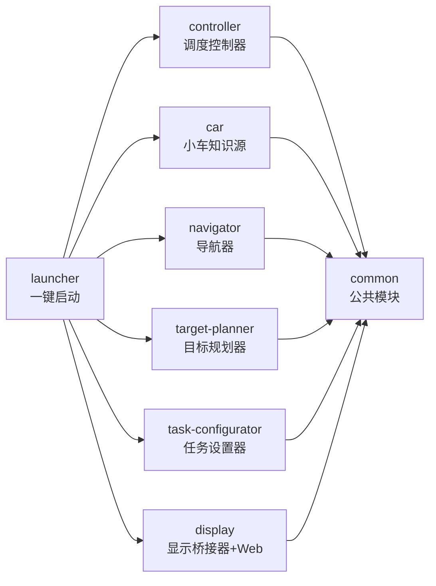
```mermaid
graph LR
    COMMON["common<br/>公共模块"]
    CTRL["controller<br/>调度控制器"]
    CAR["car<br/>小车知识源"]
    NAV["navigator<br/>导航器"]
    TP["target-planner<br/>目标规划器"]
    TCF["task-configurator<br/>任务设置器"]
    DISP["display<br/>显示桥接器+Web"]
    LCH["launcher<br/>一键启动"]

    CTRL --> COMMON
    CAR --> COMMON
    NAV --> COMMON
    TP --> COMMON
    TCF --> COMMON
    DISP --> COMMON
    LCH --> CTRL
    LCH --> CAR
    LCH --> NAV
    LCH --> TP
    LCH --> TCF
    LCH --> DISP
```

### 8.2 目录结构

```
BlackBoxAI/
├── pom.xml                                          # Maven父POM（8个子模块）
├── common/                                          # 公共模块
│   ├── pom.xml
│   └── src/main/java/inspection/common/
│       ├── model/
│       │   ├── Point.java                           # 二维坐标点(x, y)
│       │   ├── CarStatus.java                       # 枚举: 5种状态
│       │   ├── RouteAlgorithm.java                  # 枚举: BFS / A_STAR
│       │   └── SimulationState.java                # 仿真全局状态快照
│       ├── blackboard/
│       │   ├── BlackboardClient.java                # Redis黑板客户端（所有CRUD封装+分布式锁）
│       │   ├── BlackboardConfig.java                # Redis连接配置
│       │   └── DistributedLock.java                 # Redis分布式锁封装
│       ├── messaging/
│       │   ├── MessageBus.java                      # RabbitMQ封装: publish/subscribe/fanout
│       │   ├── MessageConfig.java                   # RabbitMQ连接配置
│       │   └── MessageType.java                     # 消息类型常量
│       └── util/
│           └── Constants.java                       # 系统常量（队列名/默认参数/颜色等）
├── controller/                                      # Controller模块（独立进程）
│   ├── pom.xml
│   └── src/main/java/inspection/controller/
│       ├── ControllerMain.java                      # 独立main入口
│       └── ControllerAgent.java                     # 节拍循环调度核心
├── car/                                             # Car模块（独立进程，每车一个）
│   ├── pom.xml
│   └── src/main/java/inspection/car/
│       ├── CarMain.java                             # 独立main入口，args=carId
│       └── CarAgent.java                            # 5状态状态机+移动+点亮+障碍检测
├── navigator/                                       # Navigator模块（独立进程）
│   ├── pom.xml
│   └── src/main/java/inspection/navigator/
│       ├── NavigatorMain.java                       # 独立main入口
│       ├── NavigatorAgent.java                      # 路径规划调度（选择算法）
│       ├── BfsPathFinder.java                       # BFS路径搜索实现
│       └── AStarPathFinder.java                     # A*路径搜索实现
├── target-planner/                                  # TargetPlanner模块（独立进程）
│   ├── pom.xml
│   └── src/main/java/inspection/targetplanner/
│       ├── TargetPlannerMain.java                   # 独立main入口
│       └── TargetPlannerAgent.java                  # 贪心目标分配（距离≥10规则）
├── task-configurator/                               # TaskConfigurator模块（独立进程）
│   ├── pom.xml
│   └── src/main/java/inspection/taskconfigurator/
│       ├── TaskConfiguratorMain.java                # 独立main入口
│       └── TaskConfiguratorAgent.java               # 配置→初始化黑板→通知
├── display/                                         # Display模块（独立进程）
│   ├── pom.xml
│   └── src/main/java/inspection/display/
│       ├── DisplayMain.java                         # 独立main入口
│       └── WebSocketBridge.java                     # MQ→WebSocket桥接+HTTP服务器
│   └── src/main/resources/static/
│       ├── index.html                               # 主页面
│       ├── css/style.css                            # 暗色工业风SCADA样式
│       └── js/
│           ├── app.js                               # 主入口：WebSocket+Canvas+日志
│           ├── renderer.js                          # Canvas渲染器（地图+路径+小车）
│           └── controls.js                          # 控制面板逻辑
├── launcher/                                        # 一键启动模块（开发调试用）
│   ├── pom.xml
│   └── src/main/java/inspection/launcher/
│       └── LauncherMain.java                        # 单进程多线程启动所有组件
└── README.md                                        # 项目说明文档
```

---

## 九、核心算法设计

### 9.1 BFS 路径搜索算法（Navigator 默认）

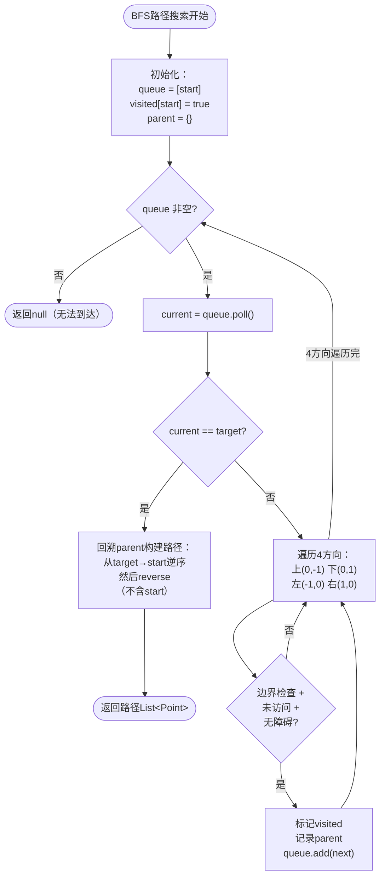
```mermaid
flowchart TD
    START(["BFS路径搜索开始"]) --> INIT["初始化：<br/>queue = [start]<br/>visited[start] = true<br/>parent = {}"]
    INIT --> LOOP{"queue 非空?"}
    LOOP -->|"否"| FAIL(["返回null（无法到达）"])
    LOOP -->|"是"| POP["current = queue.poll()"]
    POP --> CHECK{"current == target?"}
    CHECK -->|"是"| TRACE["回溯parent构建路径：<br/>从target→start逆序<br/>然后reverse<br/>（不含start）"]
    CHECK -->|"否"| DIRS["遍历4方向：<br/>上(0,-1) 下(0,1)<br/>左(-1,0) 右(1,0)"]
    DIRS --> BOUND{"边界检查 +<br/>未访问 +<br/>无障碍?"}
    BOUND -->|"否"| DIRS
    BOUND -->|"是"| ENQUEUE["标记visited<br/>记录parent<br/>queue.add(next)"]
    ENQUEUE --> DIRS
    DIRS -->|"4方向遍历完"| LOOP
    TRACE --> RETURN(["返回路径List&lt;Point&gt;"])
```

**算法复杂度**：时间 O(W×H)，空间 O(W×H)，30×30 = 900 节点，完全可接受。

### 9.2 A* 路径搜索算法（Navigator 可选）

```mermaid
flowchart TD
    START(["A*路径搜索开始"]) --> INIT["初始化：<br/>openSet = PriorityQueue(按fScore排序)<br/>gScore[start] = 0<br/>fScore[start] = h(start, target)<br/>parent = {}"]
    INIT --> LOOP{"openSet 非空?"}
    LOOP -->|"否"| FAIL(["返回null（无法到达）"])
    LOOP -->|"是"| POP["current = openSet.poll()<br/>（fScore最小的节点）"]
    POP --> CHECK{"current == target?"}
    CHECK -->|"是"| TRACE["回溯parent构建路径：<br/>从target→start逆序<br/>然后reverse<br/>（不含start）"]
    CHECK -->|"否"| DIRS["遍历4方向：<br/>上(0,-1) 下(0,1)<br/>左(-1,0) 右(1,0)"]
    DIRS --> BOUND{"边界检查 +<br/>无障碍?"}
    BOUND -->|"否"| DIRS
    BOUND -->|"是"| CALC["tentative_g = gScore[current] + 1<br/>如果 tentative_g < gScore[next]：<br/>  更新 gScore[next]<br/>  fScore[next] = gScore[next] + h(next, target)<br/>  记录parent<br/>  openSet.add(next)"]
    CALC --> DIRS
    DIRS -->|"4方向遍历完"| LOOP
    TRACE --> RETURN(["返回路径List&lt;Point&gt;"])
```

**启发函数 h(n, target)**：曼哈顿距离 `|nx - tx| + |ny - ty|`

**算法复杂度**：时间 O(W×H × log(W×H))（优先队列），空间 O(W×H)。实际运行比 BFS 更快收敛。

**BFS vs A* 选择**：

| 对比项 | BFS | A* |
|--------|-----|-----|
| 最短路径保证 | 是（步数最少） | 是（步数最少） |
| 搜索速度 | 较慢（全量扩展） | 较快（启发式剪枝） |
| 实现复杂度 | 简单 | 中等（需优先队列+启发函数） |
| 适用场景 | 小地图、默认算法 | 大地图、性能优先 |
| 选择方式 | `TaskConfig.algorithm = BFS` | `TaskConfig.algorithm = A_STAR` |

### 9.3 贪心目标分配算法（TargetPlanner）

```mermaid
flowchart TD
    START(["目标分配开始"]) --> COLLECT["收集需要目标的小车<br/>（空闲状态）"]
    COLLECT --> SCAN["扫描全图：<br/>找出所有 !mapView && !mapBlock 的格子<br/>作为候选目标集"]
    SCAN --> EMPTY{"候选目标集为空?"}
    EMPTY -->|"是"| DONE(["所有区域已探索，无需分配"])
    EMPTY -->|"否"| LOOP{"遍历每台需要目标的车"}
    LOOP -->|"遍历完"| FINISH(["通知Controller TARGET_ASSIGNED"])
    LOOP -->|"下一台车"| CHECK_COUNT{"剩余候选目标 > 1?"}
    CHECK_COUNT -->|"是"| FIND_FAR["从候选目标集中<br/>找曼哈顿距离最近且<br/>距离 ≥ 10 的目标"]
    CHECK_COUNT -->|"否（最后1个）"| FIND_ANY["直接分配最后一个<br/>候选目标（无距离限制）"]
    FIND_FAR --> HAS_TARGET{"找到满足条件的<br/>目标?"}
    HAS_TARGET -->|"是"| ASSIGN["分配目标：<br/>写入CarID:Target<br/>⚠️不写CarID:Status<br/>从候选集中移除该目标"]
    HAS_TARGET -->|"否"| SKIP["暂不分配<br/>等待下轮调度"]
    FIND_ANY --> ASSIGN
    ASSIGN --> LOOP
    SKIP --> LOOP
```

**距离规则说明**：
- **剩余候选区域 > 1** 时：只分配距离 ≥ 10 的目标，避免小车反复前往附近已探索区域
- **剩余候选区域 = 1** 时：最后一个未探索区域无距离限制，直接分配
- **未找到满足条件的目标**：该车暂不分配，等待其他车完成任务后重新调度

**算法复杂度**：时间 O(C × U)，C=小车数(5)，U=未探索格子数，最坏 5×900=4500 次，完全可接受。

---

## 十、Web 前端设计

### 10.1 页面布局

```mermaid
graph TB
    subgraph Page["变电站巡检监控台 (1280×720+)"]
        subgraph Header["顶部标题栏"]
            TITLE["变电站巡检仿真系统"]
            STATUS["运行状态灯 ● + 状态文字"]
            TIME["仿真时间"]
        end

        subgraph Main["主内容区"]
            subgraph Left["左侧：地图画布区 (600×600px)"]
                CANVAS["Canvas 渲染<br/>底层: 地图(已探索/未探索/障碍物)<br/>中层: 规划路径(虚线+箭头,各车颜色)<br/>顶层: 小车(彩色圆形+编号001~005)"]
            end

            subgraph Right["右侧：控制面板"]
                subgraph CTRL_PANEL["系统控制"]
                    BTN_START["▶ 启动巡检"]
                    BTN_PAUSE["⏸ 暂停"]
                    BTN_RESET["↺ 重置"]
                    SPEED["速度滑块"]
                    ALGO["路径算法选择<br/>BFS / A*"]
                end

                subgraph PARAM_PANEL["参数设置"]
                    CAR_COUNT["车辆数"]
                    OBSTACLE["障碍物密度"]
                    MAP_SIZE["地图大小"]
                    BTN_GENERATE["重新生成"]
                end

                subgraph STATS_PANEL["统计信息"]
                    PROGRESS["探索率进度条"]
                    CAR_STATS["各车步数/状态/规划路径长度<br/>（带状态颜色标识）"]
                    RUNTIME["运行时间"]
                end
            end
        end

        subgraph Footer["底部状态栏"]
            LOGS["消息日志滚动区 (最近50条)"]
        end
    end
```

### 10.2 Canvas 渲染

| 层级 | 内容 | 渲染方式 | 颜色方案 |
|------|------|----------|----------|
| 底层：地图 | 未探索格子 / 已探索格子 / 障碍物 | 填充矩形 | 未探索 `#1A1A2E` / 已探索 `#1B5E20` / 障碍物 `#F44336` |
| 中层：规划路径 | 各车完整规划路径 | **虚线+箭头，从当前位置到目标** | 对应小车颜色，半透明 |
| 顶层：小车 | 小车圆形 + 编号标注(001~005) | 填充圆形+文字 | 001 `#00E676` / 002 `#FFC107` / 003 `#FF9800` / 004 `#00BCD4` / 005 `#E91E63` |

> **规划路径显示规则**：
> - 从 `CarID:RouteList` 获取完整路径点序列
> - 使用对应小车颜色、半透明虚线绘制连线
> - 每隔若干步绘制一个小箭头表示方向
> - 起点为小车当前位置，终点为目标位置
> - 路径随节拍更新（小车移动后路径缩短，重新规划后路径变化）

### 10.3 小车状态颜色标识

| 状态 | 颜色 | 色值 | 图示 |
|------|------|------|------|
| 空闲 (IDLE) | 灰色 | `#9E9E9E` | 灰色圆形+编号 |
| 等待路径 (WAITING_ROUTE) | 蓝色 | `#2196F3` | 蓝色圆形+编号 |
| 就绪 (READY) | 绿色 | `#4CAF50` | 绿色圆形+编号 |
| 移动中 (MOVING) | 橙色 | `#FF9800` | 橙色圆形+编号 |
| 受阻 (BLOCKED) | 红色 | `#F44336` | 红色圆形+编号 |

> 小车在地图上的渲染方式：以小车主题色填充圆形，圆形上方或内部显示编号 `001~005`。当车状态变化时，圆形颜色随之改变。右侧面板的车辆状态列表同样使用对应颜色标识。

### 10.4 刷新机制

**Controller 节拍驱动刷新**（非定时轮询）：

```
1. Controller 每个节拍完成调度后，发布 UpdateView fanout 广播
2. WebSocketBridge 收到广播后读取黑板，构建 SimulationState
3. 通过 WebSocket 推送至所有浏览器客户端
4. 浏览器收到推送后重绘 Canvas（地图+路径+小车）
5. 新连接的客户端首次推送完整状态
```

### 10.5 WebSocket 通信协议

**服务端→浏览器**：`SimulationState` JSON（使用 fastjson2 序列化）

```json
{
  "mapWidth": 30,
  "mapHeight": 30,
  "mapView": [true, false, true, ...],
  "mapBlock": [false, true, false, ...],
  "exploredPercent": 45.2,
  "taskActive": true,
  "tick": 15,
  "cars": {
    "Car001": {
      "carId": "Car001",
      "displayId": "001",
      "position": {"x": 5, "y": 3},
      "target": {"x": 20, "y": 15},
      "routeList": [{"x": 6, "y": 3}, {"x": 7, "y": 3}, ...],
      "status": "READY",
      "stepsWalked": 42,
      "statusColor": "#4CAF50"
    }
  }
}
```

> `routeList` 包含完整规划路径，前端据此绘制虚线路径。

**浏览器→服务端**：命令消息

```json
{"type": "SET_CONFIG", "data": {"mapWidth": 30, "mapHeight": 30, "carCount": 5, "obstacleDensity": 0.1, "algorithm": "BFS"}}
{"type": "RESET", "data": {}}
{"type": "SET_TICK_INTERVAL", "data": {"interval": 300}}
{"type": "SET_ALGORITHM", "data": {"algorithm": "A_STAR"}}
```

---

## 十一、部署与运行

### 11.1 前置条件

| 依赖 | 版本要求 | 说明 |
|------|----------|------|
| JDK | 17+ | 编译和运行 |
| Maven | 3.8+ | 项目构建 |
| Redis | 5.x+ | 黑板存储，默认 localhost:6379 |
| RabbitMQ | 3.x+ | 消息中间件，默认 localhost:5672 |

### 11.2 独立进程部署模式

**所有知识源均支持独立进程部署**，每个模块拥有独立的 `Main` 入口类：

```bash
# 1. 构建
mvn clean package -DskipTests

# 2. 启动各组件（每个在一个终端中，顺序不限）
# TaskConfigurator — 独立进程
java -cp common/target/common-1.0-SNAPSHOT.jar;task-configurator/target/task-configurator-1.0-SNAPSHOT.jar inspection.taskconfigurator.TaskConfiguratorMain

# TargetPlanner — 独立进程
java -cp common/target/common-1.0-SNAPSHOT.jar;target-planner/target/target-planner-1.0-SNAPSHOT.jar inspection.targetplanner.TargetPlannerMain

# Navigator — 独立进程
java -cp common/target/common-1.0-SNAPSHOT.jar;navigator/target/navigator-1.0-SNAPSHOT.jar inspection.navigator.NavigatorMain

# Car-001~005 — 每车独立进程
java -cp common/target/common-1.0-SNAPSHOT.jar;car/target/car-1.0-SNAPSHOT.jar inspection.car.CarMain Car001
java -cp common/target/common-1.0-SNAPSHOT.jar;car/target/car-1.0-SNAPSHOT.jar inspection.car.CarMain Car002
# ... Car003~Car005

# Controller — 独立进程
java -cp common/target/common-1.0-SNAPSHOT.jar;controller/target/controller-1.0-SNAPSHOT.jar inspection.controller.ControllerMain

# Display (WebSocketBridge) — 独立进程
java -cp common/target/common-1.0-SNAPSHOT.jar;display/target/display-1.0-SNAPSHOT.jar inspection.display.DisplayMain
```

> **独立部署原则**：每个进程仅依赖 `common` 模块和自身模块，通过 Redis 和 RabbitMQ 与其他进程通信，无进程间直接调用。任何进程崩溃后可独立重启。

### 11.3 一键启动模式（开发调试）

```bash
java -jar launcher/target/launcher-1.0-SNAPSHOT.jar
```

在单进程中以多线程方式启动所有组件，方便开发调试。

### 11.4 使用流程

1. 启动所有组件（独立进程或一键启动）
2. 浏览器打开 `http://localhost:8887`
3. 在右侧面板设置参数（车辆数、障碍物密度、**路径算法选择 BFS/A*** 等）
4. 点击「启动巡检」开始仿真
5. 观察 Canvas 上小车移动、**规划路径（虚线+箭头）** 和地图点亮
6. 探索率 100% 时仿真自动停止

---

## 十二、关键类设计

### 12.1 类图

```mermaid
classDiagram
    class Point {
        -int x
        -int y
        +Point(int x, int y)
        +getX() int
        +getY() int
        +distanceTo(Point other) double
        +manhattanDistance(Point other) int
        +equals(Object o) boolean
        +hashCode() int
        +toString() String
    }

    class CarStatus {
        <<enumeration>>
        IDLE
        WAITING_ROUTE
        READY
        MOVING
        BLOCKED
    }

    class RouteAlgorithm {
        <<enumeration>>
        BFS
        A_STAR
    }

    class SimulationState {
        -int mapWidth
        -int mapHeight
        -boolean[] mapView
        -boolean[] mapBlock
        -Map~String, CarInfo~ cars
        -double exploredPercent
        -long tickCount
        -boolean taskActive
    }

    class SimulationState_CarInfo {
        -String carId
        -String displayId
        -Point position
        -Point target
        -List~Point~ routeList
        -CarStatus status
        -int stepsWalked
        -String statusColor
    }

    SimulationState --> SimulationState_CarInfo : cars
    SimulationState_CarInfo --> Point : position/target
    SimulationState_CarInfo --> CarStatus : status

    class BlackboardConfig {
        -String host
        -int port
        -String password
        -int database
    }

    class BlackboardClient {
        -JedisPool jedisPool
        +getMapViewBit(x, y, w) boolean
        +setMapViewBit(x, y, w, val) void
        +illuminateArea(cx, cy, w, h) void
        +getFullMapView(w, h) boolean[]
        +getMapBlockBit(x, y, w) boolean
        +setMapBlockBit(x, y, w, val) void
        +getFullMapBlock(w, h) boolean[]
        +getCarPosition(carId) Point
        +setCarPosition(carId, x, y) void
        +getCarTarget(carId) Point
        +setCarTarget(carId, target) void
        +getCarRouteList(carId) List~Point~
        +peekNextRouteStep(carId) Point
        +popNextRouteStep(carId) Point
        +setCarRouteList(carId, route) void
        +clearCarRouteList(carId) void
        +getCarStatus(carId) CarStatus
        +setCarStatus(carId, status) void
        +getCarSteps(carId) int
        +incrementCarSteps(carId) void
        +setCarSteps(carId, steps) void
        +getCarBlockedTick(carId) long
        +setCarBlockedTick(carId, tick) void
        +getRouteAlgorithm() RouteAlgorithm
        +setRouteAlgorithm(algorithm) void
        +getTaskConfig() Map
        +setTaskConfig(config) void
        +isTaskActive() boolean
        +getMapWidth() int
        +getMapHeight() int
        +getCarCount() int
        +getExploredPercent(w, h) double
        +clearAll() void
        +close() void
    }

    BlackboardClient --> BlackboardConfig : config

    class DistributedLock {
        -JedisPool jedisPool
        +tryLock(lockKey, requestId, expireMs) boolean
        +unlock(lockKey, requestId) void
        +executeWithLock(lockKey, operation) boolean
    }

    DistributedLock --> BlackboardConfig : config

    class MessageConfig {
        -String host
        -int port
        -String username
        -String password
        -String vhost
    }

    class MessageBus {
        -MessageConfig config
        -Connection connection
        -Channel channel
        +connect() void
        +declareQueue(name) void
        +declareFanoutExchange(name) void
        +bindQueueToFanout(queue, exchange) void
        +publish(queue, cmd, data) void
        +fanoutPublish(exchange, cmd, data) void
        +subscribe(queue, handler) void
        +subscribeFanout(exchange, queue, handler) void
        +declareAllSystemQueues(carCount) void
        +close() void
    }

    MessageBus --> MessageConfig : config

    class PathFinder {
        <<interface>>
        +findPath(start, target, w, h, mapBlock) List~Point~
    }

    class BfsPathFinder {
        +findPath(start, target, w, h, mapBlock) List~Point~
    }

    class AStarPathFinder {
        +findPath(start, target, w, h, mapBlock) List~Point~
        -heuristic(a, b) int
    }

    PathFinder <|.. BfsPathFinder
    PathFinder <|.. AStarPathFinder

    class ControllerAgent {
        -BlackboardClient blackboard
        -DistributedLock distributedLock
        -MessageBus messageBus
        -ScheduledExecutorService scheduler
        -AtomicLong tickCount
        -Set~String~ pendingTargetRequests
        -boolean running
        -long tickIntervalMs
        +start() void
        -tick() void
        -requestTargetAssignment(carId) void
        -requestRoutePlan(carId) void
        -checkBlockedTimeout(carId) void
        -handleTargetAssigned(data) void
        -handleRoutePlanned(data) void
        -broadcastTickMove(carIds) void
        -broadcastViewUpdate() void
        -handleResponse(cmd, data) void
        -forwardWebCommand(cmd, data) void
        +setTickInterval(ms) void
        +stop() void
    }

    ControllerAgent --> BlackboardClient
    ControllerAgent --> DistributedLock
    ControllerAgent --> MessageBus

    class CarAgent {
        -String carId
        -String displayId
        -BlackboardClient blackboard
        -DistributedLock distributedLock
        -MessageBus messageBus
        -boolean running
        +start() void
        -handleMessage(cmd, data) void
        -handleTickMove() void
        -handleBlocked(blockedPos) void
        -handleRouteDone() void
        -notifyController(msgType, position) void
        +stop() void
    }

    CarAgent --> BlackboardClient
    CarAgent --> DistributedLock
    CarAgent --> MessageBus

    class NavigatorAgent {
        -BlackboardClient blackboard
        -DistributedLock distributedLock
        -MessageBus messageBus
        -Map~RouteAlgorithm, PathFinder~ pathFinders
        +start() void
        -handleMessage(cmd, data) void
        -handlePlanRoute(data) void
        -planRouteForCar(carId, algorithm) void
        +stop() void
    }

    NavigatorAgent --> BlackboardClient
    NavigatorAgent --> DistributedLock
    NavigatorAgent --> MessageBus
    NavigatorAgent --> PathFinder

    class TargetPlannerAgent {
        -BlackboardClient blackboard
        -MessageBus messageBus
        -int MIN_TARGET_DISTANCE
        +start() void
        -handleMessage(cmd, data) void
        -handleAssignTarget(data) void
        -findUnexploredCells(w, h) List~Point~
        +stop() void
    }

    TargetPlannerAgent --> BlackboardClient
    TargetPlannerAgent --> MessageBus

    class TaskConfiguratorAgent {
        -BlackboardClient blackboard
        -MessageBus messageBus
        -Random random
        +start() void
        -handleMessage(cmd, data) void
        -handleSetConfig(data) void
        -initializeObstacles(w, h, density, carCount) void
        -getCarInitialPositions(carCount, w, h) Set
        -initializeCars(carIds, w, h) void
        -handleReset() void
        +stop() void
    }

    TaskConfiguratorAgent --> BlackboardClient
    TaskConfiguratorAgent --> MessageBus

    class WebSocketBridge {
        -BlackboardClient blackboard
        -MessageBus messageBus
        +startAll() void
        -handleViewUpdate(cmd, data) void
        -pushSimulationState() void
        -buildSimulationState() SimulationState
        -broadcast(message) void
        +onOpen(conn, handshake) void
        +onClose(conn, code, reason, remote) void
        +onMessage(conn, message) void
        +onError(conn, ex) void
        +stopAll() void
    }

    WebSocketBridge --> BlackboardClient
    WebSocketBridge --> MessageBus
    WebSocketBridge --> SimulationState
```

### 12.2 关键方法说明

#### ControllerAgent.tick()

```
1. 检查黑板 TaskConfig.taskActive → false 则等待下一节拍
2. 计算探索率 ≥ 99.9% → 巡检完成
3. 遍历所有小车：
   - 空闲 → 请求 TargetPlanner 分配目标，记录 pendingTargetRequests
   - 等待路径 → 请求 Navigator 规划路径（指定算法）
   - 就绪 → 跳过
   - 移动中 → 重置为就绪（异常恢复）
   - 受阻 → 检查超时：
     - 如果 blockedTick + 2 ≤ 当前tick → 加锁清空路径+目标，写Status=IDLE
     - 否则 → 跳过（等待下一节拍）
4. 向所有就绪车发送 TICK_MOVE
5. 广播 UpdateView 刷新
6. 检查 ControllerCmd 中是否有 WSB 的 Web 命令，若有则转发给 TaskConfigurator
```

#### ControllerAgent 状态变迁写入

```
// Controller 收到 TARGET_ASSIGNED 后
handleTargetAssigned(data):
    for each assignedCar:
        blackboard.setCarStatus(carId, WAITING_ROUTE)  // Controller写Status

// Controller 收到 ROUTE_PLANNED 后
handleRoutePlanned(data):
    if routeFound:
        blackboard.setCarStatus(carId, READY)           // Controller写Status
    else:
        blackboard.setCarStatus(carId, IDLE)             // Controller写Status

// Controller 检测 BLOCKED 超时
checkBlockedTimeout(carId):
    blockedTick = blackboard.getCarBlockedTick(carId)
    if (currentTick - blockedTick >= 2):
        distributedLock.executeWithLock("lock:" + carId, () -> {
            blackboard.clearCarRouteList(carId)
            blackboard.setCarTarget(carId, null)
            blackboard.setCarStatus(carId, IDLE)
        })
```

#### CarAgent.handleTickMove()

```
1. 检查 Car:Status == READY → 否则忽略
2. peekNextRouteStep → 获取下一步
3. 路径为空 → handleRouteDone() → Status=IDLE
4. 检查下一步 mapBlock → 有障碍 → handleBlocked()
5. 加锁 lock:CarID
6. Status → MOVING
7. popNextRouteStep → 从路径移除
8. 清除旧位置 mapBlock 动态障碍
9. 更新 Car:Position
10. 设置新位置 mapBlock 动态障碍
11. illuminateArea → 点亮 3×3
12. incrementCarSteps → 递增步数
13. 路径仍有下一步 → Status=READY，通知 MOVED
14. 路径走完 → handleRouteDone() → Status=IDLE，通知 ROUTE_DONE
15. 释放锁
```

#### CarAgent.handleBlocked()

```
1. 清空 RouteList
2. 更新 Status = BLOCKED
3. 记录 blockedTick = 当前 tick 号到黑板
4. 通知 Controller BLOCKED
⚠️ Car 不做任何重规划尝试，仅等待 Controller 处理
```

#### NavigatorAgent.planRouteForCar(carId, algorithm)

```
1. 加锁 lock:CarID
2. 从黑板读取 CarID:Position, CarID:Target, mapBlock
3. 根据 algorithm 选择 PathFinder：
   - BFS → BfsPathFinder
   - A_STAR → AStarPathFinder
4. pathFinder.findPath(start, target, w, h, mapBlock)
5. 路径找到 → 写入黑板 RouteList（⚠️不写Status）
6. 路径未找到 → 不写任何状态
7. 释放锁
8. 通知 Controller ROUTE_PLANNED
```

#### TargetPlannerAgent.handleAssignTarget()

```
1. 收集需要目标的车（空闲状态）
2. 扫描全图找出未探索非障碍格子
3. 贪心分配（含距离规则）：
   - 如果剩余候选 > 1：只分配距离 ≥ 10 的目标
   - 如果剩余候选 = 1：直接分配（无距离限制）
   - 无满足条件的目标 → 暂不分配
4. 写入 CarID:Target（⚠️不写CarID:Status）
5. 通知 Controller TARGET_ASSIGNED
```

---

## 十三、fastjson2 序列化配置

### 13.1 Maven 依赖

```xml
<dependency>
    <groupId>com.alibaba.fastjson2</groupId>
    <artifactId>fastjson2</artifactId>
    <version>2.0.47</version>
</dependency>
```

### 13.2 使用方式

```java
import com.alibaba.fastjson2.JSON;
import com.alibaba.fastjson2.JSONObject;

// 序列化
String json = JSON.toJSONString(obj);

// 反序列化
Point p = JSON.parseObject(json, Point.class);

// 消息构建
JSONObject msg = new JSONObject();
msg.put("cmd", "TICK_MOVE");
msg.put("data", new JSONObject().fluentPut("carId", "Car001"));
msg.put("timestamp", System.currentTimeMillis());
String jsonStr = msg.toJSONString();

// 消息解析
JSONObject received = JSON.parseObject(jsonStr);
String cmd = received.getString("cmd");
JSONObject data = received.getJSONObject("data");
```

### 13.3 与 Gson 的替换说明

| 原Gson用法 | fastjson2替代 |
|-----------|--------------|
| `new Gson().toJson(obj)` | `JSON.toJSONString(obj)` |
| `new Gson().fromJson(json, cls)` | `JSON.parseObject(json, cls)` |
| `new JsonObject()` | `new JSONObject()` |
| `obj.addProperty("key", val)` | `obj.put("key", val)` |
| `obj.get("key").getAsString()` | `obj.getString("key")` |
| `Gson gson` 成员变量 | 无需持有，使用静态方法 |

---

## 十四、性能考量与优化

| 关注点 | 分析 | 方案 |
|--------|------|------|
| 地图遍历 | 30×30=900 格，每格一次 Redis GETBIT | Redis pipeline 批量操作减少 RTT |
| BFS 路径规划 | O(W×H) = O(900)，每次规划毫秒级 | 可接受，无需优化 |
| A* 路径规划 | O(W×H × log(W×H))，比BFS更快收敛 | 大地图时推荐使用 |
| 目标分配 | 5 车 × 900 格，O(N×M) | 贪心算法完全可接受 |
| 3×3 视野点亮 | 每次移动 9 次 SETBIT | 边界检查后批量 pipeline |
| 动态障碍标记 | 每次移动 2 次 SETBIT（清旧+设新） | 可接受 |
| 节拍驱动刷新 | 由 Controller 广播触发，无轮询开销 | 比定时轮询更高效 |
| 前端渲染 | 30×30 = 900 格 Canvas 绘制 + 路径线 | requestAnimationFrame + 脏区域重绘 |
| fastjson2 序列化 | 比 Gson 快 30%+ | 天然性能优势 |
| 分布式锁开销 | Car 级别锁，5把锁，低竞争 | 锁持有时间短（<10ms），可接受 |
| BLOCKED不再重规划 | 减少不必要的重规划请求 | 简化流程，降低MQ消息量 |

---

## 十五、设计风格与配色

采用科技感暗色工业风主题，契合变电站 SCADA 监控场景：

| 元素 | 颜色 | 色值 |
|------|------|------|
| 主背景 | 深蓝黑 | `#0A0E27` |
| 面板背景 | 深蓝灰 | `#1A1A2E` |
| 已探索区域 | 深绿 | `#1B5E20` |
| 障碍物 | 红色 | `#F44336` |
| 边框/网格 | 暗蓝灰 | `#2C3E50` |
| 高亮文字 | 荧光绿 | `#00E676` |
| 主标题 | 白色 | `#ECEFF1` |
| 001 小车 | 青绿 | `#00E676` |
| 002 小车 | 琥珀黄 | `#FFC107` |
| 003 小车 | 橙色 | `#FF9800` |
| 004 小车 | 青蓝 | `#00BCD4` |
| 005 小车 | 粉红 | `#E91E63` |
| 规划路径 | 对应小车颜色半透明 | 各车颜色 + alpha |
| 空闲 (IDLE) 状态 | 灰色 | `#9E9E9E` |
| 等待路径 (WAITING_ROUTE) 状态 | 蓝色 | `#2196F3` |
| 就绪 (READY) 状态 | 绿色 | `#4CAF50` |
| 移动中 (MOVING) 状态 | 橙色 | `#FF9800` |
| 受阻 (BLOCKED) 状态 | 红色 | `#F44336` |

---

## 十六、扩展性设计

1. **小车数量可配**：通过 `TaskConfig.carCount` 和 `Constants.generateCarIds()` 动态生成
2. **地图大小可配**：通过 `TaskConfig.mapWidth/mapHeight` 动态调整
3. **障碍物密度可配**：通过 `TaskConfig.obstacleDensity` 调整
4. **节拍速度可调**：通过 `TaskConfig.tickInterval` 和 Controller `setTickInterval()` 调整
5. **路径算法可切换**：通过 `TaskConfig.algorithm` 在 BFS/A* 之间切换，Navigator 根据参数选择 PathFinder 实现
6. **新增知识源**：只需声明新的 MQ 队列 + 实现 start/handleMessage/notifyController 模式（仅受 Controller 调度）
7. **多种目标分配策略**：TargetPlanner 可扩展匈牙利算法等
8. **更多路径算法**：PathFinder 接口可扩展 Dijkstra、JPS 等算法
9. **新增 Car 实例**：只需启动新的 CarMain 进程（指定 carId），自动订阅对应队列

---

*v3.3 文档结束*
