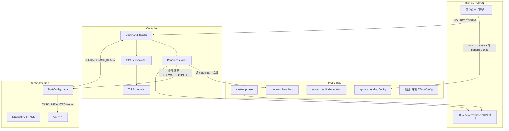
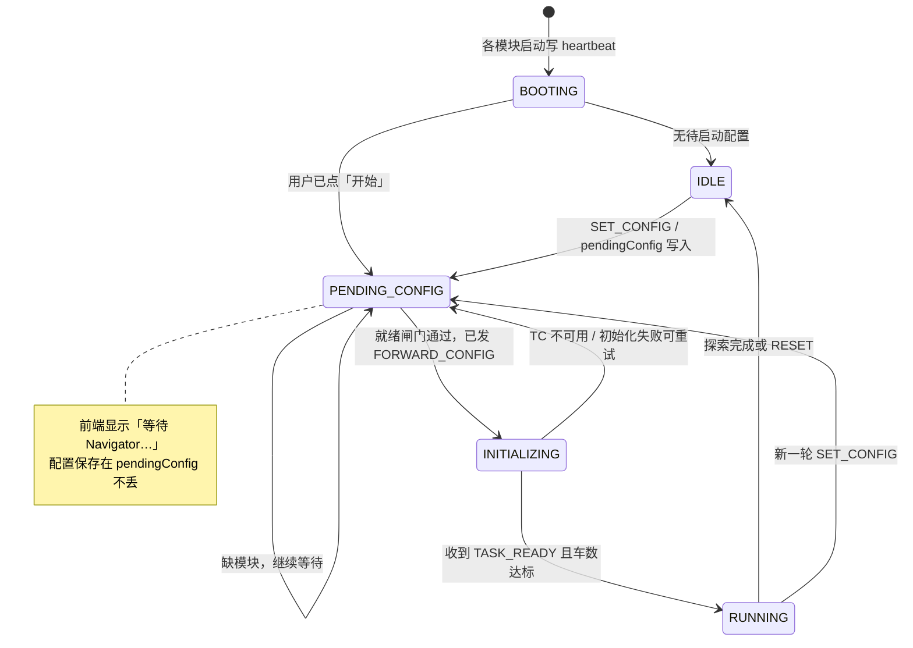

# 启动健壮性方案 — 手动开始、乱序启动可收敛

> **用途**：设计说明与实施参考。用户仍通过 Display 点击「开始」，但各 Java 模块可任意顺序启动；系统在条件满足后自动完成初始化并开始调度。  
> **对应文档**：`PROJECT_CONTEXT.md`、`分布式部署指南.md`、`系统设计文档.md`  
> **状态**：方案文档（尚未编码）  
> **更新**：2026-06-22

---

## 1. 目标与非目标

### 1.1 目标

| 编号 | 目标 |
|------|------|
| G1 | 各业务模块（Controller、TaskConfigurator、Navigator、TargetPlanner、StrategySupervisor、Car×N、Display）**启动顺序无要求** |
| G2 | 用户**仍手动点击「开始」**（不自动开局、不偷偷用默认配置） |
| G3 | 用户可在模块未齐时提前点「开始」；配置**不丢失**，模块就绪后**自动继续** |
| G4 | `SET_CONFIG` → `flushDB` → 初始化 → `TASK_READY` 全链路在乱序、重启场景下**可重试、可收敛** |
| G5 | Display 展示**当前系统阶段**与**缺失模块**，便于联调与答辩演示 |

### 1.2 非目标

| 编号 | 说明 |
|------|------|
| NG1 | 不要求「所有进程起来就自动开局」（无用户确认） |
| NG2 | 不替代基础设施约束：全组仍须共享**同一套** Redis + RabbitMQ |
| NG3 | 不解决「多 Controller 同时运行」（现有 Redis 单实例锁保留） |
| NG4 | 不要求 TaskConfigurator 多实例（`flushDB` 仍须单写者） |

---

## 2. 现状与主要脆弱点

当前实现已具备部分容错（MQ 持久队列、动态 `discoverCarIds()`、Car 5 秒自注册兜底、Controller 路线 Redis 兜底），但启动阶段仍有典型竞态：

| 场景 | 现象 | 根因 |
|------|------|------|
| Controller **最后**启动，用户已点「开始」 | 任务永不开始 | Controller 启动时 `purgeQueue(CONTROLLER_CMD)` 可能清掉队列中的 `SET_CONFIG` / `TASK_READY` |
| Car **先于** `SET_CONFIG` 启动 | 黑板有车 → `flushDB` 后无车，进程空转 | Car 仅在启动时等待注册，**不会在 flush 后重注册** |
| `TASK_READY` 时 Car 进程未起 | tick 空转，无报错 | `onTaskReady` 不校验车数，调度器直接 `start()` |
| 配置 5 台车只起 3 个 Car 进程 | 2 台永远不动 | 无「期望车数 vs 在线车数」比对 |
| TaskConfigurator 晚于「开始」 | 取决于消息是否在队列 | 无持久化 `pendingConfig`，无重发机制 |
| 某 Worker 中途崩溃后重启 | 可能卡在 pending 状态 | 无模块存活检测与阶段恢复 |

---

## 3. 设计原则

1. **手动意图优先**：「开始」= 用户显式授权；系统只负责**延后执行**直到可安全执行。  
2. **配置幂等**：同一份待启动配置可多次 `FORWARD_CONFIG`，以最后一次为准。  
3. **黑板为事实源**：车辆、地图、阶段以 Redis 为准；MQ 为命令通道，丢消息靠 Redis 状态兜底。  
4. **编排集中在 Controller**：不新增独立常驻协调进程（避免过度设计）；common 只提供可复用工具类。  
5. **可观测**：每个阶段可通过 Redis Key + WebSocket 事件让前端展示，便于答辩。

---

## 4. 总体架构



**核心新增概念：就绪闸门（Readiness Gate）**  
用户点「开始」后，Controller **不立即**假定可以初始化，而是进入 `PENDING_CONFIG` 阶段，由后台轮询检查必需模块与车辆是否在线；全部满足后再转发 `FORWARD_CONFIG`，收到 `TASK_READY` 且车数达标后才 `scheduler.start()`。

---

## 5. 系统阶段状态机



| 阶段 | Redis `system:phase` | 调度器 | 用户可见 |
|------|----------------------|--------|----------|
| `BOOTING` | 有模块尚未上报心跳（可选，也可合并进 IDLE） | 停止 | 「系统启动中…」 |
| `IDLE` | 无待处理配置 | 停止 | 「请点击开始」 |
| `PENDING_CONFIG` | 已点「开始」，等待就绪 | 停止 | 「等待模块：Navigator, Car004…」 |
| `INITIALIZING` | 已发 `FORWARD_CONFIG`，等 TC | 停止 | 「正在初始化地图…」 |
| `RUNNING` | 任务进行中 | 运行 | 正常仿真 UI |

---

## 6. Redis 约定（新增 Key）

### 6.1 系统编排

| Key | 类型 | TTL | 写入者 | 说明 |
|-----|------|-----|--------|------|
| `system:phase` | String | 无 | Controller | `IDLE` / `PENDING_CONFIG` / `INITIALIZING` / `RUNNING` |
| `system:pendingConfig` | String (JSON) | 无 | Display 或 Controller | 用户最后一次「开始」配置；闸门通过后仍可保留作审计 |
| `system:configGeneration` | String (int) | 无 | Controller | 每次接受新 SET_CONFIG 递增；Car 用于判断是否需要重注册 |
| `system:lastError` | String | 无 | Controller | 就绪超时、初始化失败原因（供前端展示） |
| `system:requiredModules` | String (JSON) | 无 | Controller 启动时写一次 | 必需模块列表，可配置是否包含 StrategySupervisor |

### 6.2 模块心跳

| Key 模式 | 类型 | TTL | 写入者 | 说明 |
|----------|------|-----|--------|------|
| `module:controller:heartbeat` | String | 3s | Controller | 值建议为 `timestamp` 或 `instanceId` |
| `module:task-configurator:heartbeat` | String | 3s | TaskConfigurator | |
| `module:navigator:heartbeat` | String | 3s | Navigator | |
| `module:target-planner:heartbeat` | String | 3s | TargetPlanner | |
| `module:strategy-supervisor:heartbeat` | String | 3s | StrategySupervisor | 可选模块 |
| `module:display:heartbeat` | String | 3s | Display | 用于判断 UI 服务是否在线（可选） |
| `module:car:{carId}:heartbeat` | String | 3s | 各 Car 进程 | 如 `module:car:Car001:heartbeat` |

**心跳规则**

- 各模块 `start()` 成功后启动单线程定时任务，每 **1 秒** `SETEX key 3 value`。  
- 判定存活：`EXISTS key == 1`（或 TTL > 0）。  
- 进程正常退出时不必删 Key（3s 自动过期）。

### 6.3 与现有 Key 的关系

| 现有 Key | 本方案中的角色 |
|----------|----------------|
| `TaskConfig` | 初始化完成后由 TaskConfigurator 写入；`carCount` 用于就绪闸门 |
| `controller:instance` | 不变，仍保证单 Controller |
| `{carId}:Status` | 初始化后存在；闸门同时要求**进程心跳**与**黑板注册**一致 |
| `mapView` 等 | `flushDB` 后由 TC 重建；Car 不得依赖 flush 前的自注册数据 |

---

## 7. 消息与事件（MQ）

### 7.1 保留的现有消息

| 消息 | 方向 | 说明 |
|------|------|------|
| `SET_CONFIG` | Display → Controller | 用户点「开始」；触发 `prepareForNewConfig` + 写 `pendingConfig` |
| `FORWARD_CONFIG` | Controller → TaskConfigurator | **仅当就绪闸门通过**后发送 |
| `TASK_READY` | TaskConfigurator → Controller | 初始化完成；Controller 校验车数后再 `start()` |
| `RESET` | Display → Controller | 清空 `pendingConfig`，阶段回 `IDLE`，转发 `FORWARD_RESET` |

### 7.2 建议新增

| 消息 / 事件 | 方向 | 说明 |
|-------------|------|------|
| `SYSTEM_STATUS` | Controller → Display（fanout 或 WS 封装） | `{ phase, missingModules[], carCount, onlineCars[], lastError }` |
| `TASK_INITIALIZED` | TaskConfigurator → fanout | `flushDB` + `initialize` 完成后广播；Car 收到后执行重注册 |
| `START_BLOCKED` | Controller → Display | 就绪等待超时（如 120s）时通知用户 |

### 7.3 Controller 启动时队列策略（重要）

| 现状 | 目标 |
|------|------|
| 启动即 `purgeQueue(CONTROLLER_CMD)` | **取消全量 purge**，或仅丢弃带旧 `configGeneration` 的消息 |
| — | 启动后从 Redis 读取 `pendingConfig`：若存在且 `phase=PENDING_CONFIG`，**恢复**闸门轮询 |

避免「Controller 最后起 → 清掉 TASK_READY」的问题。

---

## 8. 各模块职责变更摘要

### 8.1 common（新增工具，无业务编排）

建议新增类（命名供实现参考）：

| 类 | 职责 |
|----|------|
| `ModuleHeartbeat` | 封装 `start(moduleName)` / `stop()`，定时写 Redis |
| `ReadinessChecker` | 根据 `system:requiredModules` + `TaskConfig.carCount` + heartbeat 返回 `ReadinessReport` |
| `SystemPhase` | 枚举 + Redis 读写 `system:phase` |
| `PendingConfigStore` | 读写 `system:pendingConfig`、`system:configGeneration` |

### 8.2 Controller

| 职责 | 说明 |
|------|------|
| 上报 `module:controller:heartbeat` | 启动后立即开始 |
| `ReadinessPoller` | 每 1s：若 `phase==PENDING_CONFIG` 且 `ReadinessChecker.isReady()` → `forwardConfig()`，`phase=INITIALIZING` |
| `onTaskReady` 增强 | `discoverCarIds().size() >= expectedCarCount` 才 `scheduler.start()`；否则子状态「等车」，每 500ms 重查，超时写 `system:lastError` |
| 启动恢复 | 读 `pendingConfig`，决定是否进入 `PENDING_CONFIG` |
| 广播 `SYSTEM_STATUS` | 每次阶段变化或 Poller 发现缺失模块变化时 fanout |
| **不再** purge 全队列 | 见 §7.3 |

### 8.3 TaskConfigurator

| 职责 | 说明 |
|------|------|
| 上报 heartbeat | 同其他 Worker |
| 初始化完成后 | 除 `TASK_READY` 外，发布 `TASK_INITIALIZED`（带 `configGeneration`） |
| `handleReset` 增强（可选） | 清 `pendingConfig` 相关状态由 Controller 统一处理；TC 只负责 `flushDB` 与日志 |

### 8.4 Car

| 职责 | 说明 |
|------|------|
| 上报 `module:car:{carId}:heartbeat` | 与 carId 绑定 |
| 订阅 `TASK_INITIALIZED` | 收到后：若本车 `Status` 不存在或与 `configGeneration` 不匹配 → 调用现有 `selfRegister` 逻辑 |
| 启动时自注册 | 保留现有 5s 等待；**不能**作为 flush 后唯一手段 |
| 禁止在 `RUNNING` 中重复抢注册 | 仅响应 `TASK_INITIALIZED` 或「无 Status」 |

### 8.5 Navigator / TargetPlanner / StrategySupervisor

| 职责 | 说明 |
|------|------|
| 上报对应 heartbeat | 无其他逻辑变更 |
| StrategySupervisor | 默认列入**可选**模块；`system:requiredModules` 可配置为必需 |

### 8.6 Display

| 职责 | 说明 |
|------|------|
| 点「开始」 | 除发 `SET_CONFIG` 外，**写入** `system:pendingConfig`（与 Controller 双写或只写 Redis 由实现定，须幂等） |
| 订阅 `SYSTEM_STATUS` | 在控制面板展示阶段与缺失列表 |
| 禁用重复点击（可选） | `INITIALIZING` 时按钮显示「初始化中…」；`PENDING_CONFIG` 时显示「等待模块…」 |

---

## 9. 端到端流程

### 9.1 正常路径（乱序启动，用户后点「开始」）

```
1. Redis + RabbitMQ 先起（仍须最先）
2. 各人随意顺序启动 Java 模块，各自写 heartbeat
3. 用户打开 Display，点击「开始」
4. Display → SET_CONFIG + system:pendingConfig，system:phase=PENDING_CONFIG
5. Controller ReadinessPoller 检测：
   - task-configurator / navigator / target-planner heartbeat 存在
   - strategy-supervisor（若配置为必需）
   - module:car:Car001..Car00N heartbeat 数量 >= carCount
6. 通过 → FORWARD_CONFIG → TaskConfigurator
7. TC: flushDB → initialize → TASK_READY + TASK_INITIALIZED
8. Car 收到 TASK_INITIALIZED → 确认黑板注册
9. Controller onTaskReady：车数达标 → scheduler.start()，phase=RUNNING
10. 探索循环照常
```

### 9.2 用户提前点「开始」（模块未齐）

```
1. 步骤 4 同上，phase=PENDING_CONFIG
2. Poller 发现缺 Navigator → 不发 FORWARD_CONFIG
3. Display 显示「等待：navigator」
4. 稍后 Navigator 启动 → heartbeat 出现
5. Poller 下一轮通过 → 继续 §9.1 步骤 6 起
```

**关键**：`pendingConfig` 一直保留，无需用户再次点击。

### 9.3 Controller 最后启动

```
1. 用户已点「开始」，pendingConfig 已在 Redis
2. Controller 启动：
   - 不 purge 有效消息
   - 读 pendingConfig → 进入 PENDING_CONFIG
   - 启动 ReadinessPoller
3. 若其他模块已齐 → 很快 FORWARD_CONFIG → 正常运行
```

### 9.4 Car 先于 TaskConfigurator 启动

```
1. Car 启动，heartbeat 正常
2. 用户点「开始」前：Car 可自注册或等待（不影响闸门，闸门看 heartbeat）
3. FORWARD_CONFIG → flushDB 清空旧注册
4. TASK_INITIALIZED → Car 重注册，与 TC 写入的 Car001..N 对齐
```

### 9.5 就绪超时

```
1. PENDING_CONFIG 超过 START_TIMEOUT_MS（建议 120_000）
2. Controller 写 system:lastError，发 START_BLOCKED
3. phase 保持 PENDING_CONFIG（不自动取消用户意图）
4. 模块补齐后仍自动继续，或用户点「重置」再「开始」
```

---

## 10. 就绪判定规则（详细）

### 10.1 必需模块（默认）

| 模块 | heartbeat Key | 是否必需 |
|------|---------------|----------|
| TaskConfigurator | `module:task-configurator:heartbeat` | **是** |
| Navigator | `module:navigator:heartbeat` | **是** |
| TargetPlanner | `module:target-planner:heartbeat` | **是** |
| Controller | `module:controller:heartbeat` | **是**（自身） |
| StrategySupervisor | `module:strategy-supervisor:heartbeat` | **否**（可配置） |
| Display | `module:display:heartbeat` | **否**（仅 UI） |

### 10.2 车辆判定

从 `pendingConfig.carCount`（或默认 5）得到期望 ID 列表：`Car001` … `Car{NNN}`。

**通过条件（建议同时满足）**

1. 每个期望 `carId` 的 `module:car:{carId}:heartbeat` 存在；  
2. `discoverCarIds()` 在 `INITIALIZING` 完成之后包含这些 ID（防止只有进程无黑板）。

若允许「动态少车」模式（可选配置）：`onlineCars >= minCarCount` 即可，需产品明确；**默认不允许**，避免静默少车。

### 10.3 与分布式部署的关系

- 心跳写在**中心 Redis**，与 `分布式部署指南.md` 一致：各机模块连同一 Redis 即可。  
- 不要求 Car 与 Navigator 同网段直连，只要求能访问 Redis/MQ。

---

## 11. 实施分期

### 第一期：消除致命竞态（最小可用）

| 项 | 内容 |
|----|------|
| P1-1 | Controller 取消启动时 `purgeQueue(CONTROLLER_CMD)` |
| P1-2 | Controller 启动时读取 `pendingConfig`，恢复 `PENDING_CONFIG` |
| P1-3 | `onTaskReady` 等车数达标再 `scheduler.start()` |
| P1-4 | Car 订阅 `TASK_INITIALIZED` 并重注册 |
| P1-5 | TaskConfigurator 初始化后发送 `TASK_INITIALIZED` |

**验收**：Controller 最后起、用户先点「开始」，任务仍能自动开始。

### 第二期：就绪闸门与可观测性

| 项 | 内容 |
|----|------|
| P2-1 | common：`ModuleHeartbeat`、`PendingConfigStore`、`ReadinessChecker` |
| P2-2 | 各 `*Main` 接入 heartbeat |
| P2-3 | Controller `ReadinessPoller` + `system:phase` |
| P2-4 | Display 展示 `SYSTEM_STATUS` |
| P2-5 | 就绪超时与 `START_BLOCKED` |

**验收**：任意顺序启动；缺模块时前端有明确提示；补齐后无需再点「开始」。

### 第三期：幂等与重启恢复（可选）

| 项 | 内容 |
|----|------|
| P3-1 | `configGeneration` 全链路传递 |
| P3-2 | `FORWARD_CONFIG` 失败重试（TC 重启） |
| P3-3 | RUNNING 中 TC 误重启的防护（禁止重复 flush 除非 RESET） |
| P3-4 | 集成测试：模拟模块延迟启动 / 随机顺序 |

---

## 12. 测试用例清单

| 编号 | 步骤 | 期望 |
|------|------|------|
| T1 | 按文档旧顺序启动，点「开始」 | 与现网行为一致 |
| T2 | 仅先起 Display + Controller，点「开始」，再起其余模块 | 自动进入 RUNNING，无需再点 |
| T3 | Controller 最后起，且用户已点「开始」 | 不丢配置，Controller 起来后自动初始化 |
| T4 | Car 先于 TC，点「开始」 | flush 后 Car 重注册，车辆数正确 |
| T5 | 配置 5 车只起 3 进程，点「开始」 | 保持 PENDING_CONFIG，前端提示缺 Car004、Car005 |
| T6 | 补齐 Car004、Car005 后 | 自动 FORWARD_CONFIG（或从 INITIALIZING 继续） |
| T7 | Navigator 未起，点「开始」 | 提示缺 Navigator，不 flush |
| T8 | PENDING_CONFIG 超过 120s | `START_BLOCKED`，补齐后仍可继续 |
| T9 | RESET 后再「开始」 | phase 回 IDLE → PENDING_CONFIG → RUNNING |
| T10 | 分布式两机：A=基础设施+Controller，B=Car+Navigator | 与 T2 相同收敛行为 |

---

## 13. 前端展示建议（Display）

在控制面板增加**系统状态条**（不改变「开始」按钮语义）：

```
系统状态：等待模块就绪
缺失：Navigator, Car004
已就绪：TaskConfigurator, TargetPlanner, Car001–Car003, Controller
```

阶段与按钮文案：

| phase | 主按钮 | 副文案 |
|-------|--------|--------|
| IDLE | 开始 | — |
| PENDING_CONFIG | 开始（禁用或「等待中…」） | 列出 missingModules |
| INITIALIZING | 初始化中…（禁用） | — |
| RUNNING | 暂停 / 重置 | — |

WebSocket 可复用现有 fanout 机制，或 Controller 在 `SYSTEM_STATUS` 中携带 JSON，由 `WebSocketBridge` 转发给浏览器。

---

## 14. 风险与对策

| 风险 | 对策 |
|------|------|
| 心跳误报（网络抖动） | TTL 3s + 连续 2 次检测通过才算就绪 |
| `pendingConfig` 与 MQ 双写不一致 | 以 Redis 为准；MQ `SET_CONFIG` 仅作触发 |
| 重复 `FORWARD_CONFIG` | TC `initialize` 保持幂等；`configGeneration` 去重 |
| 多 Display 同时点「开始」 | 后者覆盖 `pendingConfig`；Controller 以最新 generation 为准 |
| StrategySupervisor 可选 | 默认不参与闸门；探索率监督功能降级可接受 |

---

## 15. 与现有文档的衔接

| 文档 | 需同步的章节（实现后） |
|------|------------------------|
| `PROJECT_CONTEXT.md` | §8 启动顺序 → 改为「推荐顺序 + 健壮模式说明」 |
| `分布式部署指南.md` | 联调检查清单增加 heartbeat / system:phase |
| `start_all.bat` | 可保留延时启动作为优化，但不再作为硬依赖 |

---

## 16. 答辩表述要点（简短）

1. **问题**：分布式多机联调时，模块启动顺序难以统一，易导致「点了开始没反应」。  
2. **思路**：手动开始保留用户确认；**就绪闸门**把「点开始」与「真正 flush/调度」解耦。  
3. **手段**：Redis 心跳 + `pendingConfig` 持久化 + `TASK_INITIALIZED` 车辆重同步。  
4. **效果**：任意顺序启动，配置不丢，模块到齐后**自动收敛**，前端可观测缺失项。

---

*文档版本：2026-06-22 · 设计稿，待开发评审*
