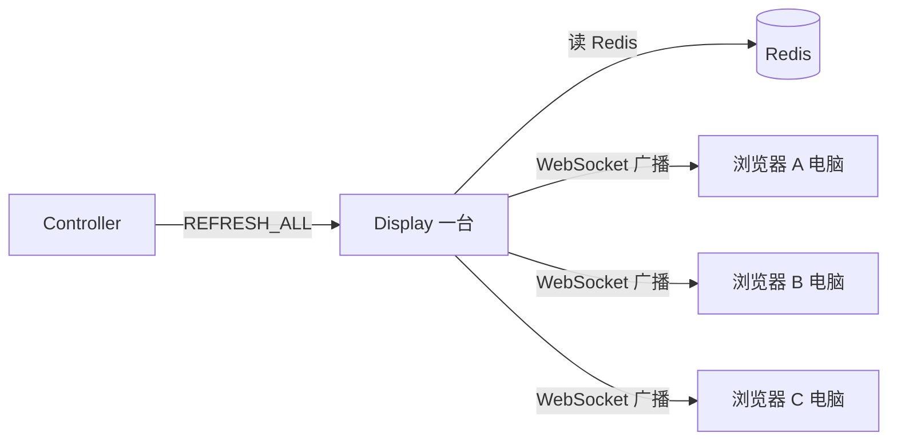

# 多人同步观看仿真网页教程

> **用途**：答辩、联调时让多台电脑同时打开浏览器，**实时看到同一张地图**（小车移动、探索率同步刷新）。  
> **前提**：全组只有 **一台** Display（Person D）；其他人只开浏览器，不另起 Display 进程。

---

## 1. 原理（一分钟看懂）



- **HTTP 8887**：登录、打开页面（Person D 的 Display 提供）
- **WebSocket 8888**：每拍推送地图和小车状态
- 前端已改为：**WebSocket 自动连「你打开页面的那台机器」**，不再写死 `localhost`
  - 访问 `http://100.x.x.x:8887` → 自动连 `ws://100.x.x.x:8888`

因此：**所有人访问 Person D 的地址**，看到的是同一份实时数据。

---

## 2. 谁要做什么

| 角色 | 要不要起 Display | 浏览器怎么用 |
|------|------------------|--------------|
| **Person D** | **要**（唯一一台） | 本机 `http://localhost:8887`，负责点「开始」 |
| **Person A / B / C** | 不要 | `http://<D的Tailscale IP>:8887` 只看 |
| **其他同学 / 老师** | 不要 | 同上，能进 Tailscale 即可 |

**建议**：点「开始 / 重置 / 加车」只让 **Person D** 操作，避免重复下发配置。

---

## 3. Person D 准备（每次联调前）

### 3.1 首次配置

```powershell
cd D:\car_homework
.\scripts\setup-config.ps1 -Role display
```

按提示输入 Person A 的 IP；`displayHost` 会尽量自动填本机 Tailscale IP。

### 3.2 启动 SQL Server + Display

1. 确保本机 **SQL Server** 已运行（登录需要）
2. 启动 Display：

```powershell
.\scripts\start-display.ps1
```

### 3.3 防火墙放行（管理员 PowerShell，本机只做一次）

让别人能访问你的页面，必须放行 **8887（HTTP）** 和 **8888（WebSocket）**：

```powershell
New-NetFirewallRule -DisplayName "DisplayHTTP" -Direction Inbound -Protocol TCP -LocalPort 8887 -Action Allow
New-NetFirewallRule -DisplayName "DisplayWS" -Direction Inbound -Protocol TCP -LocalPort 8888 -Action Allow
```

### 3.4 查本机 IP 并发到群里

```powershell
tailscale ip -4
```

告知大家访问：

```text
http://<上面显示的IP>:8887
```

示例：`http://100.94.124.4:8887`

---

## 4. 其他人怎么观看

### 4.1 连接 Tailscale

确保已加入同一 tailnet，能 ping 通 Person D：

```powershell
ping <D的Tailscale IP>
```

### 4.2 打开浏览器

Chrome / Edge 地址栏输入：

```text
http://<D的Tailscale IP>:8887
```

1. 登录（账号在 D 机 SQL Server 里，与 D 本机登录相同）
2. 进入仿真页（`dashboard.html` → 仿真）
3. 等 Person D 点「开始」后，地图会与其他人**同步刷新**

**不需要**在本机运行 Java、不需要 `setup-config`（除非你自己也要起模块）。

### 4.3 自检是否同步

| 现象 | 说明 |
|------|------|
| 页面能开，地图一直空白 | WebSocket 未连上，见 §6 |
| 地图随小车动、探索率涨 | 正常 |
| D 点了开始你这边的车不动 | 检查是否连错地址（误开 localhost） |

---

## 5. 推荐联调顺序（与全组启动配合）

```
1. A 起 Docker
2. B/C 起小车、规划模块
3. D 起 Display + 防火墙已放行
4. A 最后起 Controller
5. D 本机浏览器点「开始」
6. A/B/C/其他人打开 http://<D的IP>:8887 观看
```

---

## 6. 常见问题

| 现象 | 原因 | 处理 |
|------|------|------|
| 别人打不开 `http://D的IP:8887` | D 防火墙未放行 8887 | D 执行 §3.3 |
| 页面能开，地图不刷新 | 8888 未放行，或 WS 连错 | D 放行 8888；观众确认 URL 是 **D 的 IP**，不是 localhost |
| 观众访问 `localhost:8887` | 连的是观众自己电脑 | 必须改成 `http://<D的IP>:8887` |
| 登录失败 | D 的 SQL Server 未启动 | D 先起 SQL Server |
| 只有 D 能动，别人点没反应 | 正常；控制命令经 D 的 Display 转发 | 观看者不要点「开始」，由 D 操作 |
| 显示已连接但无数据 | Controller 未起或仿真未开始 | 等 D 点「开始」 |

### 快速检查 WebSocket（观众本机）

浏览器按 F12 → **网络 (Network)** → 筛选 **WS**，应看到：

```text
ws://<D的IP>:8888    状态：101 或已连接
```

若显示 `ws://127.0.0.1:8888` 或 `ws://localhost:8888`，说明地址栏填错了。

---

## 7. 和「多台 Display」的区别

| 做法 | 是否推荐 |
|------|----------|
| **一台 Display，多人浏览器** | **推荐**，画面一致 |
| 每人各起一个 Display | 不推荐，控制命令分裂、难同步 |

---

## 8. 技术说明（给答辩用）

- 改动文件：`display/src/main/resources/web/js/app.js`
- WebSocket 地址：`ws://` + `location.hostname` + `:8888`
- 后端 `WebSocketBridge` 本来就会向**所有已连接浏览器**广播同一 JSON，无需改 Java

---

## 9. 相关文档

| 文件 | 说明 |
|------|------|
| `分布式联调使用指南.md` | 四人分工、配置与启动脚本 |
| `四台分布式启动流程.md` | Tailscale、全组启动顺序 |
| `分布式部署指南.md` | 分布式原理与 Navigator 扩展 |

---

*文档版本：2026-06-23*
